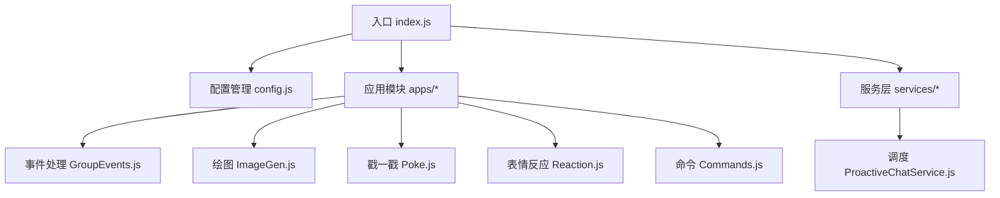
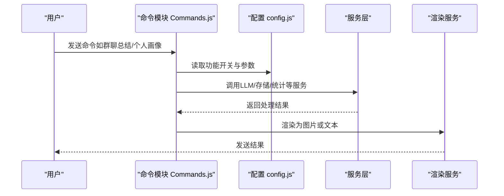
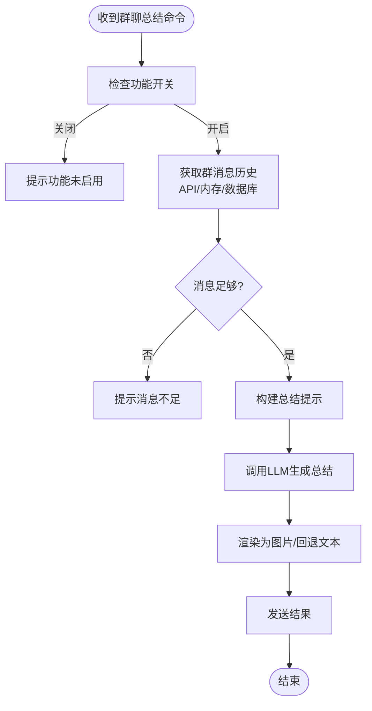
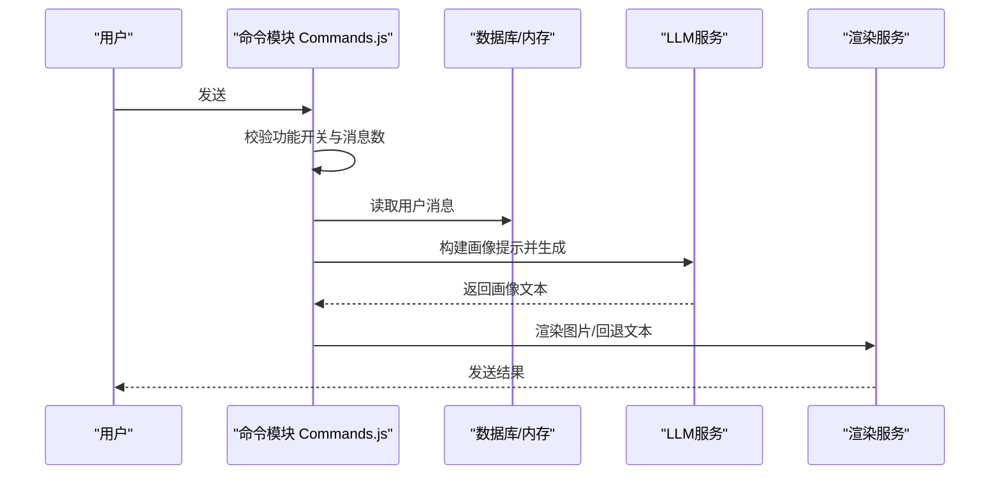
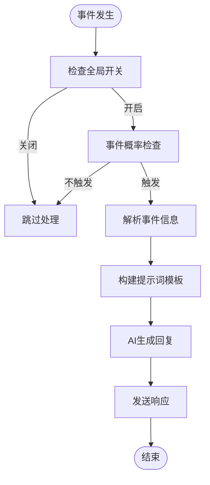
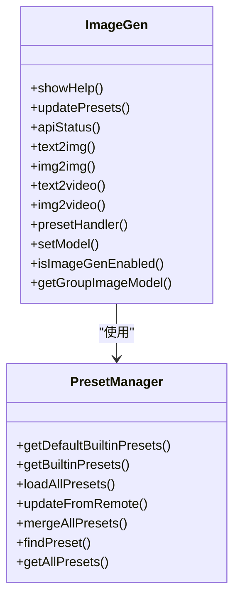
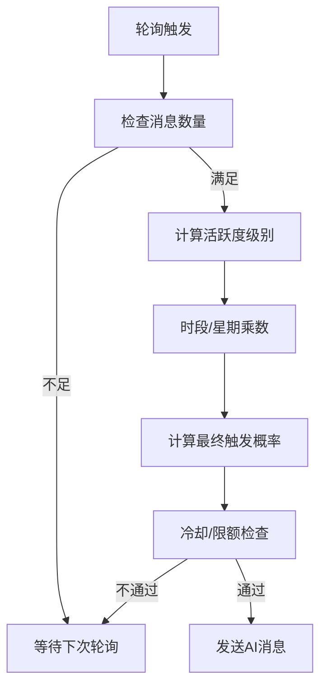
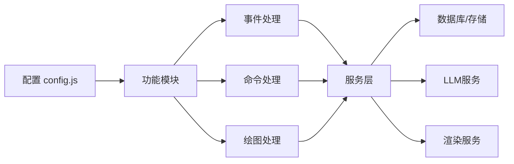

# 功能配置

<cite>
**本文档引用的文件**
- [index.js](file://index.js)
- [config.js](file://config/config.js)
- [aivoice.json](file://config/aivoice.json)
- [README.md](file://README.md)
- [GroupEvents.js](file://apps/GroupEvents.js)
- [ImageGen.js](file://apps/ImageGen.js)
- [Poke.js](file://apps/Poke.js)
- [Reaction.js](file://apps/Reaction.js)
- [Commands.js](file://apps/Commands.js)
- [ProactiveChatService.js](file://src/services/scheduler/ProactiveChatService.js)
</cite>

## 目录
1. [简介](#简介)
2. [项目结构](#项目结构)
3. [核心组件](#核心组件)
4. [架构总览](#架构总览)
5. [详细组件分析](#详细组件分析)
6. [依赖关系分析](#依赖关系分析)
7. [性能考虑](#性能考虑)
8. [故障排除指南](#故障排除指南)
9. [结论](#结论)

## 简介
本文件面向使用者与维护者，系统化梳理插件的高级功能配置，涵盖群聊总结、个人画像分析、事件响应（戳一戳、表情回应、消息撤回、入群欢迎等）、AI绘图等模块的配置项、触发条件、启用建议与使用场景。

## 项目结构
插件采用模块化设计，核心配置集中在配置管理器中，功能通过应用模块（apps）实现，服务层（services）提供底层能力（LLM、存储、渲染、调度等）。入口文件负责初始化与加载。

图表来源
- [index.js](file://index.js#L1-L258)
- [config.js](file://config/config.js#L1-L631)

章节来源
- [index.js](file://index.js#L1-L258)
- [config.js](file://config/config.js#L1-L631)

## 核心组件
- 配置管理器：提供默认配置、深合并、持久化保存与按层级读取。
- 应用模块：封装具体功能（群聊总结、个人画像、事件响应、绘图等）。
- 服务层：LLM调用、存储、渲染、调度等能力抽象。
- Web管理面板：可视化配置与监控。

章节来源
- [config.js](file://config/config.js#L1-L631)
- [README.md](file://README.md#L1-L983)

## 架构总览
插件通过配置驱动功能开关与行为，应用模块在事件或命令触发时调用服务层完成具体任务，并通过渲染服务输出美观的结果。

图表来源
- [Commands.js](file://apps/Commands.js#L695-L947)
- [config.js](file://config/config.js#L400-L499)

## 详细组件分析

### 群聊总结功能配置
- 功能开关与参数
  - 全局开关：features.groupSummary.enabled
  - 最大消息数：features.groupSummary.maxMessages（默认100）
  - 自动触发：features.groupSummary.autoTrigger（伪人模式下）
  - 最大字符数：features.groupSummary.maxChars（默认6000）
  - 定时推送：features.groupSummary.push（启用、间隔类型/值、推送时间、消息数、模型）
- 触发方式
  - 命令触发：#群聊总结/#总结群聊
  - 群组独立配置：支持群内独立启用/禁用与模型配置
- 处理流程
  - 优先从Bot API获取群历史；若不可用则回退到内存缓冲或数据库
  - 构建多维度总结提示，调用LLM生成文本，渲染为图片或回退文本
- 启用建议
  - 群活跃度：建议群内有一定聊天记录再启用
  - 模型选择：可为群组设置独立模型以提升质量
  - 定时推送：适合需要定期回顾的群组，建议设置合理间隔与时间

图表来源
- [Commands.js](file://apps/Commands.js#L695-L947)
- [config.js](file://config/config.js#L400-L415)

章节来源
- [Commands.js](file://apps/Commands.js#L695-L947)
- [config.js](file://config/config.js#L400-L415)

### 个人画像分析配置
- 功能开关与参数
  - 全局开关：features.userPortrait.enabled
  - 最低消息数：features.userPortrait.minMessages（默认10）
- 触发方式
  - 命令触发：#个人画像/#用户画像/#分析我
  - 群内@触发：#画像 @xxx
- 处理流程
  - 读取用户消息（支持群内与私聊），按配置截断分析长度
  - 构建多维度画像提示（性格、说话风格、兴趣、思维、活跃度、标签）
  - 渲染为图片或回退文本
- 启用建议
  - 建议在用户有一定发言后启用，保证画像准确性
  - 可结合记忆系统提升长期画像稳定性

图表来源
- [Commands.js](file://apps/Commands.js#L952-L1053)
- [config.js](file://config/config.js#L416-L419)

章节来源
- [Commands.js](file://apps/Commands.js#L952-L1053)
- [config.js](file://config/config.js#L416-L419)

### 事件响应功能配置
- 支持事件类型
  - 戳一戳：features.poke.enabled、pokeBack、prompt、message
  - 表情回应：features.reaction.enabled、prompt/removePrompt
  - 消息撤回：features.recall.enabled、aiResponse、prompt
  - 入群欢迎：features.welcome.enabled、message/prompt
  - 退群通知：features.goodbye.enabled、aiResponse、prompt
  - 禁言事件：features.ban.enabled、aiResponse、prompt
  - 管理员变更：features.admin.enabled、prompt
  - 幸运之星：features.luckyKing.enabled、congratulate、prompt
  - 荣誉变更：features.honor.enabled、prompt
- 触发条件
  - 全局开关与群组独立开关（群事件模块支持按群覆盖）
  - 事件概率检查（统一的概率检查工具）
  - 机器人自身事件的防护（避免循环响应）
- 处理流程
  - 事件到达 → 概率检查 → 解析事件 → 构建提示词模板 → AI生成 → 发送响应

图表来源
- [GroupEvents.js](file://apps/GroupEvents.js#L482-L659)
- [Poke.js](file://apps/Poke.js#L49-L110)
- [Reaction.js](file://apps/Reaction.js#L333-L429)
- [config.js](file://config/config.js#L420-L471)

章节来源
- [GroupEvents.js](file://apps/GroupEvents.js#L482-L659)
- [Poke.js](file://apps/Poke.js#L49-L110)
- [Reaction.js](file://apps/Reaction.js#L333-L429)
- [config.js](file://config/config.js#L420-L471)

### AI绘图功能配置
- 功能开关与参数
  - 全局开关：features.imageGen.enabled
  - 默认模型：features.imageGen.model（默认gemini-3-pro-image）
  - 视频模型：features.imageGen.videoModel（默认veo-2.0-generate-001）
  - 超时：features.imageGen.timeout（默认600000ms）
  - 最大图片数：features.imageGen.maxImages（默认3）
  - API列表：features.imageGen.apis（支持多个API）
  - 预设来源：features.imageGen.presetSources（云端预设）
  - 自定义预设：features.imageGen.customPresets
- 命令与处理
  - 命令：#文生图、#图生图、#文生视频、#图生视频、#绘图帮助、#更新预设、#画图状态
  - 预设匹配：内置/自定义/远程预设合并，支持表情包网格切分
  - 群组独立模型：支持群内独立配置绘图模型
- 启用建议
  - 建议先配置多个API以提升可用性与负载均衡
  - 合理设置timeout与maxImages，平衡质量与资源
  - 使用远程预设提升创意多样性

图表来源
- [ImageGen.js](file://apps/ImageGen.js#L298-L782)
- [ImageGen.js](file://apps/ImageGen.js#L47-L296)

章节来源
- [ImageGen.js](file://apps/ImageGen.js#L298-L782)
- [config.js](file://config/config.js#L477-L490)

### 主动聊天（伪人模式）配置
- 功能开关与参数
  - 全局开关：proactiveChat.enabled
  - 轮询间隔：proactiveChat.pollInterval（分钟）
  - 触发阈值：proactiveChat.minMessagesBeforeTrigger（默认10）
  - 最大并发触发：proactiveChat.maxConcurrentTriggers（默认3）
  - 基础概率/上限：proactiveChat.baseProbability/maxProbability
  - 时段乘数：晚夜/清晨/上午/下午/傍晚/晚上
  - 星期乘数：useWeekdayMultiplier与weekdayMultipliers
  - 活跃度检测：高频/活跃/低活跃/死群阈值
  - 冷却与限额：cooldownMinutes、maxDailyMessages、maxHourlyMessages
  - 上下文：useGroupContext、contextMessageCount
- 触发条件
  - 消息数量阈值
  - 活跃度级别计算
  - 时段/星期乘数与概率上限
  - 冷却与限额控制
- 启用建议
  - 适合活跃群组，避免在深夜或死群触发
  - 合理设置概率与限额，防止刷屏

图表来源
- [ProactiveChatService.js](file://src/services/scheduler/ProactiveChatService.js#L62-L77)
- [ProactiveChatService.js](file://src/services/scheduler/ProactiveChatService.js#L642-L704)
- [config.js](file://config/config.js#L133-L206)

章节来源
- [ProactiveChatService.js](file://src/services/scheduler/ProactiveChatService.js#L62-L77)
- [ProactiveChatService.js](file://src/services/scheduler/ProactiveChatService.js#L642-L704)
- [config.js](file://config/config.js#L133-L206)

## 依赖关系分析
- 配置依赖：各功能模块均通过配置管理器读取参数，支持默认值与深合并。
- 事件依赖：事件响应模块依赖统一事件解析与概率检查工具。
- 服务依赖：命令与绘图模块依赖LLM、存储、渲染等服务。
- 群组独立配置：通过作用域管理器（ScopeManager）实现群组级覆盖。

图表来源
- [config.js](file://config/config.js#L1-L631)
- [GroupEvents.js](file://apps/GroupEvents.js#L1-L844)
- [Commands.js](file://apps/Commands.js#L1-L1867)
- [ImageGen.js](file://apps/ImageGen.js#L1-L1614)

章节来源
- [config.js](file://config/config.js#L1-L631)
- [GroupEvents.js](file://apps/GroupEvents.js#L1-L844)
- [Commands.js](file://apps/Commands.js#L1-L1867)
- [ImageGen.js](file://apps/ImageGen.js#L1-L1614)

## 性能考虑
- 轮询与限额：主动聊天设置轮询间隔、每日/每小时限额与冷却时间，避免过度触发。
- 上下文裁剪：群聊总结与画像分析支持消息截断与上下文数量限制，控制Token与延迟。
- 渲染优化：优先图片渲染，失败回退文本，减少大文本传输成本。
- API冗余：绘图支持多API与远程预设缓存，提升可用性与响应速度。

## 故障排除指南
- 配置未生效
  - 检查配置文件是否保存成功（配置管理器提供保存逻辑）
  - 确认功能开关与群组独立设置
- 事件不触发
  - 概率检查未通过：调整基础概率或时段乘数
  - 机器人自身事件被过滤：确认事件解析与防护逻辑
- 绘图失败
  - API状态检查：使用#画图状态查看各API健康状况
  - 超时与限额：适当增大timeout或减少并发
- 性能问题
  - 减少上下文长度与消息截断
  - 关闭不必要的功能（如记忆系统、MCP）

章节来源
- [config.js](file://config/config.js#L591-L626)
- [GroupEvents.js](file://apps/GroupEvents.js#L482-L659)
- [ImageGen.js](file://apps/ImageGen.js#L471-L604)

## 结论
本插件通过配置驱动实现高度可定制的AI功能，涵盖群聊总结、个人画像、事件响应与AI绘图等场景。建议根据群组活跃度与资源情况合理设置参数，优先启用高质量渠道与预设，配合主动聊天与事件响应提升群组互动体验。