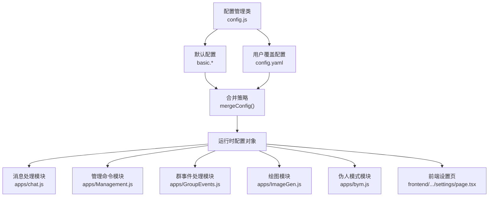
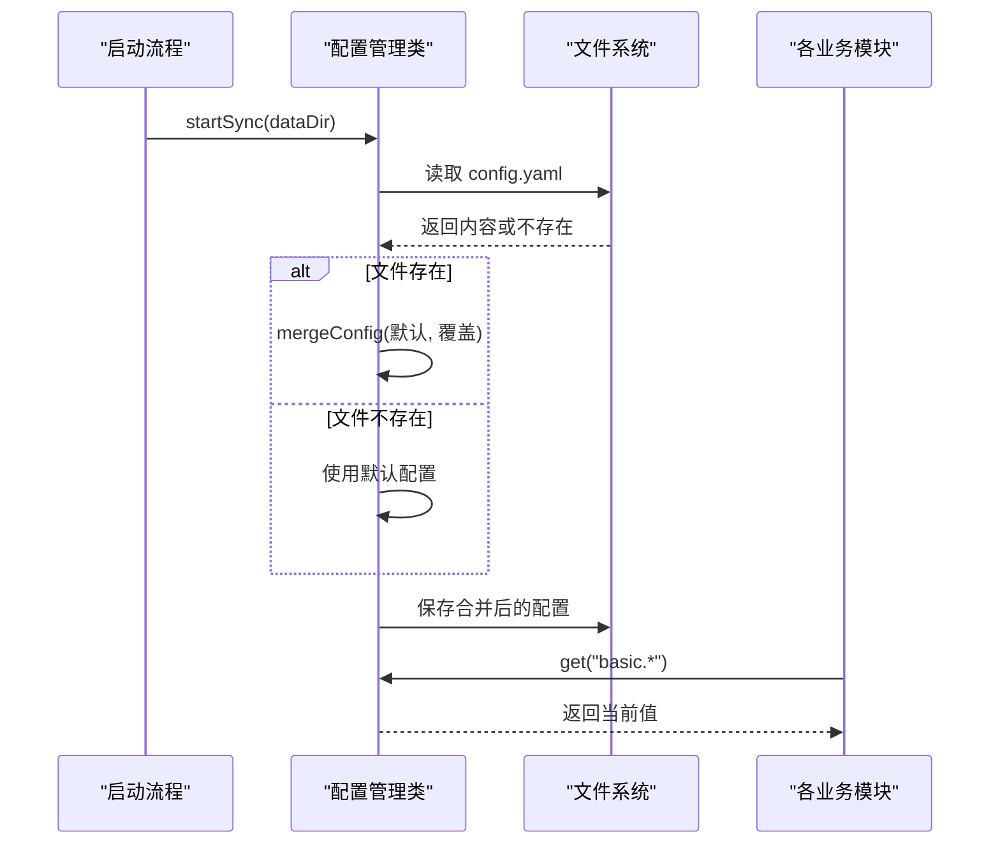
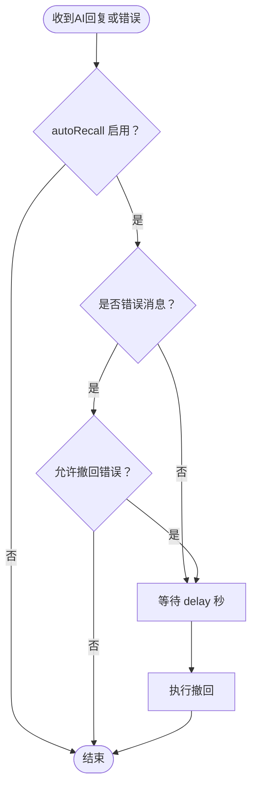
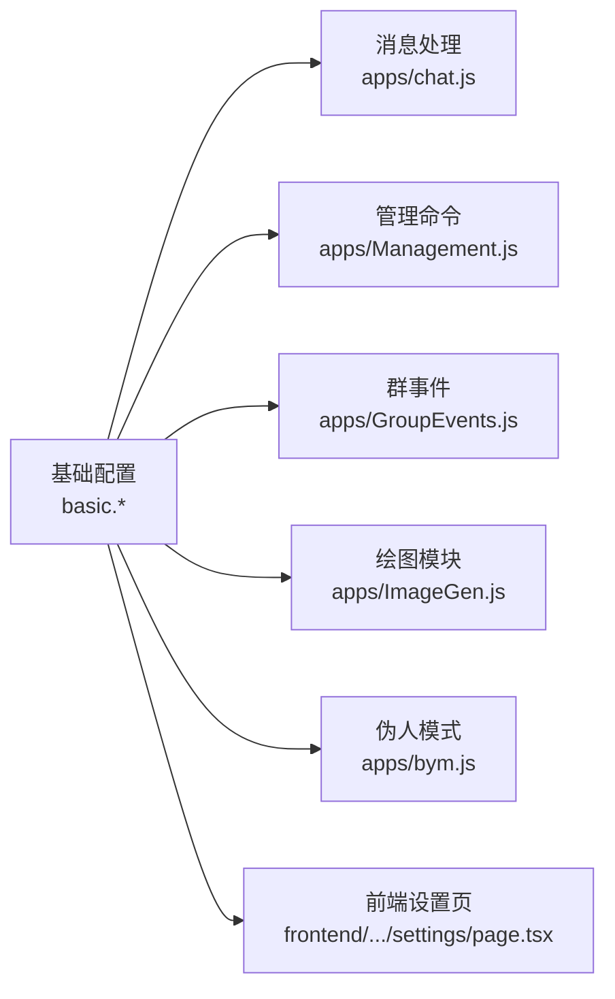

# 基础配置

<cite>
**本文档引用的文件**
- [config.js](file://config/config.js)
- [config.yaml](file://config/config.yaml)
- [chat.js](file://apps/chat.js)
- [Management.js](file://apps/Management.js)
- [GroupEvents.js](file://apps/GroupEvents.js)
- [ImageGen.js](file://apps/ImageGen.js)
- [bym.js](file://apps/bym.js)
- [page.tsx（设置页）](file://frontend/app/(dashboard)/settings/page.tsx)
- [page.tsx（群管理页）](file://frontend/app/group-admin/page.tsx)
</cite>

## 目录
1. [简介](#简介)
2. [项目结构](#项目结构)
3. [核心组件](#核心组件)
4. [架构总览](#架构总览)
5. [详细组件分析](#详细组件分析)
6. [依赖分析](#依赖分析)
7. [性能考虑](#性能考虑)
8. [故障排查指南](#故障排查指南)
9. [结论](#结论)
10. [附录](#附录)

## 简介
本章节聚焦“基础配置”部分，系统性解读命令前缀、调试模式、思考消息显示、引用回复、自动撤回等核心配置项。我们将结合代码实现与前端配置界面，给出默认值、可选范围、实际应用场景、最佳实践与常见问题解决方案，并为管理员提供优化建议与性能调优指导。

## 项目结构
基础配置位于配置管理类中，通过默认配置与用户覆盖配置进行合并，最终由各模块按需读取。前端设置页提供可视化开关与输入框，便于管理员实时调整。

图表来源
- [config.js](file://config/config.js#L43-L76)
- [config.js](file://config/config.js#L62-L586)
- [chat.js](file://apps/chat.js#L559-L615)
- [Management.js](file://apps/Management.js#L18-L135)
- [GroupEvents.js](file://apps/GroupEvents.js#L357-L390)
- [ImageGen.js](file://apps/ImageGen.js#L332)
- [bym.js](file://apps/bym.js#L538)
- [page.tsx（设置页）](file://frontend/app/(dashboard)/settings/page.tsx#L966-L989)

章节来源
- [config.js](file://config/config.js#L43-L76)
- [config.js](file://config/config.js#L62-L586)

## 核心组件
- 基础配置容器：负责加载、合并与持久化配置；提供 get/set 访问。
- 运行时读取点：消息处理、管理命令、群事件、绘图与伪人模式等模块均从基础配置读取相应开关与参数。
- 前端可视化：设置页提供开关与输入控件，直接写入对应配置键。

章节来源
- [config.js](file://config/config.js#L591-L626)
- [page.tsx（设置页）](file://frontend/app/(dashboard)/settings/page.tsx#L966-L989)

## 架构总览
基础配置在启动时加载默认配置与用户覆盖配置，形成最终运行时配置。各业务模块通过统一的配置读取接口获取所需参数，保证一致性与可维护性。

图表来源
- [config.js](file://config/config.js#L18-L38)
- [config.js](file://config/config.js#L43-L57)
- [config.js](file://config/config.js#L591-L608)

## 详细组件分析

### 命令前缀（commandPrefix）
- 作用：管理命令与触发前缀的统一入口，决定插件命令的识别与路由。
- 默认值：未覆盖时使用默认值。
- 实际应用：
  - 管理命令模块基于该前缀构建正则规则，以识别“管理面板”“帮助”“调试”等命令。
  - 群设置页支持动态添加/移除前缀，配合触发配置实现灵活的触发策略。
- 可选范围：字符串，建议以单字符或短前缀为主，避免与平台默认前缀冲突。
- 最佳实践：
  - 团队内统一约定前缀，避免多前缀导致误触。
  - 与触发配置中的前缀列表协同使用，减少误判。
- 常见问题：
  - 前缀冲突：若与平台或其他插件冲突，可能导致命令无法识别。
  - 未生效：确认已保存并重启相关服务或刷新页面。

章节来源
- [config.js](file://config/config.js#L64-L65)
- [Management.js](file://apps/Management.js#L18-L135)
- [page.tsx（设置页）](file://frontend/app/(dashboard)/settings/trigger/page.tsx#L209-L233)

### 调试模式（debug）
- 作用：控制调试信息的输出与展示范围。
- 默认值：未覆盖时使用默认值。
- 实际应用：
  - 消息处理模块在异常时会发送用户友好错误，并在调试模式下附加调试信息。
  - 管理命令模块提供“调试开启/关闭”命令，便于临时切换。
- 可选范围：布尔值。
- 最佳实践：
  - 生产环境建议关闭，避免泄露敏感信息。
  - 仅在定位问题时开启，并限定到特定会话或用户。
- 常见问题：
  - 控制台噪音：开启后会产生大量调试日志，注意日志轮转。
  - 仅控制台输出：结合“调试信息仅输出到控制台”选项，避免在群内暴露细节。

章节来源
- [config.js](file://config/config.js#L66)
- [chat.js](file://apps/chat.js#L634-L638)
- [Commands.js](file://apps/Commands.js#L285-L296)

### 思考消息显示（showThinkingMessage）
- 作用：控制是否向用户发送“思考中...”提示。
- 默认值：未覆盖时使用默认值。
- 实际应用：
  - 消息处理模块在发送请求前，若开启该选项则先发送提示消息，提升交互体验。
- 可选范围：布尔值。
- 最佳实践：
  - 建议开启，改善等待体验。
  - 若网络延迟极低或对实时性要求极高，可考虑关闭以减少一次消息往返。
- 常见问题：
  - 提示过多：在高频对话场景下可能显得冗余，可结合“仅控制台调试”使用。

章节来源
- [config.js](file://config/config.js#L67)
- [chat.js](file://apps/chat.js#L559-L562)

### 引用回复（quoteReply）
- 作用：控制AI回复是否引用原始触发消息，便于上下文关联。
- 默认值：未覆盖时使用默认值。
- 实际应用：
  - 消息处理模块在构造回复时读取该开关，决定是否携带引用。
  - 绘图模块与伪人模式也遵循该开关，保持行为一致。
- 可选范围：布尔值。
- 最佳实践：
  - 建议开启，有助于用户理解回复来源。
  - 在长消息或富媒体场景下，引用可能影响阅读体验，可按需关闭。
- 常见问题：
  - 平台限制：部分平台对引用消息有长度或格式限制，需关注平台能力。

章节来源
- [config.js](file://config/config.js#L69)
- [chat.js](file://apps/chat.js#L588-L615)
- [ImageGen.js](file://apps/ImageGen.js#L332)
- [bym.js](file://apps/bym.js#L538)

### 自动撤回（autoRecall）
- 作用：在指定延迟后自动撤回AI回复或错误消息，减少消息刷屏与冗余。
- 子参数：
  - enabled：是否启用自动撤回。
  - delay：撤回延迟（秒），默认值为60。
  - recallError：是否撤回错误消息。
- 默认值：未覆盖时使用默认值。
- 实际应用：
  - 消息处理模块在成功回复或错误回复后，根据开关与条件触发撤回。
  - 绘图模块与伪人模式同样遵循该策略。
- 可选范围：
  - enabled：布尔值。
  - delay：正整数（秒），建议根据消息长度与用户阅读习惯设定。
  - recallError：布尔值。
- 最佳实践：
  - 生产环境建议开启，delay建议≥60秒，避免用户未读即撤回。
  - 错误消息可选择性撤回，避免影响排障。
- 常见问题：
  - 撤回失败：检查平台权限与消息ID有效性。
  - 延迟过短：用户可能来不及阅读，适当延长delay。

图表来源
- [chat.js](file://apps/chat.js#L864-L867)
- [page.tsx（设置页）](file://frontend/app/(dashboard)/settings/page.tsx#L966-L989)

章节来源
- [config.js](file://config/config.js#L70-L74)
- [chat.js](file://apps/chat.js#L588-L615)
- [chat.js](file://apps/chat.js#L864-L867)
- [ImageGen.js](file://apps/ImageGen.js#L332)
- [bym.js](file://apps/bym.js#L538)
- [page.tsx（设置页）](file://frontend/app/(dashboard)/settings/page.tsx#L966-L989)

### 调试信息仅输出到控制台（debugToConsoleOnly）
- 作用：限制调试信息的可见范围，避免在群内泄露。
- 默认值：未覆盖时使用默认值。
- 实际应用：
  - 消息处理模块在调试模式下，将详细信息仅输出到控制台，不向用户展示。
- 可选范围：布尔值。
- 最佳实践：
  - 生产环境务必开启，确保隐私与安全。
- 常见问题：
  - 误以为调试无效：需在控制台查看日志。

章节来源
- [config.js](file://config/config.js#L68)
- [chat.js](file://apps/chat.js#L631-L633)

## 依赖分析
基础配置在多个模块中被读取与使用，耦合度低、职责清晰。前端设置页与后端配置管理类形成闭环，确保配置变更可追踪、可回滚。

图表来源
- [config.js](file://config/config.js#L62-L76)
- [chat.js](file://apps/chat.js#L559-L615)
- [Management.js](file://apps/Management.js#L18-L135)
- [GroupEvents.js](file://apps/GroupEvents.js#L357-L390)
- [ImageGen.js](file://apps/ImageGen.js#L332)
- [bym.js](file://apps/bym.js#L538)
- [page.tsx（设置页）](file://frontend/app/(dashboard)/settings/page.tsx#L966-L989)

章节来源
- [config.js](file://config/config.js#L62-L76)

## 性能考虑
- 自动撤回延迟：合理设置 delay，避免过短导致用户体验差，过长增加消息占用。
- 思考提示：开启“思考中...”会增加一次消息往返，对高并发场景需评估延迟。
- 引用回复：在富媒体场景下可能增大消息体积，注意平台限制。
- 调试模式：生产环境应关闭或仅限控制台输出，避免日志风暴。

## 故障排查指南
- 命令前缀无效
  - 检查管理命令模块是否正确读取基础配置。
  - 确认前端设置页已保存并生效。
- 调试信息泄露
  - 确认“调试信息仅输出到控制台”已开启。
- 思考提示未显示
  - 检查“思考消息显示”开关与消息处理逻辑。
- 引用回复异常
  - 平台对引用消息有限制，检查平台能力与消息类型。
- 自动撤回不生效
  - 检查开关、延迟与错误撤回设置。
  - 确认平台权限与消息ID有效。

章节来源
- [Management.js](file://apps/Management.js#L18-L135)
- [chat.js](file://apps/chat.js#L559-L615)
- [chat.js](file://apps/chat.js#L864-L867)
- [GroupEvents.js](file://apps/GroupEvents.js#L357-L390)

## 结论
基础配置是插件行为的关键开关。通过统一的配置管理与前端可视化，管理员可以灵活调整命令前缀、调试模式、思考提示、引用回复与自动撤回等参数。建议在生产环境中谨慎开启调试与展示类功能，合理设置自动撤回延迟，并结合平台能力与用户习惯进行优化。

## 附录
- 配置键路径参考
  - 基础配置根：basic
  - 命令前缀：basic.commandPrefix
  - 调试模式：basic.debug
  - 思考消息显示：basic.showThinkingMessage
  - 引用回复：basic.quoteReply
  - 自动撤回：basic.autoRecall.enabled/delay/recallError
  - 调试信息仅输出到控制台：basic.debugToConsoleOnly

章节来源
- [config.js](file://config/config.js#L62-L76)
- [config.yaml](file://config/config.yaml#L1-L10)