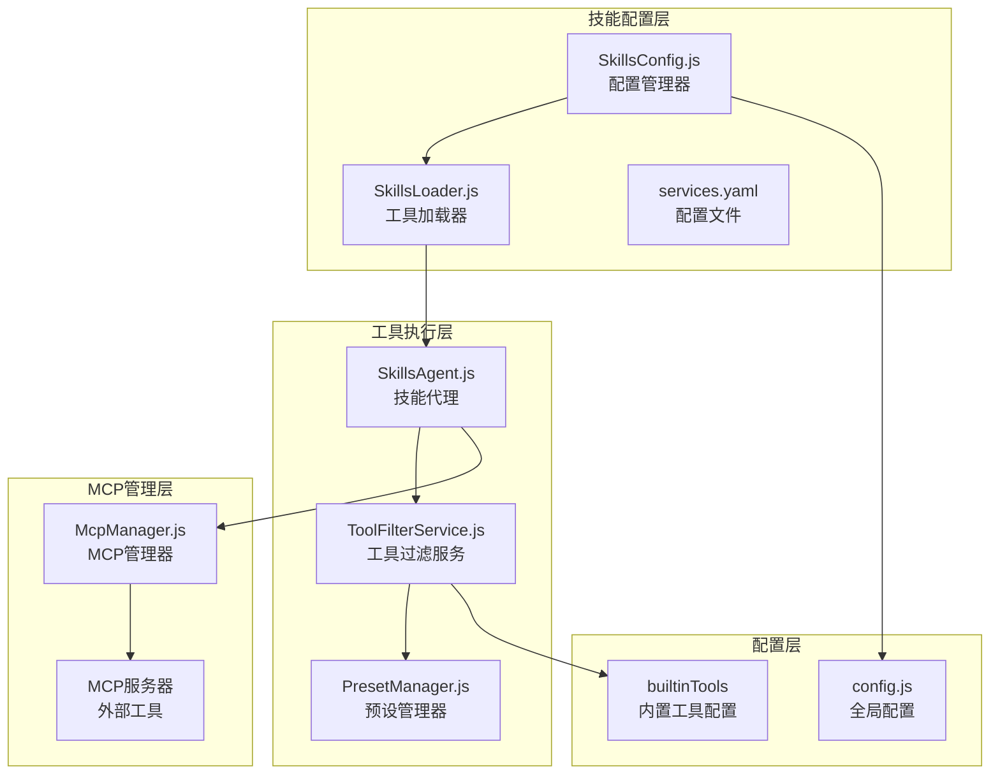
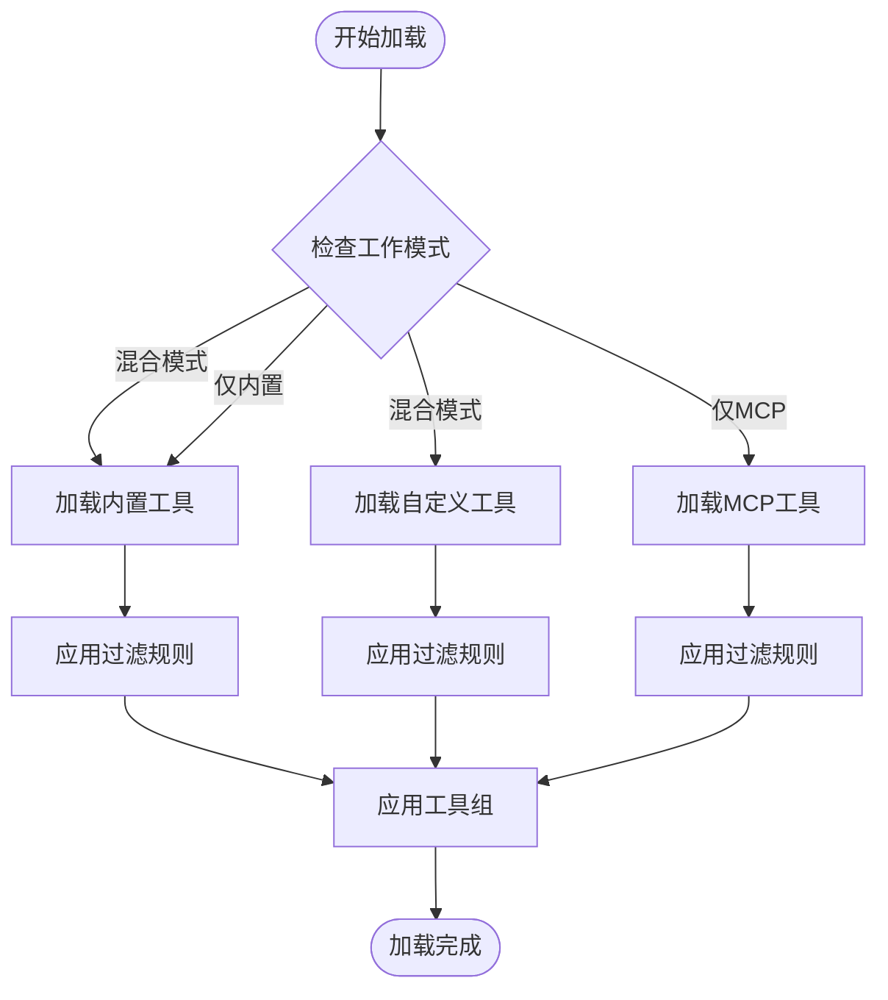
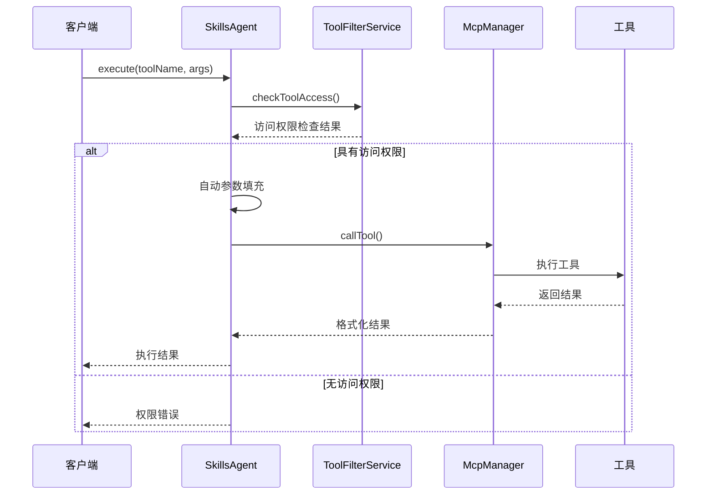
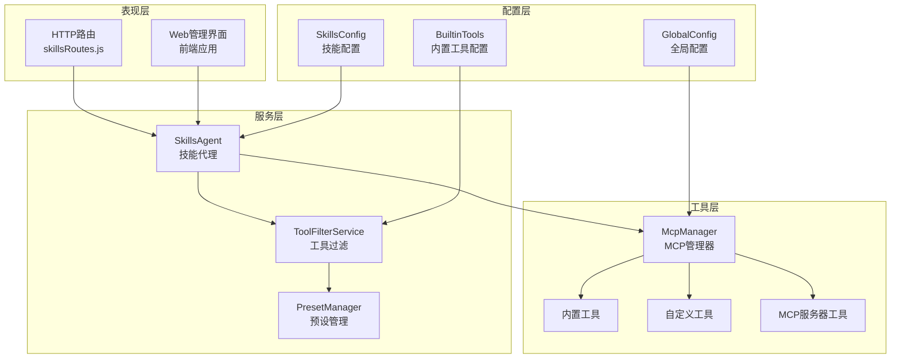
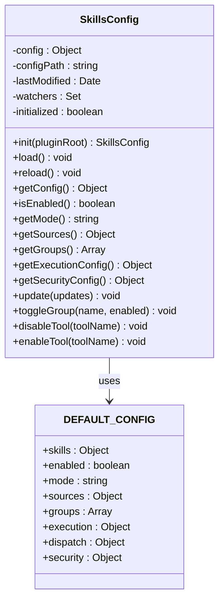
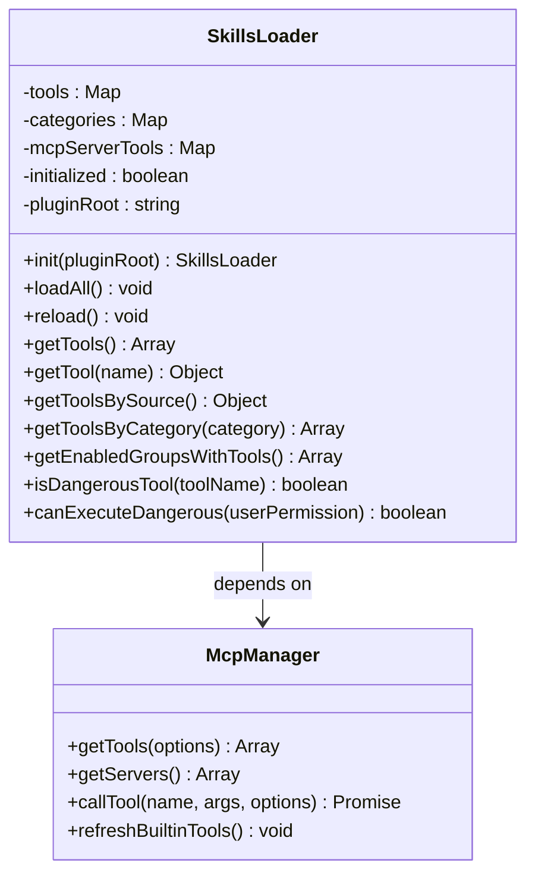
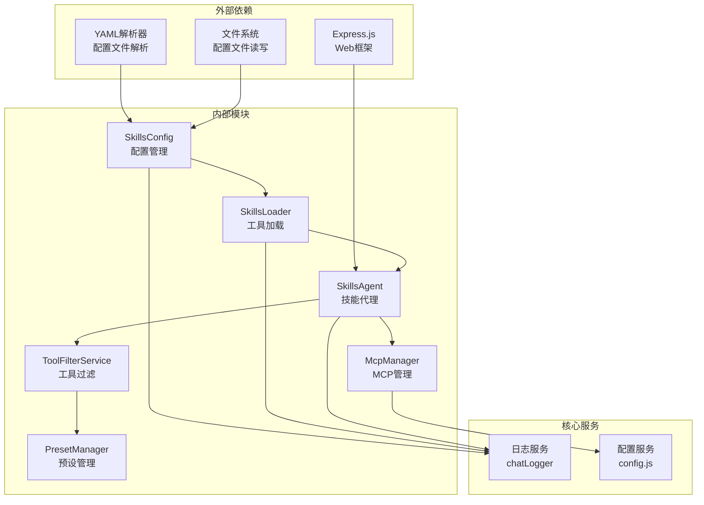

# 技能配置系统

<cite>
**本文档引用的文件**
- [SkillsConfig.js](file://src/services/skills/SkillsConfig.js)
- [SkillsLoader.js](file://src/services/skills/SkillsLoader.js)
- [skills.yaml](file://data/skills.yaml)
- [SkillsAgent.js](file://src/services/agent/SkillsAgent.js)
- [skillsRoutes.js](file://src/services/routes/skillsRoutes.js)
- [McpManager.js](file://src/mcp/McpManager.js)
- [ToolFilterService.js](file://src/services/tools/ToolFilterService.js)
- [PresetManager.js](file://src/services/preset/PresetManager.js)
- [config.js](file://config/config.js)
</cite>

## 目录
1. [简介](#简介)
2. [项目结构](#项目结构)
3. [核心组件](#核心组件)
4. [架构概览](#架构概览)
5. [详细组件分析](#详细组件分析)
6. [依赖关系分析](#依赖关系分析)
7. [性能考虑](#性能考虑)
8. [故障排除指南](#故障排除指南)
9. [结论](#结论)

## 简介

技能配置系统是 ChatGPT 插件的核心组件之一，负责管理、加载和执行各种工具/技能。该系统提供了灵活的配置机制，支持多种工具来源（内置工具、自定义JS工具、外部MCP服务器工具），并通过预设系统实现细粒度的权限控制和工具访问管理。

系统采用混合模式工作，既支持传统的内置工具，也支持现代的MCP（Model Context Protocol）协议工具，为用户提供统一的工具管理体验。

## 项目结构

技能配置系统主要分布在以下目录和文件中：

**图表来源**
- [SkillsConfig.js](file://src/services/skills/SkillsConfig.js#L1-L531)
- [SkillsLoader.js](file://src/services/skills/SkillsLoader.js#L1-L507)
- [SkillsAgent.js](file://src/services/agent/SkillsAgent.js#L1-L657)

## 核心组件

### SkillsConfig - 配置管理器

SkillsConfig 是技能配置系统的核心，负责管理 skills.yaml 配置文件的加载、验证和热重载功能。

**主要功能：**
- 配置文件的加载和解析
- 默认配置与用户配置的合并
- 配置验证和参数规范化
- 配置热重载和变更监听
- 工具组和权限配置管理

**配置层次结构：**
- **全局配置**：启用状态、工作模式、执行参数
- **工具源配置**：内置工具、自定义工具、MCP服务器
- **工具组配置**：按功能分类的工具组合
- **安全配置**：危险工具控制和权限要求

**图表来源**
- [SkillsConfig.js](file://src/services/skills/SkillsConfig.js#L15-L57)

### SkillsLoader - 工具加载器

SkillsLoader 负责根据配置从不同来源加载工具，统一管理工具的生命周期。

**核心能力：**
- 按模式加载不同类型的工具（混合、仅内置、仅MCP）
- 工具过滤和权限验证
- 工具分类和组织
- 工具组的动态应用

**加载流程：**

**图表来源**
- [SkillsLoader.js](file://src/services/skills/SkillsLoader.js#L53-L87)

### SkillsAgent - 技能代理

SkillsAgent 提供统一的技能执行接口，整合了工具过滤、权限验证和执行日志等功能。

**主要职责：**
- 工具列表的动态加载和管理
- 执行权限的实时验证
- 工具调用的参数填充和上下文管理
- 执行结果的格式化和缓存

**执行流程：**

**图表来源**
- [SkillsAgent.js](file://src/services/agent/SkillsAgent.js#L343-L396)

## 架构概览

技能配置系统采用分层架构设计，确保了良好的模块化和可扩展性：

**图表来源**
- [skillsRoutes.js](file://src/services/routes/skillsRoutes.js#L1-L391)
- [SkillsAgent.js](file://src/services/agent/SkillsAgent.js#L1-L657)

## 详细组件分析

### 配置管理系统

#### SkillsConfig 类设计

SkillsConfig 采用了单例模式和完整的配置管理机制：

**图表来源**
- [SkillsConfig.js](file://src/services/skills/SkillsConfig.js#L59-L531)

#### 配置文件结构

skills.yaml 文件提供了丰富的配置选项：

**工作模式配置：**
- `hybrid`: 混合模式，同时加载内置工具和MCP工具
- `skills-only`: 仅加载内置工具，忽略MCP工具
- `mcp-only`: 仅加载MCP工具，兼容旧版本行为

**工具源配置：**
- **内置工具**: 基于 BuiltinMcpServer 的工具集合
- **自定义工具**: data/tools 目录下的JS工具
- **MCP工具**: 外部MCP服务器提供的工具

**工具组配置**:
系统预定义了20多个工具组，涵盖基础信息、用户管理、群组管理、消息操作、媒体处理、搜索功能等各个方面。

**图表来源**
- [skills.yaml](file://data/skills.yaml#L1-L193)

### 工具加载和管理

#### SkillsLoader 类架构

SkillsLoader 实现了灵活的工具加载机制：

**图表来源**
- [SkillsLoader.js](file://src/services/skills/SkillsLoader.js#L17-L507)

#### 工具过滤机制

ToolFilterService 提供了多层次的工具过滤能力：

**过滤层次：**
1. **预设级别过滤**: 基于预设配置的工具白/黑名单
2. **权限级别过滤**: 基于用户权限的工具访问控制
3. **危险工具过滤**: 对敏感操作的额外保护
4. **服务器级别过滤**: 对MCP服务器的访问控制

**权限体系：**
- `member`: 普通成员
- `admin`: 群管理员  
- `owner`: 群主/系统所有者

**图表来源**
- [ToolFilterService.js](file://src/services/tools/ToolFilterService.js#L28-L314)

### 预设管理系统

PresetManager 提供了强大的预设管理功能：

**预设类型：**
- **内置预设**: 系统自带的标准配置
- **用户自定义预设**: 用户创建和管理的个性化配置
- **混合预设**: 结合内置和用户配置的复合预设

**预设配置项：**
- **工具配置**: 启用/禁用特定工具
- **上下文配置**: 对话上下文管理
- **模型参数**: LLM模型的温度、采样等参数
- **人设配置**: AI助手的角色设定和个性特征

**图表来源**
- [PresetManager.js](file://src/services/preset/PresetManager.js#L79-L843)

## 依赖关系分析

技能配置系统的依赖关系体现了清晰的分层架构：

**图表来源**
- [SkillsConfig.js](file://src/services/skills/SkillsConfig.js#L8-L13)
- [SkillsLoader.js](file://src/services/skills/SkillsLoader.js#L10-L15)
- [SkillsAgent.js](file://src/services/agent/SkillsAgent.js#L1-L6)

### 关键依赖链

1. **配置依赖**: SkillsConfig → YAML → skills.yaml
2. **工具依赖**: SkillsLoader → McpManager → BuiltinMcpServer
3. **权限依赖**: SkillsAgent → ToolFilterService → PresetManager
4. **执行依赖**: SkillsAgent → McpManager → 外部工具

## 性能考虑

### 缓存策略

系统实现了多层次的缓存机制：

**工具结果缓存**:
- 默认缓存60秒
- 支持自定义TTL
- 按工具名称和参数组合缓存

**内存优化**:
- 工具映射使用 Map 数据结构
- 分类索引减少遍历成本
- 懒加载机制避免不必要的初始化

### 并行执行

系统支持工具的并行执行以提高性能：

**并发控制**:
- 最大并行数默认5个
- 可配置的超时机制
- 错误重试机制（可选）

**性能监控**:
- 执行时间统计
- 工具调用日志
- 缓存命中率监控

## 故障排除指南

### 常见问题及解决方案

**配置文件加载失败**:
- 检查 skills.yaml 语法
- 验证文件路径和权限
- 查看日志中的具体错误信息

**工具无法加载**:
- 确认工具源配置正确
- 检查网络连接（MCP服务器）
- 验证工具权限设置

**权限访问被拒绝**:
- 检查用户权限级别
- 验证工具组权限配置
- 查看预设的工具访问规则

**性能问题**:
- 调整并行执行数量
- 优化缓存TTL设置
- 检查工具过滤规则的复杂度

### 调试技巧

**启用详细日志**:
- 设置 debug 模式
- 监控工具调用过程
- 分析执行时间分布

**配置验证**:
- 使用配置验证工具
- 检查配置文件的完整性
- 测试工具组的可用性

## 结论

技能配置系统通过精心设计的架构和丰富的功能，为用户提供了强大而灵活的工具管理能力。系统的主要优势包括：

**灵活性**: 支持多种工具来源和工作模式，适应不同的使用场景

**安全性**: 多层次的权限控制和危险工具保护机制

**可扩展性**: 模块化的架构设计，便于添加新的工具源和功能

**易用性**: 直观的配置界面和丰富的预设管理功能

通过合理的配置和使用，技能配置系统能够满足从简单到复杂的各种应用场景需求，为用户提供高质量的AI工具执行体验。