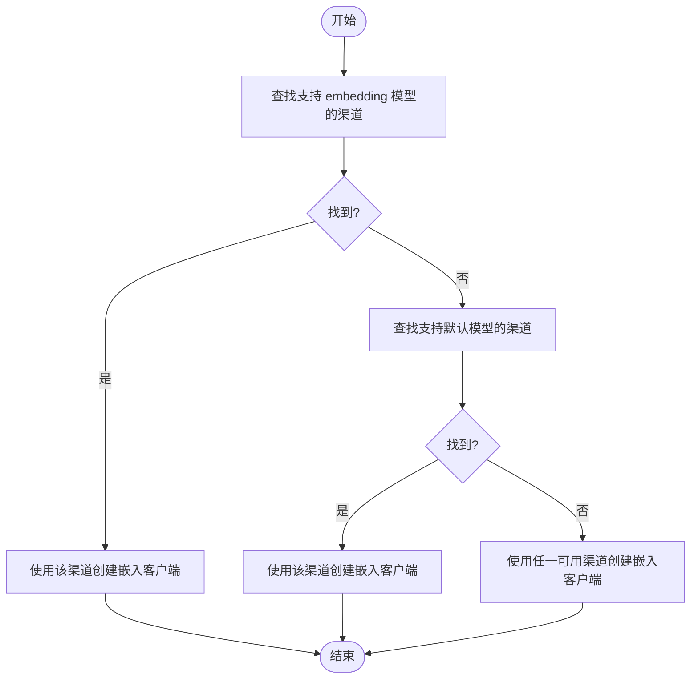

# 模型配置

<cite>
**本文档引用的文件**
- [config.js](file://config/config.js)
- [LlmService.js](file://src/services/llm/LlmService.js)
- [ChannelManager.js](file://src/services/llm/ChannelManager.js)
- [ChatService.js](file://src/services/llm/ChatService.js)
- [OpenAIClient.js](file://src/core/adapters/openai/OpenAIClient.js)
- [AbstractClient.js](file://src/core/adapters/AbstractClient.js)
- [models.js](file://src/core/types/models.js)
- [model-select.tsx](file://frontend/components/group-form/model-select.tsx)
- [ModelSelector.tsx](file://frontend/components/ModelSelector.tsx)
- [page.tsx](file://frontend/app/(dashboard)/settings/page.tsx)
- [page.tsx](file://frontend/app/(dashboard)/channels/page.tsx)
</cite>

## 目录
1. [简介](#简介)
2. [项目结构](#项目结构)
3. [核心组件](#核心组件)
4. [架构总览](#架构总览)
5. [详细组件分析](#详细组件分析)
6. [依赖关系分析](#依赖关系分析)
7. [性能考量](#性能考量)
8. [故障排查指南](#故障排查指南)
9. [结论](#结论)
10. [附录](#附录)

## 简介
本文件系统化梳理本项目的模型配置体系，涵盖默认模型设置、模型分类配置、备选模型轮询机制、嵌入模型与维度、模型兼容性与迁移、最佳实践与性能优化建议。目标是帮助使用者在不同业务场景（对话、工具调用、图像、角色扮演、搜索等）下，正确选择与配置模型，并在出现异常时快速定位与解决。

## 项目结构
围绕模型配置的关键文件分布如下：
- 配置层：config/config.js 定义默认配置、模型分类、备选轮询、嵌入模型与维度等
- 服务层：src/services/llm/LlmService.js 提供模型选择、客户端创建、嵌入客户端获取等
- 渠道层：src/services/llm/ChannelManager.js 管理渠道、模型映射、API Key轮换、健康检查
- 业务层：src/services/llm/ChatService.js 实现备选模型轮询、渠道切换、Key轮换、空响应重试
- 适配层：src/core/adapters/openai/OpenAIClient.js、src/core/adapters/AbstractClient.js 实现具体适配器与工具调用解析
- 类型定义：src/core/types/models.js 定义消息、工具调用、嵌入等类型
- 前端组件：frontend/components 下的 ModelSelect、ModelSelector 等用于配置模型


**图表来源**
- [config.js](file://config/config.js#L62-L114)
- [LlmService.js](file://src/services/llm/LlmService.js#L1-L300)
- [ChannelManager.js](file://src/services/llm/ChannelManager.js#L1-L1776)
- [ChatService.js](file://src/services/llm/ChatService.js#L900-L1100)
- [OpenAIClient.js](file://src/core/adapters/openai/OpenAIClient.js#L1-L800)
- [AbstractClient.js](file://src/core/adapters/AbstractClient.js#L1-L800)
- [model-select.tsx](file://frontend/components/group-form/model-select.tsx#L1-L42)
- [ModelSelector.tsx](file://frontend/components/ModelSelector.tsx#L1-L275)
- [page.tsx](file://frontend/app/(dashboard)/settings/page.tsx#L1175-L1195)
- [page.tsx](file://frontend/app/(dashboard)/channels/page.tsx#L1396-L1413)

**章节来源**
- [config.js](file://config/config.js#L62-L114)
- [LlmService.js](file://src/services/llm/LlmService.js#L1-L300)
- [ChannelManager.js](file://src/services/llm/ChannelManager.js#L1-L1776)
- [ChatService.js](file://src/services/llm/ChatService.js#L900-L1100)
- [OpenAIClient.js](file://src/core/adapters/openai/OpenAIClient.js#L1-L800)
- [AbstractClient.js](file://src/core/adapters/AbstractClient.js#L1-L800)
- [model-select.tsx](file://frontend/components/group-form/model-select.tsx#L1-L42)
- [ModelSelector.tsx](file://frontend/components/ModelSelector.tsx#L1-L275)
- [page.tsx](file://frontend/app/(dashboard)/settings/page.tsx#L1175-L1195)
- [page.tsx](file://frontend/app/(dashboard)/channels/page.tsx#L1396-L1413)

## 核心组件
- 默认模型设置（defaultModel）
  - 位置：config/config.js 中 llm.defaultModel
  - 作用：作为全局默认模型，未显式指定模型时的兜底
  - 读取：LlmService.getDefaultModel()/getModel() 与 ChatService 的主模型选择
- 模型分类配置（chat、tool、dispatch、image、roleplay、search）
  - 位置：config/config.js 中 llm.models
  - 作用：针对不同业务场景指定专用模型；为空则继承 defaultModel
  - 使用：前端组件提供“继承全局”与“指定模型”的选择
- 备选模型轮询（fallback）
  - 位置：config/config.js 中 llm.fallback
  - 作用：主模型失败时自动轮询备选模型，支持渠道切换、Key轮换、空响应重试
  - 控制：maxRetries、retryDelay、enableChannelSwitch、enableKeyRotation、emptyRetries、notifyOnFallback
- 嵌入模型配置（embeddingModel）与维度（dimensions）
  - 位置：config/config.js 中 llm.embeddingModel、llm.dimensions
  - 作用：用于向量化/嵌入生成；LlmService.getEmbeddingClient() 会基于此选择渠道
- 模型兼容性与迁移
  - 渠道模型映射：ChannelManager.getActualModel() 支持将框架内模型名映射到实际API模型名
  - 旧配置兼容：兼容旧 chatModel 等字段，保证迁移平滑
- 前端模型选择组件
  - ModelSelect：单选模型，支持“使用全局配置”
  - ModelSelector：多选模型，支持分组、搜索、自定义模型、批量操作

**章节来源**
- [config.js](file://config/config.js#L82-L114)
- [LlmService.js](file://src/services/llm/LlmService.js#L233-L287)
- [ChatService.js](file://src/services/llm/ChatService.js#L980-L1100)
- [ChannelManager.js](file://src/services/llm/ChannelManager.js#L975-L1041)
- [model-select.tsx](file://frontend/components/group-form/model-select.tsx#L1-L42)
- [ModelSelector.tsx](file://frontend/components/ModelSelector.tsx#L1-L275)

## 架构总览
模型配置贯穿“配置层 → 服务层 → 渠道层 → 适配层”的链路，前端组件负责配置输入与展示。


**图表来源**
- [config.js](file://config/config.js#L62-L114)
- [LlmService.js](file://src/services/llm/LlmService.js#L21-L135)
- [ChannelManager.js](file://src/services/llm/ChannelManager.js#L975-L1041)
- [ChatService.js](file://src/services/llm/ChatService.js#L980-L1100)
- [OpenAIClient.js](file://src/core/adapters/openai/OpenAIClient.js#L162-L637)

## 详细组件分析

### 默认模型与分类配置
- 默认模型（defaultModel）
  - 作用：全局兜底；未指定模型时使用
  - 读取：LlmService.getDefaultModel()/getModel() 优先取 llm.defaultModel
  - 兼容：若未配置，回退到旧 chatModel（数组或字符串）
- 模型分类（models）
  - chat：普通聊天（无工具）
  - tool：工具调用
  - dispatch：工具组调度（轻量快速）
  - image：图像理解/生成
  - roleplay：角色扮演
  - search：联网搜索
  - 空值策略：分类为空则继承 defaultModel
- 前端交互
  - ModelSelect 支持“使用全局配置”（空值）
  - ModelSelector 支持分组、搜索、自定义模型


**图表来源**
- [config.js](file://config/config.js#L82-L114)
- [LlmService.js](file://src/services/llm/LlmService.js#L233-L253)
- [model-select.tsx](file://frontend/components/group-form/model-select.tsx#L26-L38)

**章节来源**
- [config.js](file://config/config.js#L82-L114)
- [LlmService.js](file://src/services/llm/LlmService.js#L233-L253)
- [model-select.tsx](file://frontend/components/group-form/model-select.tsx#L1-L42)
- [ModelSelector.tsx](file://frontend/components/ModelSelector.tsx#L1-L275)

### 备选模型轮询机制
- 启用状态与参数
  - enabled：是否启用轮询
  - models：备选模型列表（按优先级）
  - maxRetries：主模型最大重试次数
  - retryDelay：重试延迟（ms），采用递增策略
  - notifyOnFallback：切换模型时是否通知用户
  - enableChannelSwitch：是否启用渠道切换
  - enableKeyRotation：是否启用Key轮换
  - emptyRetries：空响应重试次数
- 轮询流程
  - 优先尝试主模型；失败后按 models 顺序尝试备选模型
  - 每个模型可结合渠道切换与Key轮换
  - 对空响应进行额外重试，避免“无内容”噪声
  - 记录切换链路（switchChain），便于排障

```mermaid
sequenceDiagram
participant CS as "ChatService"
participant CM as "ChannelManager"
participant LLM as "LlmService"
participant OA as "OpenAI适配器"
CS->>CS : 选择主模型与渠道
loop 主模型重试(maxRetries)
CS->>OA : sendMessage(主模型)
alt 成功且有内容
OA-->>CS : 返回响应
CS-->>CS : 成功，重置渠道错误
break
else 失败或空响应
OA-->>CS : 抛出错误/空响应
CS->>CS : 计数+延时重试
end
end
alt 备选模型列表非空
loop 遍历备选模型
CS->>CM : 获取最佳渠道(备选模型)
CM-->>CS : 返回渠道与Key
CS->>LLM : 用新渠道创建客户端
CS->>OA : sendMessage(备选模型)
alt 成功
OA-->>CS : 返回响应
CS-->>CS : 记录切换链路/通知(可选)
break
else 失败
OA-->>CS : 抛出错误
end
end
end
```

**图表来源**
- [ChatService.js](file://src/services/llm/ChatService.js#L980-L1100)
- [ChannelManager.js](file://src/services/llm/ChannelManager.js#L975-L1041)
- [LlmService.js](file://src/services/llm/LlmService.js#L21-L135)
- [OpenAIClient.js](file://src/core/adapters/openai/OpenAIClient.js#L162-L637)

**章节来源**
- [config.js](file://config/config.js#L102-L109)
- [ChatService.js](file://src/services/llm/ChatService.js#L980-L1100)
- [ChannelManager.js](file://src/services/llm/ChannelManager.js#L975-L1041)

### 嵌入模型与维度
- 配置项
  - embeddingModel：嵌入模型名称（如 text-embedding-004）
  - dimensions：嵌入维度（如 1536）
- 选择策略
  - LlmService.getEmbeddingClient() 优先查找包含 embedding 模型的渠道，其次默认模型，最后任一可用渠道
  - 适配器类型由渠道 adapterType 决定（OpenAI/Gemini/Claude）



**图表来源**
- [LlmService.js](file://src/services/llm/LlmService.js#L140-L175)
- [config.js](file://config/config.js#L82-L86)

**章节来源**
- [config.js](file://config/config.js#L82-L86)
- [LlmService.js](file://src/services/llm/LlmService.js#L140-L175)

### 模型兼容性与迁移
- 旧配置兼容
  - 兼容旧字段 chatModel、codeModel、translationModel；若未配置 defaultModel，则回退到旧字段
- 模型映射（迁移/适配）
  - ChannelManager.getActualModel() 支持将框架内模型名映射到实际API模型名（含通配符）
  - 适用于不同平台/供应商的命名差异（如 glm4 → gemini-1.5-pro）
- 前端配置
  - 渠道页支持为渠道配置模型映射，便于迁移与适配


**图表来源**
- [ChannelManager.js](file://src/services/llm/ChannelManager.js#L975-L1041)
- [config.js](file://config/config.js#L110-L114)

**章节来源**
- [config.js](file://config/config.js#L110-L114)
- [ChannelManager.js](file://src/services/llm/ChannelManager.js#L975-L1041)

### 前端模型配置组件
- ModelSelect
  - 支持“使用全局配置”（空值），适合简单场景
- ModelSelector
  - 支持分组（OpenAI、Gemini、Qwen等）、搜索、自定义模型、全选/取消全选、按组选择
  - 适合复杂场景与批量配置

**章节来源**
- [model-select.tsx](file://frontend/components/group-form/model-select.tsx#L1-L42)
- [ModelSelector.tsx](file://frontend/components/ModelSelector.tsx#L1-L275)

## 依赖关系分析
- 配置依赖
  - config/config.js 提供默认值与兼容字段
- 服务依赖
  - LlmService 依赖 ChannelManager 获取渠道与模型映射
  - ChatService 依赖 LlmService 创建客户端，并实现轮询与重试
- 适配器依赖
  - OpenAIClient/AbstractClient 依赖工具解析与消息转换
- 前端依赖
  - 前端组件依赖配置与渠道模型列表，支持“继承全局/指定模型”


**图表来源**
- [config.js](file://config/config.js#L62-L114)
- [LlmService.js](file://src/services/llm/LlmService.js#L1-L300)
- [ChannelManager.js](file://src/services/llm/ChannelManager.js#L1-L1776)
- [ChatService.js](file://src/services/llm/ChatService.js#L900-L1100)
- [OpenAIClient.js](file://src/core/adapters/openai/OpenAIClient.js#L1-L800)
- [AbstractClient.js](file://src/core/adapters/AbstractClient.js#L1-L800)
- [model-select.tsx](file://frontend/components/group-form/model-select.tsx#L1-L42)
- [ModelSelector.tsx](file://frontend/components/ModelSelector.tsx#L1-L275)
- [page.tsx](file://frontend/app/(dashboard)/settings/page.tsx#L1175-L1195)
- [page.tsx](file://frontend/app/(dashboard)/channels/page.tsx#L1396-L1413)

**章节来源**
- [config.js](file://config/config.js#L62-L114)
- [LlmService.js](file://src/services/llm/LlmService.js#L1-L300)
- [ChannelManager.js](file://src/services/llm/ChannelManager.js#L1-L1776)
- [ChatService.js](file://src/services/llm/ChatService.js#L900-L1100)
- [OpenAIClient.js](file://src/core/adapters/openai/OpenAIClient.js#L1-L800)
- [AbstractClient.js](file://src/core/adapters/AbstractClient.js#L1-L800)
- [model-select.tsx](file://frontend/components/group-form/model-select.tsx#L1-L42)
- [ModelSelector.tsx](file://frontend/components/ModelSelector.tsx#L1-L275)
- [page.tsx](file://frontend/app/(dashboard)/settings/page.tsx#L1175-L1195)
- [page.tsx](file://frontend/app/(dashboard)/channels/page.tsx#L1396-L1413)

## 性能考量
- 选择合适模型
  - 轻量场景（如调度）优先使用更小/更快的模型
  - 工具调用场景建议使用更强推理能力的模型
- 轮询与重试
  - 合理设置 maxRetries 与 retryDelay，避免频繁重试造成延迟
  - 启用 enableChannelSwitch 与 enableKeyRotation，提升可用性
- 嵌入性能
  - embeddingModel 与 dimensions 影响向量规模与相似度计算成本
  - 优先选择与下游检索/相似度库匹配的维度
- 前端体验
  - 使用 ModelSelector 的分组与搜索，减少配置时间
  - “继承全局”减少重复配置，降低维护成本

[本节为通用指导，无需特定文件引用]

## 故障排查指南
- 常见问题与定位
  - 未找到可用渠道：检查 channels 配置与 adapterType、apiKey、baseUrl
  - 模型不可用：确认渠道 models 列表包含目标模型，或启用模型映射
  - 轮询无效：检查 llm.fallback.enabled 与 models 列表
  - 空响应：检查 emptyRetries 与 retryDelay；必要时启用 Key 轮换
  - 嵌入失败：确认 embeddingModel 与 dimensions 配置正确
- 日志与调试
  - ChatService 记录调试信息（请求摘要、上下文摘要、工具列表）
  - OpenAIClient 记录详细 API 错误与响应格式校验
- 前端配置核对
  - 设置页与渠道页核对 fallback 参数与模型映射
  - 使用 ModelSelector 校验模型分组与搜索结果

**章节来源**
- [ChatService.js](file://src/services/llm/ChatService.js#L900-L1100)
- [OpenAIClient.js](file://src/core/adapters/openai/OpenAIClient.js#L500-L576)
- [page.tsx](file://frontend/app/(dashboard)/settings/page.tsx#L1175-L1195)
- [page.tsx](file://frontend/app/(dashboard)/channels/page.tsx#L1396-L1413)

## 结论
本项目的模型配置体系以“默认模型 + 分类模型 + 备选轮询 + 嵌入配置 + 兼容与迁移”为核心，配合渠道管理与前端组件，实现了灵活、可扩展、易维护的模型选择与运行机制。遵循本文档的最佳实践与排障建议，可在不同业务场景下稳定高效地使用模型资源。

[本节为总结，无需特定文件引用]

## 附录

### 配置项速查
- 默认模型：llm.defaultModel
- 分类模型：llm.models.chat/tool/dispatch/image/roleplay/search
- 备选轮询：llm.fallback.enabled/models/maxRetries/retryDelay/notifyOnFallback
- 渠道切换/Key轮换：llm.fallback.enableChannelSwitch/enableKeyRotation
- 空响应重试：llm.fallback.emptyRetries
- 嵌入模型与维度：llm.embeddingModel/llm.dimensions
- 旧配置兼容：llm.chatModel/codeModel/translationModel

**章节来源**
- [config.js](file://config/config.js#L82-L114)