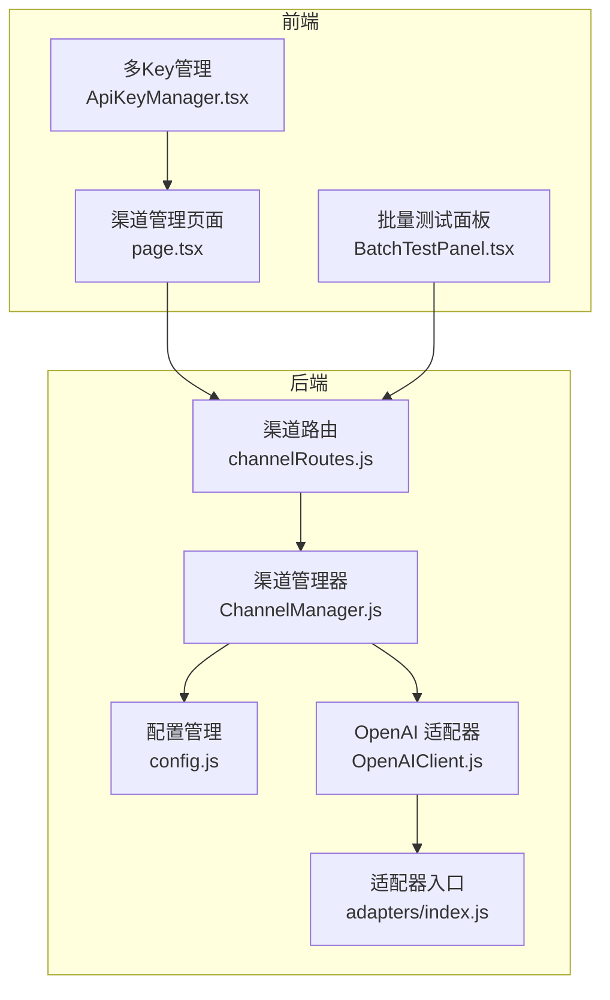
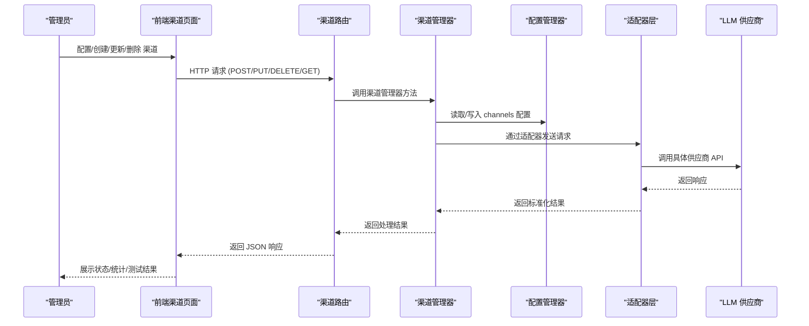
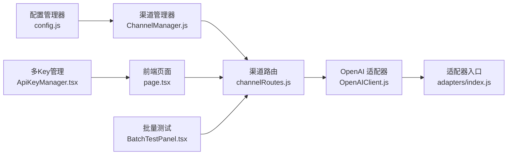

# 渠道配置

<cite>
**本文档引用的文件**
- [index.js](file://index.js)
- [README.md](file://README.md)
- [config.js](file://config/config.js)
- [ChannelManager.js](file://src/services/llm/ChannelManager.js)
- [channelRoutes.js](file://src/services/routes/channelRoutes.js)
- [OpenAIClient.js](file://src/core/adapters/openai/OpenAIClient.js)
- [adapters/index.js](file://src/core/adapters/index.js)
- [page.tsx](file://frontend/app/(dashboard)/channels/page.tsx)
- [ApiKeyManager.tsx](file://frontend/components/channels/ApiKeyManager.tsx)
- [BatchTestPanel.tsx](file://frontend/components/channels/BatchTestPanel.tsx)
</cite>

## 目录
1. [简介](#简介)
2. [项目结构](#项目结构)
3. [核心组件](#核心组件)
4. [架构总览](#架构总览)
5. [详细组件分析](#详细组件分析)
6. [依赖关系分析](#依赖关系分析)
7. [性能考虑](#性能考虑)
8. [故障排查指南](#故障排查指南)
9. [结论](#结论)

## 简介
本文件系统性阐述插件的渠道配置体系，围绕 channels 数组配置展开，涵盖渠道对象的属性结构、API 密钥与端点配置、模型映射、权限控制、切换机制、负载均衡与故障转移策略，并提供安全与监控建议及最佳实践。

## 项目结构
渠道配置贯穿后端配置管理、运行时渠道管理、适配器层以及前端可视化配置界面：

- 后端配置层：通过配置文件与运行时配置管理器统一加载与持久化 channels 配置
- 运行时渠道管理层：负责渠道生命周期、健康检查、模型列表获取、API Key 轮询与统计
- 适配器层：对 OpenAI/Gemini/Claude 等不同供应商进行统一抽象与调用
- 前端管理面板：提供渠道的可视化配置、测试、批量模型测试与导出导入

图表来源
- [page.tsx](file://frontend/app/(dashboard)/channels/page.tsx#L381-L800)
- [ApiKeyManager.tsx](file://frontend/components/channels/ApiKeyManager.tsx#L1-L456)
- [BatchTestPanel.tsx](file://frontend/components/channels/BatchTestPanel.tsx#L1-L795)
- [config.js](file://config/config.js#L629-L631)
- [ChannelManager.js](file://src/services/llm/ChannelManager.js#L77-L137)
- [channelRoutes.js](file://src/services/routes/channelRoutes.js#L1-L86)
- [adapters/index.js](file://src/core/adapters/index.js#L1-L24)
- [OpenAIClient.js](file://src/core/adapters/openai/OpenAIClient.js#L145-L200)

章节来源
- [index.js](file://index.js#L1-L258)
- [README.md](file://README.md#L208-L282)

## 核心组件
- 配置管理器：负责 channels 的默认值、合并、持久化与读取
- 渠道管理器：负责渠道的创建、更新、删除、健康检查、模型列表获取、API Key 轮询与统计
- 渠道路由：提供 REST 接口用于 CRUD、测试、批量测试、模型列表获取
- 适配器层：封装不同供应商的 API 调用细节，支持请求头模板、自定义路径、认证方式覆盖等
- 前端渠道页面：提供渠道的可视化配置、测试、批量测试与导出导入

章节来源
- [config.js](file://config/config.js#L62-L586)
- [ChannelManager.js](file://src/services/llm/ChannelManager.js#L77-L137)
- [channelRoutes.js](file://src/services/routes/channelRoutes.js#L1-L86)
- [OpenAIClient.js](file://src/core/adapters/openai/OpenAIClient.js#L145-L200)
- [page.tsx](file://frontend/app/(dashboard)/channels/page.tsx#L381-L800)

## 架构总览
渠道配置的端到端流程如下：

图表来源
- [channelRoutes.js](file://src/services/routes/channelRoutes.js#L19-L86)
- [ChannelManager.js](file://src/services/llm/ChannelManager.js#L99-L137)
- [config.js](file://config/config.js#L591-L626)
- [adapters/index.js](file://src/core/adapters/index.js#L1-L24)

## 详细组件分析

### channels 数组配置结构与属性
channels 是一个数组，每个元素代表一个渠道对象。其关键属性包括但不限于：

- id：渠道唯一标识
- name：渠道显示名称
- adapterType：适配器类型，如 openai、gemini、claude
- baseUrl：API 基础地址，若为空将使用默认地址；支持自定义路径
- apiKey / apiKeys：单个或多个 API Key（多 Key 模式）
- strategy：API Key 轮询策略（轮询、随机、权重、最少使用、故障转移）
- models：可用模型列表
- priority：优先级（用于调度）
- enabled：是否启用
- advanced：高级参数（如 streaming、llm 参数）
- customHeaders / headersTemplate / requestBodyTemplate：自定义请求头与模板
- endpoints：自定义端点（如 chat、models、embeddings、images）
- auth：认证方式覆盖（bearer、api-key、custom）
- imageConfig：图片处理配置（传输模式、格式转换、压缩等）
- timeout/retry/quota/weight：超时、重试、配额与权重
- overrides：覆盖配置（如 temperature、maxTokens、topP、topK、频率/存在惩罚、停止序列、系统提示前后缀、模型映射）

章节来源
- [README.md](file://README.md#L225-L247)
- [ChannelManager.js](file://src/services/llm/ChannelManager.js#L193-L279)
- [ChannelManager.js](file://src/services/llm/ChannelManager.js#L287-L340)
- [ChannelManager.js](file://src/services/llm/ChannelManager.js#L372-L414)
- [ChannelManager.js](file://src/services/llm/ChannelManager.js#L477-L585)

### 渠道对象属性详解
- 渠道标识与可见性
  - id/name/enabled/priority：用于识别、排序与启用控制
- 适配器与端点
  - adapterType/baseUrl/endpoints/chatPath/modelsPath：决定适配器类型与调用路径
  - normalizeBaseUrl：自动补全 /v1 等路径，支持自定义路径
- 认证与安全
  - apiKey/apiKeys + strategy：多 Key 管理与轮询策略
  - auth：认证方式覆盖（bearer、api-key、custom）
  - customHeaders/headersTemplate/requestBodyTemplate：灵活注入请求头与请求体模板
- 高级参数与覆盖
  - advanced.llm：temperature/maxTokens/topP 等
  - overrides：模型映射、系统提示前后缀、停止序列等
- 资源与可靠性
  - timeout/retry/quota/weight：超时、重试、配额与权重
  - imageConfig：图片处理策略

章节来源
- [ChannelManager.js](file://src/services/llm/ChannelManager.js#L38-L57)
- [ChannelManager.js](file://src/services/llm/ChannelManager.js#L193-L279)
- [ChannelManager.js](file://src/services/llm/ChannelManager.js#L477-L585)

### API 密钥与端点配置
- 单 Key 与多 Key 模式
  - 单 Key：apiKey
  - 多 Key：apiKeys（数组），支持启用/禁用、权重、使用/错误统计、故障转移
- 轮询策略
  - round-robin、random、weighted、least-used、failover
- 认证方式
  - bearer、api-key、custom，支持自定义头部名称与前缀
- 请求模板
  - headersTemplate/requestBodyTemplate 支持占位符与 JSON 模板
- 端点与路径
  - chatPath/modelsPath/endpoints.*：覆盖默认端点路径

章节来源
- [ChannelManager.js](file://src/services/llm/ChannelManager.js#L143-L169)
- [ChannelManager.js](file://src/services/llm/ChannelManager.js#L477-L585)
- [channelRoutes.js](file://src/services/routes/channelRoutes.js#L97-L288)

### 模型映射与权限控制
- 模型映射
  - overrides.modelMapping：将框架内模型名映射到实际供应商模型名，支持通配符
  - getActualModel：在请求时解析实际模型名
- 权限控制
  - enabled：启用/禁用渠道
  - apiKeys[].enabled：启用/禁用单个 Key
  - quota：每日/每小时/每分钟配额限制
  - 权重与最少使用：通过 weight/least-used 策略实现资源倾斜与均衡

章节来源
- [ChannelManager.js](file://src/services/llm/ChannelManager.js#L970-L1003)
- [ChannelManager.js](file://src/services/llm/ChannelManager.js#L1021-L1073)
- [ChannelManager.js](file://src/services/llm/ChannelManager.js#L498-L547)

### 渠道切换机制与最佳实践
- 切换机制
  - 基于策略的 Key 选择：轮询、随机、权重、最少使用、故障转移
  - 健康检查：testConnection/getActualModel/fetchModels
  - 状态管理：active/error/idle/disabled/quota_exceeded
- 最佳实践
  - 多 Key 轮询：为每个渠道配置多个 Key，结合权重与故障转移
  - 模型映射：统一框架内模型命名，避免供应商差异导致的错误
  - 超时与重试：合理设置 timeout/retry，避免阻塞
  - 配额控制：为关键渠道设置配额，防止超额使用
  - 自定义路径：在兼容 OpenAI API 的服务中，使用 modelsPath/chatPath 提升灵活性

章节来源
- [ChannelManager.js](file://src/services/llm/ChannelManager.js#L659-L800)
- [ChannelManager.js](file://src/services/llm/ChannelManager.js#L477-L585)
- [channelRoutes.js](file://src/services/routes/channelRoutes.js#L290-L367)

### 多渠道负载均衡与故障转移
- 负载均衡
  - 多 Key 轮询：round-robin/weighted/least-used
  - 多渠道调度：结合 priority/weight/least-used 等策略
- 故障转移
  - failover 策略：顺序使用 Key，失败后切换下一个
  - 健康检查：定期检查渠道状态，失败时降权或切换
- 并发与批量测试
  - 批量测试：支持并发控制、结果统计与筛选
  - 单模型测试：快速验证特定模型可用性

章节来源
- [ApiKeyManager.tsx](file://frontend/components/channels/ApiKeyManager.tsx#L38-L44)
- [BatchTestPanel.tsx](file://frontend/components/channels/BatchTestPanel.tsx#L182-L330)
- [channelRoutes.js](file://src/services/routes/channelRoutes.js#L370-L458)
- [channelRoutes.js](file://src/services/routes/channelRoutes.js#L460-L532)

### 渠道管理的前端与后端交互
- 前端页面
  - 渠道列表、新增/编辑、删除、测试、批量测试、导出/导入
  - 多 Key 管理与策略选择
- 后端路由
  - GET/POST/PUT/DELETE /api/channels/*
  - GET /api/channels/list、/api/channels/stats
  - POST /api/channels/test、/api/channels/batch-test、/api/channels/test-model
  - POST /api/channels/fetch-models

章节来源
- [page.tsx](file://frontend/app/(dashboard)/channels/page.tsx#L381-L800)
- [ApiKeyManager.tsx](file://frontend/components/channels/ApiKeyManager.tsx#L1-L456)
- [BatchTestPanel.tsx](file://frontend/components/channels/BatchTestPanel.tsx#L1-L795)
- [channelRoutes.js](file://src/services/routes/channelRoutes.js#L1-L86)
- [channelRoutes.js](file://src/services/routes/channelRoutes.js#L97-L288)
- [channelRoutes.js](file://src/services/routes/channelRoutes.js#L290-L367)
- [channelRoutes.js](file://src/services/routes/channelRoutes.js#L370-L532)

### 适配器层与请求模板
- 适配器抽象
  - OpenAIClient/GeminiClient/ClaudeClient 统一封装
  - 支持请求头模板、自定义路径、认证覆盖
- 请求模板
  - headersTemplate：支持 JSON 模板与占位符
  - requestBodyTemplate：支持请求体模板
  - customHeaders：自定义请求头复写

章节来源
- [adapters/index.js](file://src/core/adapters/index.js#L1-L24)
- [OpenAIClient.js](file://src/core/adapters/openai/OpenAIClient.js#L145-L200)

## 依赖关系分析
- 配置依赖
  - channels 配置由配置管理器加载与持久化，渠道管理器读取并缓存
- 运行时依赖
  - 渠道管理器依赖 Redis 缓存模型列表、统计与状态
  - 渠道路由依赖渠道管理器进行 CRUD 与测试
- 适配器依赖
  - 适配器层依赖渠道配置中的认证、端点与模板
- 前端依赖
  - 渠道页面依赖路由接口，批量测试依赖单模型测试接口

图表来源
- [config.js](file://config/config.js#L591-L626)
- [ChannelManager.js](file://src/services/llm/ChannelManager.js#L99-L137)
- [channelRoutes.js](file://src/services/routes/channelRoutes.js#L1-L86)
- [OpenAIClient.js](file://src/core/adapters/openai/OpenAIClient.js#L145-L200)
- [adapters/index.js](file://src/core/adapters/index.js#L1-L24)
- [page.tsx](file://frontend/app/(dashboard)/channels/page.tsx#L381-L800)
- [ApiKeyManager.tsx](file://frontend/components/channels/ApiKeyManager.tsx#L1-L456)
- [BatchTestPanel.tsx](file://frontend/components/channels/BatchTestPanel.tsx#L1-L795)

章节来源
- [config.js](file://config/config.js#L62-L586)
- [ChannelManager.js](file://src/services/llm/ChannelManager.js#L77-L137)
- [channelRoutes.js](file://src/services/routes/channelRoutes.js#L1-L86)
- [OpenAIClient.js](file://src/core/adapters/openai/OpenAIClient.js#L145-L200)

## 性能考虑
- 超时与重试
  - 合理设置 timeout/connect/read 与 retry/backoff，避免长时间阻塞
- 并发控制
  - 批量测试支持并发池控制，避免过度并发导致供应商限流
- 缓存与统计
  - 模型列表缓存（Redis）减少频繁查询
  - API Key 使用/错误统计辅助策略优化
- 图片处理
  - imageConfig 控制图片格式转换、压缩与最大尺寸，平衡质量与性能

章节来源
- [ChannelManager.js](file://src/services/llm/ChannelManager.js#L262-L265)
- [ChannelManager.js](file://src/services/llm/ChannelManager.js#L38-L57)
- [BatchTestPanel.tsx](file://frontend/components/channels/BatchTestPanel.tsx#L182-L330)

## 故障排查指南
- 常见错误与定位
  - 401/403：API Key 无效或权限不足，检查 Key 与权限
  - 429：请求过多，配置多渠道或多 Key 轮询，或降低频率
  - 连接失败：检查 baseUrl、端点路径、网络代理
- 健康检查与测试
  - 使用 /api/channels/test 与 /api/channels/batch-test 验证渠道与模型可用性
  - 通过 /api/channels/fetch-models 获取模型列表
- 日志与统计
  - 通过 statsService 记录 API 调用耗时、成功/失败、响应文本与用量
  - 前端展示测试耗时与错误信息

章节来源
- [README.md](file://README.md#L682-L703)
- [channelRoutes.js](file://src/services/routes/channelRoutes.js#L97-L288)
- [channelRoutes.js](file://src/services/routes/channelRoutes.js#L290-L367)
- [ChannelManager.js](file://src/services/llm/ChannelManager.js#L659-L800)

## 结论
本渠道配置体系通过统一的 channels 数组结构，结合多 Key 轮询、模型映射、健康检查与批量测试，实现了对多供应商 LLM 的灵活接入与可靠运行。配合前端可视化配置与后端 REST 接口，管理员可以高效地完成渠道的创建、测试、监控与运维。建议在生产环境中采用多 Key 轮询与故障转移策略，合理设置超时与配额，并持续通过健康检查与统计监控渠道状态，确保系统的稳定性与可用性。