# 系统配置

<cite>
**本文档引用的文件**
- [config.js](file://config/config.js)
- [RedisClient.js](file://src/core/cache/RedisClient.js)
- [webServer.js](file://src/services/webServer.js)
- [ProxyService.js](file://src/services/proxy/ProxyService.js)
- [ImageService.js](file://src/services/media/ImageService.js)
- [systemRoutes.js](file://src/services/routes/systemRoutes.js)
- [Update.js](file://apps/Update.js)
- [TelemetryService.js](file://src/services/telemetry/TelemetryService.js)
- [aivoice.json](file://config/aivoice.json)
</cite>

## 目录
1. [简介](#简介)
2. [项目结构](#项目结构)
3. [核心配置组件](#核心配置组件)
4. [架构概览](#架构概览)
5. [详细组件分析](#详细组件分析)
6. [依赖关系分析](#依赖关系分析)
7. [性能考虑](#性能考虑)
8. [故障排除指南](#故障排除指南)
9. [结论](#结论)

## 简介

本文件详细说明了 ChatAI 插件的系统配置，涵盖 Redis 缓存、图片存储、Web 服务器、更新检查、代理配置以及监控方案。通过对配置文件和相关服务的深入分析，帮助用户理解各项配置的作用机制、最佳实践和优化建议。

## 项目结构

该插件采用模块化设计，配置主要集中在 config 目录，核心服务分布在 src 目录下：

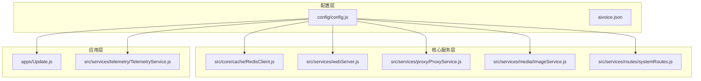

**图表来源**
- [config.js](file://config/config.js#L1-L631)
- [RedisClient.js](file://src/core/cache/RedisClient.js#L1-L130)
- [webServer.js](file://src/services/webServer.js#L1-L807)

**章节来源**
- [config.js](file://config/config.js#L1-L631)
- [webServer.js](file://src/services/webServer.js#L1-L807)

## 核心配置组件

### Redis 缓存配置

Redis 是系统的核心缓存组件，提供高性能的数据存储和会话管理功能。

**配置参数说明：**
- `redis.enabled`: 启用/禁用 Redis 功能
- `redis.host`: Redis 服务器地址，默认 127.0.0.1
- `redis.port`: Redis 端口，默认 6379
- `redis.password`: 认证密码（可选）
- `redis.db`: 数据库索引，默认 0

**连接特性：**
- 自动重连机制，指数退避策略
- 连接状态监控和错误处理
- 支持多种数据结构操作（字符串、列表、哈希、集合）

**使用场景：**
- 会话存储和认证令牌管理
- 图片元数据缓存
- 临时数据和队列管理
- 分布式锁和并发控制

**章节来源**
- [config.js](file://config/config.js#L271-L277)
- [RedisClient.js](file://src/core/cache/RedisClient.js#L10-L41)

### 图片存储配置

图片服务负责处理图片上传、转换和存储，支持多种格式和压缩选项。

**存储配置：**
- `images.storagePath`: 存储路径，默认 ./data/images
- `images.maxSize`: 文件大小限制，默认 10MB
- `images.allowedFormats`: 支持的格式列表，包括 jpg、jpeg、png、gif、webp

**处理能力：**
- 自动缩略图生成（200x200，webp 格式，80% 质量）
- 多格式转换支持
- 压缩优化和尺寸调整
- URL 验证和下载处理

**章节来源**
- [config.js](file://config/config.js#L278-L282)
- [ImageService.js](file://src/services/media/ImageService.js#L17-L33)

### Web 服务器配置

Web 服务器提供管理界面和 API 接口，支持多种部署模式。

**核心配置：**
- `web.port`: 服务器端口，默认 3000
- `web.sharePort`: TRSS 环境下共享端口模式
- `web.mountPath`: 挂载路径，默认 /chatai

**部署模式：**
- 独立端口模式：完全自管端口
- 共享端口模式：与 TRSS 环境集成
- 自动端口检测和冲突处理

**安全特性：**
- JWT 令牌认证系统
- 请求签名验证
- 防重放攻击机制
- CORS 跨域支持

**章节来源**
- [config.js](file://config/config.js#L283-L287)
- [webServer.js](file://src/services/webServer.js#L279-L311)

### 更新检查和自动更新配置

系统提供完整的版本管理和更新机制。

**更新配置：**
- `update.autoCheck`: 自动检查更新，默认开启
- `update.checkOnStart`: 启动时检查，默认开启
- `update.autoUpdate`: 自动更新，默认关闭
- `update.autoRestart`: 更新后自动重启，默认关闭
- `update.notifyMaster`: 通知主人，默认开启

**更新流程：**
1. 版本检查和差异分析
2. 自动更新和依赖安装
3. 重启和状态恢复
4. 错误回滚和恢复

**章节来源**
- [config.js](file://config/config.js#L288-L294)
- [Update.js](file://apps/Update.js#L166-L208)

### 代理配置和网络设置

代理服务支持多种网络代理协议和应用场景。

**代理配置：**
- `proxy.enabled`: 全局代理开关
- `proxy.profiles`: 代理配置列表
- `proxy.scopes`: 环境作用域配置

**支持的代理类型：**
- HTTP/HTTPS 代理
- SOCKS4/SOCKS5 代理
- 配置缓存和复用机制

**作用域管理：**
- `browser`: 浏览器/Puppeteer 环境
- `api`: 通用 API 请求
- `channel`: LLM 渠道 API

**章节来源**
- [config.js](file://config/config.js#L295-L303)
- [ProxyService.js](file://src/services/proxy/ProxyService.js#L13-L59)

## 架构概览

系统采用分层架构设计，各组件职责明确，通过配置驱动实现灵活的运行时行为。

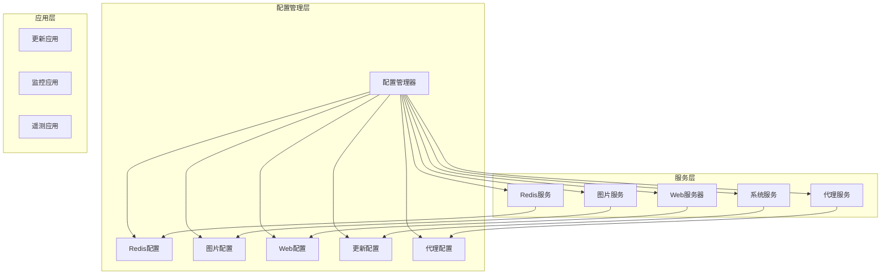

**图表来源**
- [config.js](file://config/config.js#L62-L586)
- [webServer.js](file://src/services/webServer.js#L279-L286)

## 详细组件分析

### Redis 缓存系统

Redis 客户端实现了完整的连接管理和数据操作接口。

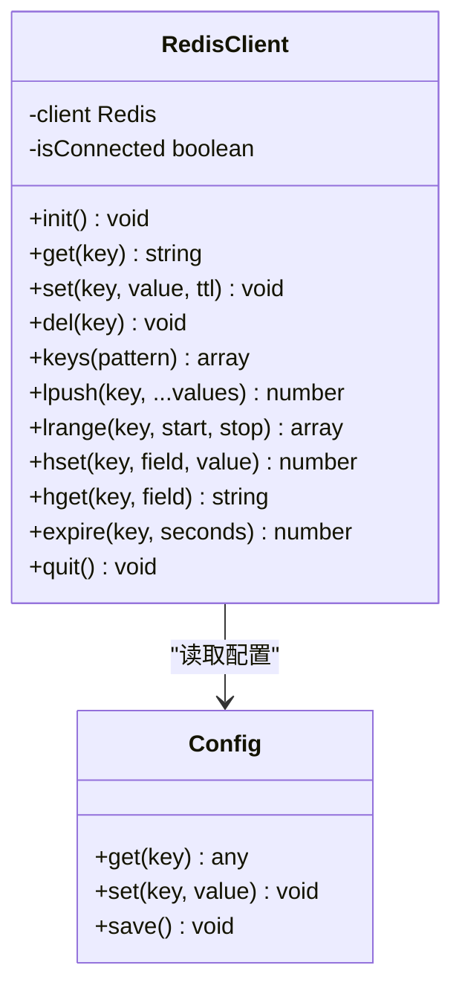

**图表来源**
- [RedisClient.js](file://src/core/cache/RedisClient.js#L4-L127)
- [config.js](file://config/config.js#L596-L626)

**连接流程：**
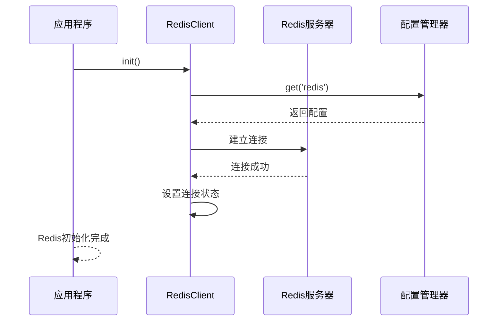

**图表来源**
- [RedisClient.js](file://src/core/cache/RedisClient.js#L10-L41)
- [config.js](file://config/config.js#L10-L11)

**章节来源**
- [RedisClient.js](file://src/core/cache/RedisClient.js#L1-L130)

### Web 服务器架构

Web 服务器支持多种部署模式和安全机制。

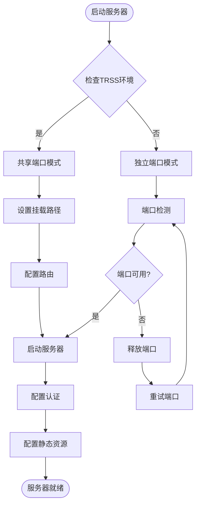

**图表来源**
- [webServer.js](file://src/services/webServer.js#L582-L673)

**认证流程：**
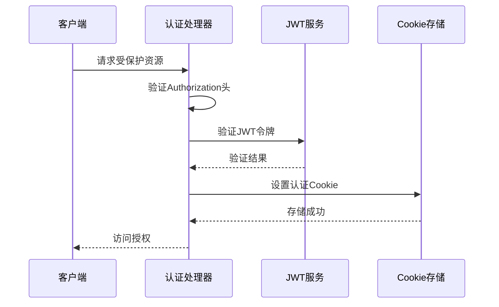

**图表来源**
- [webServer.js](file://src/services/webServer.js#L313-L337)

**章节来源**
- [webServer.js](file://src/services/webServer.js#L1-L807)

### 图片处理系统

图片服务提供了完整的图片处理和存储解决方案。

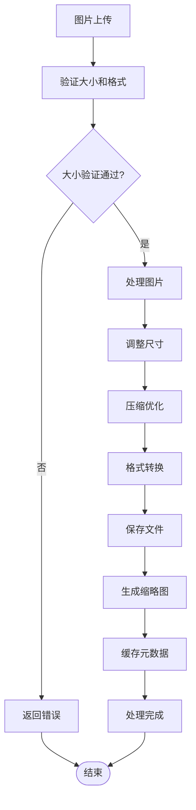

**图表来源**
- [ImageService.js](file://src/services/media/ImageService.js#L41-L86)

**处理流程：**
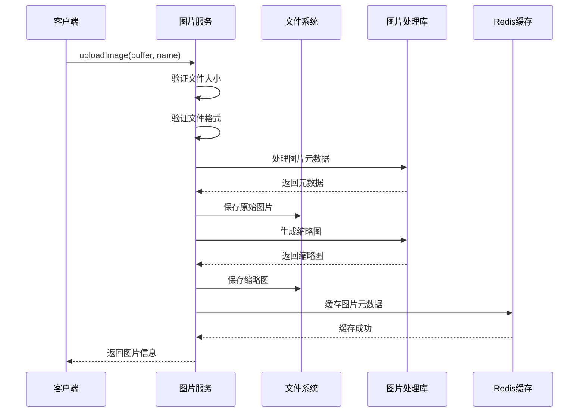

**图表来源**
- [ImageService.js](file://src/services/media/ImageService.js#L41-L86)

**章节来源**
- [ImageService.js](file://src/services/media/ImageService.js#L1-L849)

### 更新管理系统

更新系统提供了完整的版本管理和自动化更新能力。

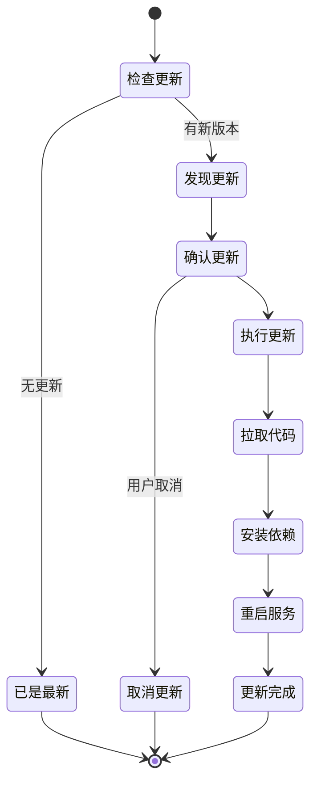

**图表来源**
- [Update.js](file://apps/Update.js#L166-L208)

**更新流程：**
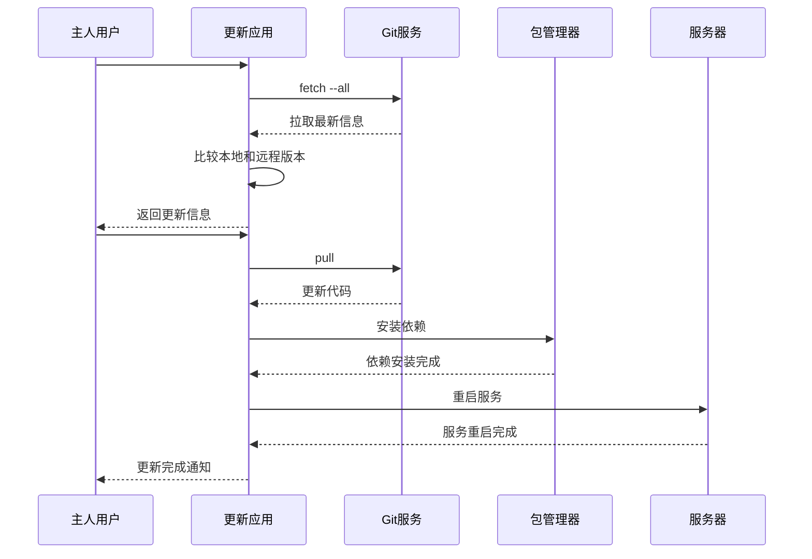

**图表来源**
- [Update.js](file://apps/Update.js#L246-L347)

**章节来源**
- [Update.js](file://apps/Update.js#L1-L362)

## 依赖关系分析

系统配置的依赖关系体现了清晰的分层架构和模块化设计。

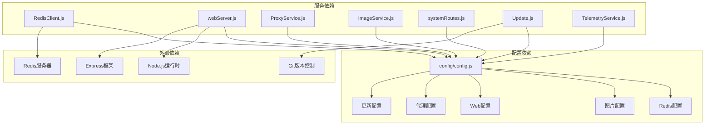

**图表来源**
- [config.js](file://config/config.js#L62-L586)
- [RedisClient.js](file://src/core/cache/RedisClient.js#L1-L130)
- [webServer.js](file://src/services/webServer.js#L1-L807)

**章节来源**
- [config.js](file://config/config.js#L1-L631)

## 性能考虑

### Redis 性能优化

1. **连接池管理**
   - 合理设置连接数，避免过多连接导致资源浪费
   - 使用连接复用和缓存机制
   - 监控连接状态和错误率

2. **数据结构选择**
   - 根据使用场景选择合适的数据结构
   - 合理设置 TTL，避免内存泄漏
   - 定期清理过期数据

### 图片处理优化

1. **异步处理**
   - 大图片处理使用异步方式
   - 批量操作时使用队列管理
   - 合理设置超时时间

2. **缓存策略**
   - 元数据缓存 24 小时
   - 缩略图缓存提升访问速度
   - CDN 加速静态资源

### Web 服务器优化

1. **负载均衡**
   - 共享端口模式减少资源占用
   - 合理设置静态资源缓存
   - 压缩传输内容

2. **安全优化**
   - JWT 令牌有效期控制
   - 请求频率限制
   - 输入验证和过滤

## 故障排除指南

### Redis 连接问题

**常见问题：**
- 连接超时：检查网络连通性和防火墙设置
- 认证失败：验证密码和权限配置
- 内存不足：监控内存使用情况，调整缓存策略

**诊断步骤：**
1. 检查 Redis 服务状态
2. 验证连接参数配置
3. 查看连接日志和错误信息

### 图片处理异常

**问题类型：**
- 格式不支持：检查允许的图片格式列表
- 大小超限：调整 maxSize 配置
- 处理失败：检查磁盘空间和权限

**解决方法：**
1. 验证输入图片的有效性
2. 检查存储路径权限
3. 监控系统资源使用情况

### Web 服务器问题

**端口冲突：**
- 自动检测和释放占用端口
- 检查防火墙规则
- 验证 TRSS 环境配置

**认证失败：**
- 检查 JWT 密钥配置
- 验证令牌有效期
- 查看认证日志

**章节来源**
- [RedisClient.js](file://src/core/cache/RedisClient.js#L33-L40)
- [ImageService.js](file://src/services/media/ImageService.js#L42-L54)
- [webServer.js](file://src/services/webServer.js#L645-L668)

## 结论

本系统配置文档详细阐述了 ChatAI 插件的各项配置选项和使用方法。通过合理的配置，用户可以实现：

1. **高性能的缓存系统**：利用 Redis 提供的高速缓存能力
2. **可靠的图片处理**：支持多种格式和优化策略
3. **灵活的部署模式**：支持独立和共享端口部署
4. **完善的更新机制**：自动化版本管理和更新流程
5. **全面的监控体系**：实时监控系统状态和性能指标

建议用户根据实际需求调整配置参数，并定期监控系统性能，确保系统的稳定运行。