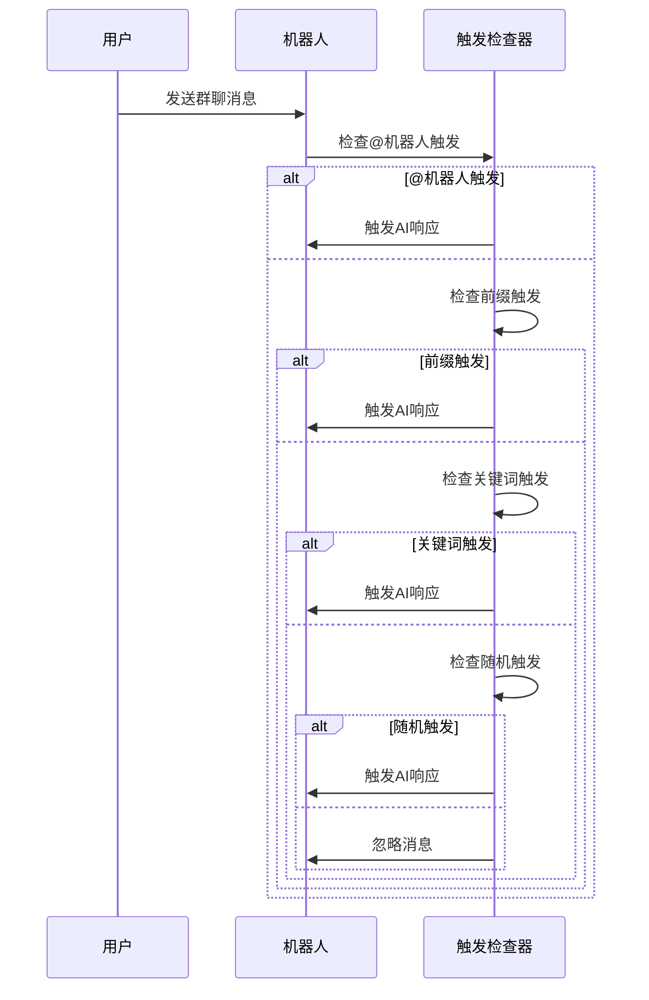
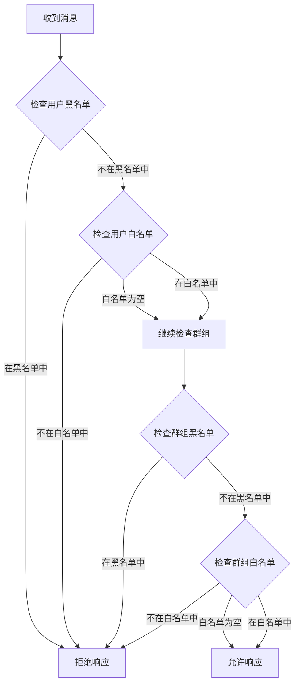

# 触发配置


## 目录
1. [简介](#简介)
2. [触发配置概述](#触发配置概述)
3. [私聊触发模式](#私聊触发模式)
4. [群聊触发模式](#群聊触发模式)
5. [关键词触发配置](#关键词触发配置)
6. [随机触发配置](#随机触发配置)
7. [前缀人格配置](#前缀人格配置)
8. [黑白名单管理](#黑白名单管理)
9. [触发前缀列表配置](#触发前缀列表配置)
10. [触发策略优化建议](#触发策略优化建议)
11. [安全配置指南](#安全配置指南)
12. [架构流程图](#架构流程图)
13. [总结](#总结)

## 简介

触发配置是 ChatAI 插件中最重要的功能之一，它决定了 AI 何时以及如何响应用户的消息。本文档将深入解释 AI 触发机制的各种配置选项，包括私聊和群聊的触发模式设置、关键词触发、随机触发、黑白名单管理等核心功能。

## 触发配置概述

触发配置主要分为两个部分：全局触发配置和群组独立配置。全局配置定义了基本的触发行为，而群组独立配置允许每个群组拥有自己的触发规则。

```mermaid
graph TB
subgraph "触发配置结构"
A[全局触发配置] --> B[私聊配置]
A --> C[群聊配置]
A --> D[触发词配置]
A --> E[黑白名单配置]
B --> B1[触发模式]
B --> B2[响应开关]
C --> C1[@机器人触发]
C --> C2[前缀触发]
C --> C3[关键词触发]
C --> C4[随机触发]
D --> D1[触发前缀列表]
D --> D2[触发关键词列表]
E --> E1[用户黑名单]
E --> E2[用户白名单]
E --> E3[群组黑名单]
E --> E4[群组白名单]
end
```

**图表来源**
- [config.js](file://config/config.js#L563-L584)
- [chat.js](file://apps/chat.js#L208-L240)

## 私聊触发模式

私聊触发模式提供了三种不同的响应方式：

### 始终响应模式 (always)
在始终响应模式下，机器人会响应所有私聊消息，无需任何触发条件。

### 前缀触发模式 (prefix)
需要用户发送特定的触发前缀才能激活 AI 响应。

### @触发模式 (at)
需要用户明确 @ 机器人才能触发 AI 响应。

```mermaid
flowchart TD
A[收到私聊消息] --> B{检查私聊配置}
B --> |enabled=false| C[忽略消息]
B --> |enabled=true| D{检查触发模式}
D --> |always| E[触发AI响应]
D --> |prefix| F{检查触发前缀}
F --> |匹配| E
F --> |不匹配| G[忽略消息]
D --> |at| H{检查@机器人}
H --> |是| E
H --> |否| G
```

**图表来源**
- [chat.js](file://apps/chat.js#L302-L323)
- [config.js](file://config/config.js#L565-L568)

**章节来源**
- [config.js](file://config/config.js#L565-L568)
- [chat.js](file://apps/chat.js#L302-L323)

## 群聊触发模式

群聊触发模式提供了四种不同的触发方式，可以根据需要灵活组合使用。

### @机器人触发 (@触发)
当消息中包含 @ 机器人的提及时触发 AI 响应。这是最常用和最安全的触发方式。

### 前缀触发
当消息以特定的触发前缀开头时触发 AI 响应。支持多个自定义前缀。

### 引用机器人触发
当用户回复或引用机器人的消息时触发 AI 响应。

### 关键词触发
当消息内容包含预设的关键词时触发 AI 响应。

### 随机触发
基于设定的概率随机触发 AI 响应，用于营造更自然的聊天氛围。



**图表来源**
- [chat.js](file://apps/chat.js#L325-L381)
- [config.js](file://config/config.js#L569-L576)

**章节来源**
- [config.js](file://config/config.js#L569-L576)
- [chat.js](file://apps/chat.js#L325-L381)

## 关键词触发配置

关键词触发允许用户通过预设的关键词列表来触发 AI 响应。关键词触发具有最高优先级，会优先于其他触发方式。

### 关键词配置方法

关键词触发需要满足以下条件：
1. 群聊配置中启用 `keyword` 模式
2. 配置 `keywords` 关键词列表
3. 消息内容包含列表中的任意一个关键词

### 关键词匹配逻辑

关键词匹配采用简单的包含检查，只要消息中包含任何一个关键词就会触发响应。

**章节来源**
- [config.js](file://config/config.js#L573-L576)
- [chat.js](file://apps/chat.js#L363-L370)

## 随机触发配置

随机触发是一种基于概率的触发方式，用于增加聊天的趣味性和自然性。

### 随机触发参数

- **启用开关**: 控制是否启用随机触发功能
- **触发概率**: 设置随机触发的概率值，范围通常在 0-0.5 之间

### 随机触发应用场景

随机触发特别适用于以下场景：
- 群聊活跃度管理
- 增加聊天的意外性和趣味性
- 模拟真实用户的随机发言

**章节来源**
- [config.js](file://config/config.js#L574-L576)
- [chat.js](file://apps/chat.js#L372-L378)

## 前缀人格配置

前缀人格功能允许为不同的触发前缀绑定不同的预设人格，实现更加个性化的聊天体验。

### 前缀人格工作机制

前缀人格通过 `prefixPersonas` 配置实现，每个前缀人格包含：
- **前缀**: 触发该人格的特定前缀
- **预设**: 对应的人格预设名称

### 前缀匹配优先级

1. 首先检查前缀人格匹配
2. 然后检查普通前缀匹配
3. 最后检查其他触发方式

**章节来源**
- [config.js](file://config/config.js#L580-L583)
- [chat.js](file://apps/chat.js#L386-L412)

## 黑白名单管理

黑白名单功能提供了精细的访问控制机制，可以精确控制哪些用户或群组能够触发 AI 响应。

### 用户黑白名单

用户级别的黑白名单控制单个用户的访问权限。

#### 黑名单 (Blacklist)
- **作用**: 拒绝特定用户触发 AI 响应
- **配置**: 在 `blacklistUsers` 中添加用户 QQ 号
- **优先级**: 黑名单优先级高于白名单

#### 白名单 (Whitelist)
- **作用**: 仅允许特定用户触发 AI 响应
- **配置**: 在 `whitelistUsers` 中添加用户 QQ 号
- **注意**: 当设置了白名单时，只有白名单中的用户才能触发

### 群组黑白名单

群组级别的黑白名单控制整个群组的访问权限。

#### 群组黑名单
- **作用**: 完全忽略特定群组的消息
- **配置**: 在 `blacklistGroups` 中添加群组 ID

#### 群组白名单
- **作用**: 仅允许特定群组触发 AI 响应
- **配置**: 在 `whitelistGroups` 中添加群组 ID



**图表来源**
- [chat.js](file://apps/chat.js#L245-L259)
- [chat.js](file://apps/chat.js#L267-L293)

**章节来源**
- [config.js](file://config/config.js#L580-L583)
- [chat.js](file://apps/chat.js#L245-L259)
- [chat.js](file://apps/chat.js#L267-L293)

## 触发前缀列表配置

触发前缀列表允许用户配置多个自定义前缀来触发 AI 响应，增加了使用的灵活性。

### 前缀配置方法

触发前缀通过 `prefixes` 配置项管理：
- **添加前缀**: 在列表中添加新的前缀字符串
- **移除前缀**: 从列表中删除不需要的前缀
- **前缀优先级**: 按照列表中的顺序进行匹配检查

### 前缀匹配逻辑

前缀匹配采用严格的前缀检查：
1. 检查消息是否以某个前缀开头
2. 如果匹配，移除前缀并触发 AI 响应
3. 如果不匹配，继续检查下一个前缀

### 前缀安全考虑

- 建议使用独特的前缀避免与其他插件冲突
- 避免使用过于常见的前缀
- 定期审查和清理不再使用的前缀

**章节来源**
- [config.js](file://config/config.js#L577-L578)
- [chat.js](file://apps/chat.js#L386-L412)

## 触发策略优化建议

基于对代码实现的分析，以下是触发策略的优化建议：

### 1. 触发模式选择建议

**私聊场景**:
- 推荐使用 `prefix` 模式，平衡易用性和安全性
- 在需要严格控制的环境中使用 `at` 模式
- 避免使用 `always` 模式，可能导致不必要的资源消耗

**群聊场景**:
- 建议同时启用 `@触发` 和 `前缀触发`
- 根据群组活跃度调整触发策略
- 对于活跃群组可考虑启用 `随机触发`

### 2. 性能优化建议

**消息去重机制**:
- 系统内置了完善的消息去重机制
- 避免重复处理相同消息，提高系统性能
- 减少不必要的 AI 调用次数

**缓存策略**:
- 群组触发配置采用缓存机制
- 缓存 TTL 为 60 秒，平衡实时性和性能

### 3. 安全性优化建议

**输入验证**:
- 系统会对消息内容进行严格的解析和验证
- 防止恶意消息格式导致的异常
- 支持多种消息类型的统一处理

**权限控制**:
- 实施多层次的权限控制机制
- 支持用户和群组级别的细粒度控制
- 提供黑白名单功能防止滥用

## 安全配置指南

### 1. 基础安全配置

**调试模式控制**:
- 在生产环境中禁用调试模式
- 调试信息可能暴露敏感的内部状态
- 调试模式仅用于问题排查

**消息处理安全**:
- 系统自动过滤自身发送的消息
- 防止消息回环和重复处理
- 支持多种协议的安全消息处理

### 2. 访问控制安全

**用户权限管理**:
- 优先检查黑名单，确保安全第一
- 白名单仅在需要时启用
- 定期审查和更新权限列表

**群组安全管理**:
- 建议为高风险群组启用黑名单
- 对于重要群组可考虑白名单机制
- 定期检查群组权限配置的有效性

### 3. 触发安全配置

**触发频率控制**:
- 合理设置随机触发概率
- 避免过高的触发频率影响用户体验
- 根据群组活跃度调整触发策略

**关键词安全**:
- 定期审查关键词列表
- 避免包含可能引起争议的内容
- 考虑文化差异和地区法规

### 4. 监控和审计

**日志记录**:
- 系统会记录重要的触发事件
- 支持调试模式下的详细日志
- 建议定期检查日志发现异常模式

**性能监控**:
- 监控触发响应时间和成功率
- 关注资源使用情况
- 及时发现和解决性能问题

**章节来源**
- [messageDedup.js](file://src/utils/messageDedup.js#L1-L368)
- [messageParser.js](file://src/utils/messageParser.js#L1-L800)

## 架构流程图

```mermaid
graph TB
subgraph "消息接收层"
A[用户消息] --> B[消息解析器]
end
subgraph "触发检查层"
B --> C{私聊检查}
C --> |私聊| D{触发模式检查}
C --> |群聊| E{群聊触发检查}
D --> F{always模式}
D --> G{prefix模式}
D --> H{@触发模式}
E --> I{@机器人触发}
E --> J{前缀触发}
E --> K{关键词触发}
E --> L{随机触发}
end
subgraph "权限控制层"
M[黑白名单检查] --> N{用户权限}
O[群组权限检查] --> N
N --> P{访问控制}
end
subgraph "AI响应层"
Q[AI服务] --> R[消息处理]
R --> S[响应生成]
end
F --> M
G --> M
H --> M
I --> M
J --> M
K --> M
L --> M
P --> Q
```

**图表来源**
- [chat.js](file://apps/chat.js#L109-L203)
- [config.js](file://config/config.js#L563-L584)

## 总结

触发配置是 ChatAI 插件的核心功能之一，通过灵活的配置选项实现了多样化的触发机制。本文档详细介绍了私聊和群聊的触发模式、关键词触发、随机触发、前缀人格、黑白名单管理等核心功能。

### 关键要点

1. **多模式支持**: 私聊支持始终响应、前缀触发、@触发三种模式；群聊支持四种触发方式
2. **精细化控制**: 通过黑白名单实现用户和群组级别的细粒度控制
3. **性能优化**: 内置消息去重和缓存机制，确保系统高效运行
4. **安全考虑**: 多层次的安全防护和权限控制机制
5. **灵活配置**: 通过 Web 管理面板提供直观的配置界面

### 最佳实践

- 根据使用场景选择合适的触发模式组合
- 合理设置触发概率和频率，避免过度触发
- 定期审查和更新黑白名单，确保安全合规
- 监控系统性能和使用情况，及时调整配置
- 在生产环境中谨慎使用调试功能

通过合理配置触发参数，可以实现既安全又高效的 AI 聊天体验，满足不同场景下的需求。
