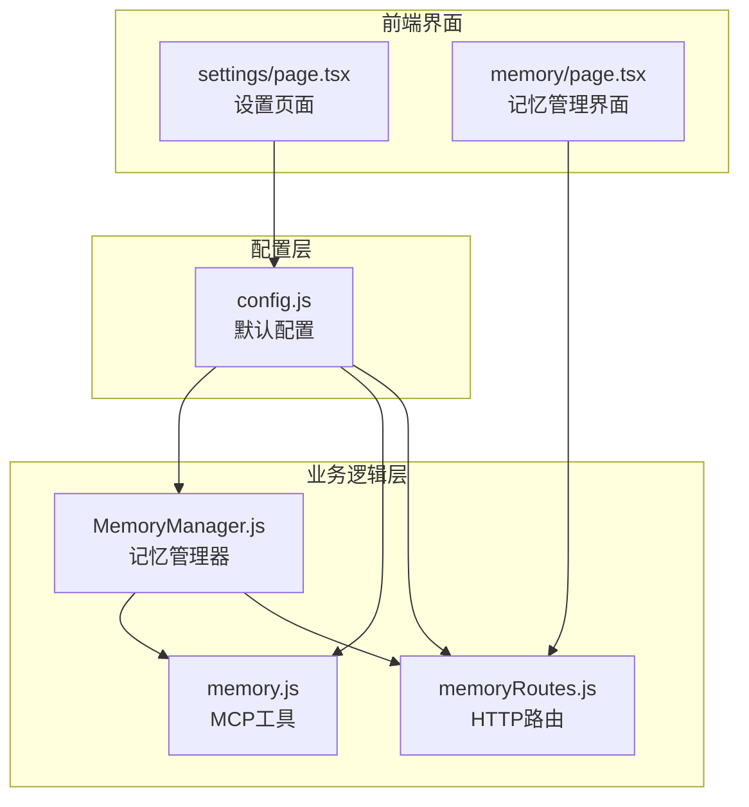
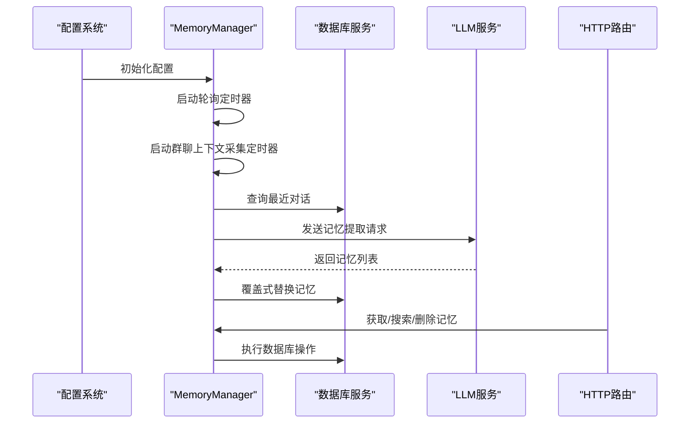
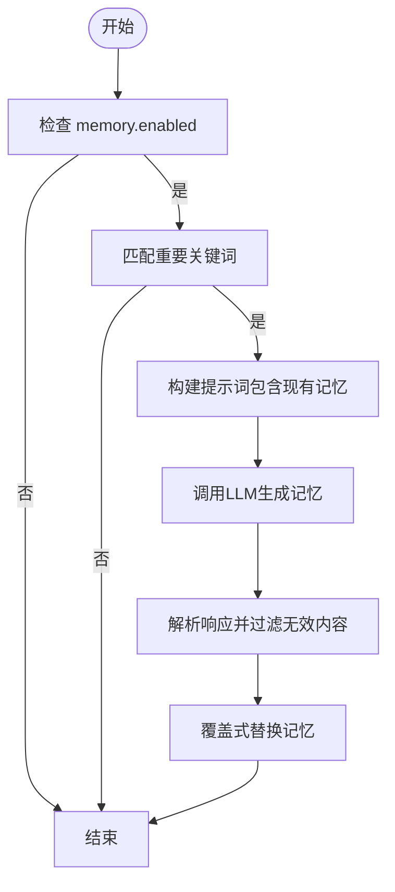
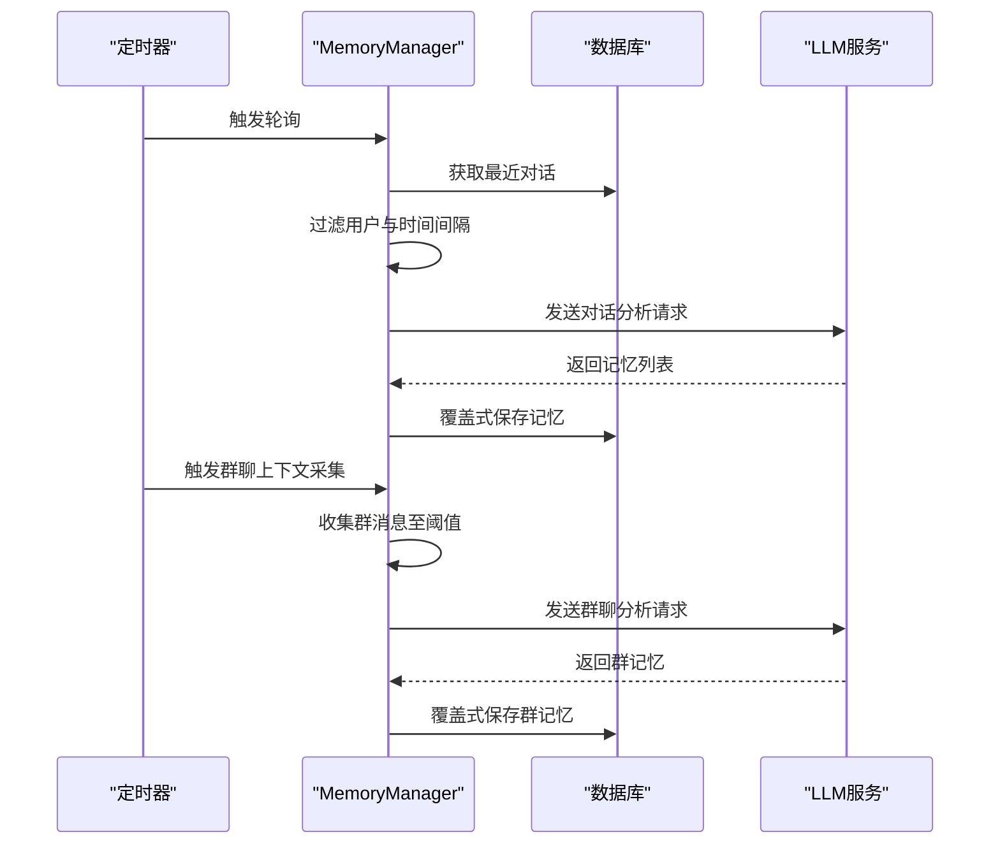
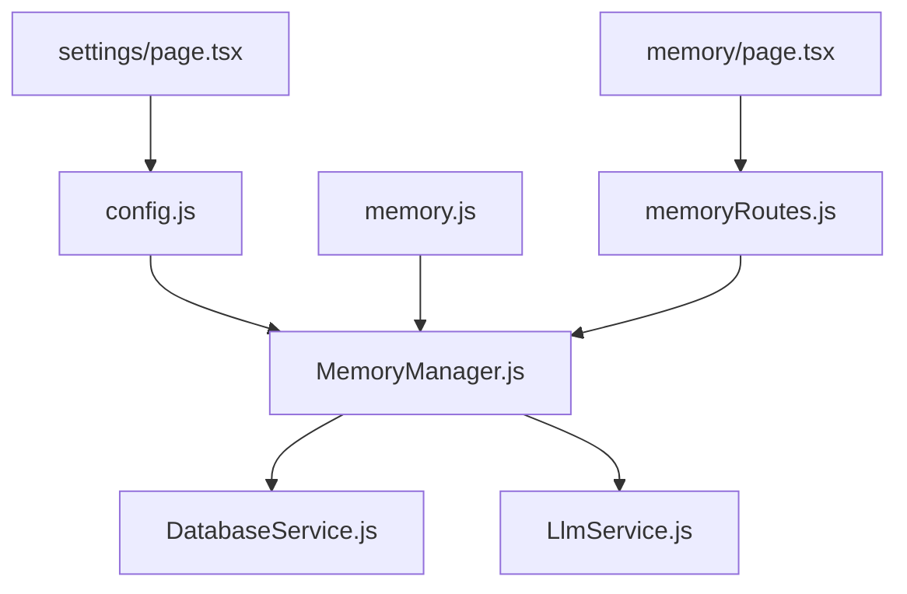

# 记忆配置

<cite>
**本文档引用的文件**
- [MemoryManager.js](file://src/services/storage/MemoryManager.js)
- [config.js](file://config/config.js)
- [memory.js](file://src/mcp/tools/memory.js)
- [memoryRoutes.js](file://src/services/routes/memoryRoutes.js)
- [page.tsx](file://frontend/app/(dashboard)/settings/page.tsx)
- [page.tsx](file://frontend/app/(dashboard)/memory/page.tsx)
</cite>

## 目录
1. [简介](#简介)
2. [项目结构](#项目结构)
3. [核心组件](#核心组件)
4. [架构概览](#架构概览)
5. [详细组件分析](#详细组件分析)
6. [依赖分析](#依赖分析)
7. [性能考虑](#性能考虑)
8. [故障排除指南](#故障排除指南)
9. [结论](#结论)

## 简介
本文件详细说明记忆配置系统的配置选项和工作机制。重点涵盖：
- 存储方式（storage）
- 自动提取功能（autoExtract）
- 轮询间隔（pollInterval）
- 每用户最大记忆数（maxMemories）
- 记忆提取模型的选择
- 群聊上下文采集的各项参数（采集间隔、消息数量限制、分析阈值等）
- 记忆提取功能的触发条件和处理流程
- 性能优化建议和存储管理策略

## 项目结构
记忆配置位于配置文件中，核心逻辑在 MemoryManager 类中实现，并通过 MCP 工具和路由接口对外提供能力。

**图表来源**
- [config.js](file://config/config.js#L343-L360)
- [MemoryManager.js](file://src/services/storage/MemoryManager.js#L12-L56)
- [memory.js](file://src/mcp/tools/memory.js#L6-L179)
- [memoryRoutes.js](file://src/services/routes/memoryRoutes.js#L1-L137)

**章节来源**
- [config.js](file://config/config.js#L343-L360)
- [MemoryManager.js](file://src/services/storage/MemoryManager.js#L12-L56)

## 核心组件
- 记忆管理器（MemoryManager）：负责周期性轮询、自动提取、群聊上下文采集与分析、记忆存储与清理。
- 配置系统（Config）：提供默认配置、读取与合并用户配置。
- MCP 工具：提供记忆的增删改查接口。
- HTTP 路由：提供 RESTful API 供前端调用。

**章节来源**
- [MemoryManager.js](file://src/services/storage/MemoryManager.js#L12-L56)
- [config.js](file://config/config.js#L600-L627)
- [memory.js](file://src/mcp/tools/memory.js#L6-L179)
- [memoryRoutes.js](file://src/services/routes/memoryRoutes.js#L1-L137)

## 架构概览
记忆系统采用配置驱动的异步处理架构，MemoryManager 作为核心协调者，依据配置决定是否启用自动提取、轮询频率、群聊上下文采集等行为。

**图表来源**
- [MemoryManager.js](file://src/services/storage/MemoryManager.js#L36-L81)
- [memoryRoutes.js](file://src/services/routes/memoryRoutes.js#L70-L134)

## 详细组件分析

### 配置选项详解
- memory.enabled：总开关，控制是否启用记忆功能。
- memory.storage：存储方式，当前为数据库存储。
- memory.autoExtract：是否自动从对话中提取记忆。
- memory.pollInterval：轮询间隔（分钟），用于周期性分析用户对话并提取记忆。
- memory.maxMemories：每用户最大记忆数，超出时按时间顺序清理最旧记忆。
- memory.model：记忆提取使用的模型，留空则使用默认模型。
- memory.groupContext.enabled：是否启用群聊上下文采集。
- memory.groupContext.collectInterval：群聊上下文采集间隔（分钟）。
- memory.groupContext.maxMessagesPerCollect：每次采集的最大消息数。
- memory.groupContext.analyzeThreshold：触发分析的最小消息数。
- memory.groupContext.extractUserInfo/extractTopics/extractRelations：是否提取用户信息、话题、关系。

**章节来源**
- [config.js](file://config/config.js#L343-L360)

### 记忆存储与清理策略
- 存储方式：数据库存储，MemoryManager 初始化时连接数据库。
- 清理策略：当记忆数量超过 maxMemories 时，按时间倒序保留最新记录，删除最旧的部分。
- 覆盖式替换：分析得到的新记忆会先清空旧记忆，再保存新记忆，确保去重和时效性。

**章节来源**
- [MemoryManager.js](file://src/services/storage/MemoryManager.js#L904-L932)
- [MemoryManager.js](file://src/services/storage/MemoryManager.js#L694-L716)

### 自动提取功能
- 触发条件：当用户消息包含特定关键词（如“我”、“记住”、“以后”等）时，触发自动提取。
- 处理流程：构建包含现有记忆和新对话的提示词，调用 LLM 生成记忆列表，解析并覆盖保存。
- 模型选择：优先使用 memory.model，否则回退到默认模型。

**图表来源**
- [MemoryManager.js](file://src/services/storage/MemoryManager.js#L724-L808)

**章节来源**
- [MemoryManager.js](file://src/services/storage/MemoryManager.js#L724-L808)

### 轮询与上下文分析
- 轮询机制：启动定时器，按 pollInterval 轮询最近活跃用户，分析其最近对话并提取记忆。
- 最小轮询间隔：minPollInterval 控制同一用户两次分析之间的最短时间间隔。
- 群聊上下文采集：按 collectInterval 收集群消息，达到 analyzeThreshold 后进行分析，提取用户信息、话题、关系。

**图表来源**
- [MemoryManager.js](file://src/services/storage/MemoryManager.js#L36-L81)
- [MemoryManager.js](file://src/services/storage/MemoryManager.js#L489-L529)
- [MemoryManager.js](file://src/services/storage/MemoryManager.js#L86-L107)

**章节来源**
- [MemoryManager.js](file://src/services/storage/MemoryManager.js#L36-L81)
- [MemoryManager.js](file://src/services/storage/MemoryManager.js#L489-L529)
- [MemoryManager.js](file://src/services/storage/MemoryManager.js#L86-L107)

### MCP 工具与路由接口
- MCP 工具：提供保存、获取、搜索、删除用户记忆的能力，支持类型筛选和关键词搜索。
- HTTP 路由：提供 RESTful API，包括获取用户列表、搜索记忆、群聊总结、用户记忆总结、删除记忆等。

**章节来源**
- [memory.js](file://src/mcp/tools/memory.js#L6-L179)
- [memoryRoutes.js](file://src/services/routes/memoryRoutes.js#L1-L137)

### 前端配置界面
- 设置页面：提供 memory.enabled、memory.autoExtract、memory.model 等配置项的可视化编辑。
- 记忆管理界面：支持添加、删除、搜索用户记忆，展示记忆来源与时间戳。

**章节来源**
- [page.tsx](file://frontend/app/(dashboard)/settings/page.tsx#L2332-L2360)
- [page.tsx](file://frontend/app/(dashboard)/memory/page.tsx#L99-L140)

## 依赖分析
- MemoryManager 依赖配置系统（读取 memory.* 配置）、数据库服务（读写记忆）、LLM 服务（调用模型进行记忆提取）。
- MCP 工具与 HTTP 路由均依赖 MemoryManager 进行业务处理。
- 前端设置页面与记忆管理界面通过 API 与后端交互。

**图表来源**
- [MemoryManager.js](file://src/services/storage/MemoryManager.js#L1-L8)
- [memory.js](file://src/mcp/tools/memory.js#L24-L52)
- [memoryRoutes.js](file://src/services/routes/memoryRoutes.js#L10-L18)

**章节来源**
- [MemoryManager.js](file://src/services/storage/MemoryManager.js#L1-L8)
- [memory.js](file://src/mcp/tools/memory.js#L24-L52)
- [memoryRoutes.js](file://src/services/routes/memoryRoutes.js#L10-L18)

## 性能考虑
- 轮询频率与资源消耗：pollInterval 和 minPollInterval 控制轮询频率，建议根据用户规模和服务器负载合理设置，避免过度轮询。
- 群聊上下文阈值：analyzeThreshold 和 maxMessagesPerCollect 控制上下文分析的触发条件与处理量，防止大量消息导致的性能问题。
- 记忆数量上限：maxMemories 限制每用户记忆数量，配合覆盖式替换减少数据库压力。
- 模型调用成本：memory.model 的选择直接影响 API 调用成本与响应时间，建议在满足质量的前提下选择合适模型。
- 数据库清理：定期清理最旧记忆，避免表膨胀影响查询性能。

## 故障排除指南
- 记忆未被提取：检查 memory.enabled 与 memory.autoExtract 是否开启，确认用户消息是否包含触发关键词。
- 轮询无效：确认 memory.pollInterval 设置是否合理，检查定时器是否正常启动。
- 群聊上下文未分析：检查 memory.groupContext.enabled、collectInterval、analyzeThreshold 是否正确配置。
- 记忆数量异常：核对 memory.maxMemories 设置，确认覆盖式替换逻辑是否正常执行。
- API 调用失败：检查 memory.model 配置与 LLM 服务可用性，查看统计记录中的错误信息。

**章节来源**
- [MemoryManager.js](file://src/services/storage/MemoryManager.js#L36-L81)
- [MemoryManager.js](file://src/services/storage/MemoryManager.js#L489-L529)
- [MemoryManager.js](file://src/services/storage/MemoryManager.js#L724-L808)

## 结论
记忆配置系统通过配置驱动实现了灵活的记忆管理能力，包括自动提取、周期轮询、群聊上下文分析与存储清理。合理配置各项参数可以在保证效果的同时控制资源消耗。建议根据实际场景调整轮询频率、上下文阈值与记忆上限，并选择合适的模型以平衡性能与质量。