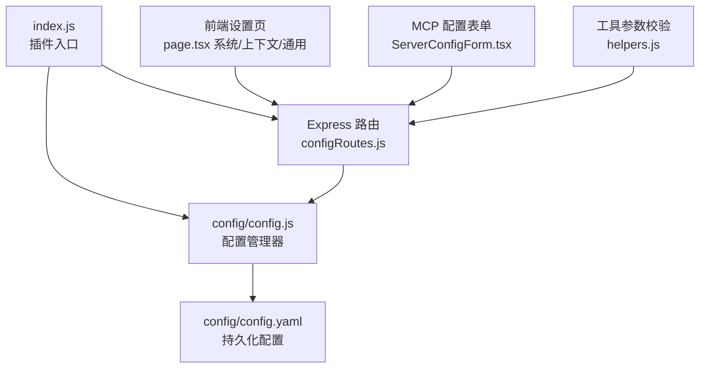
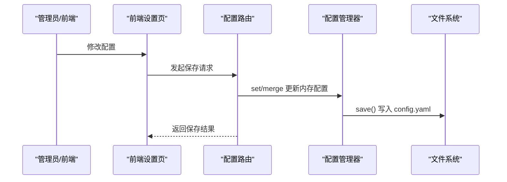
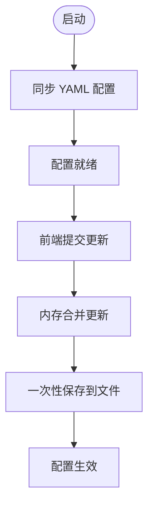
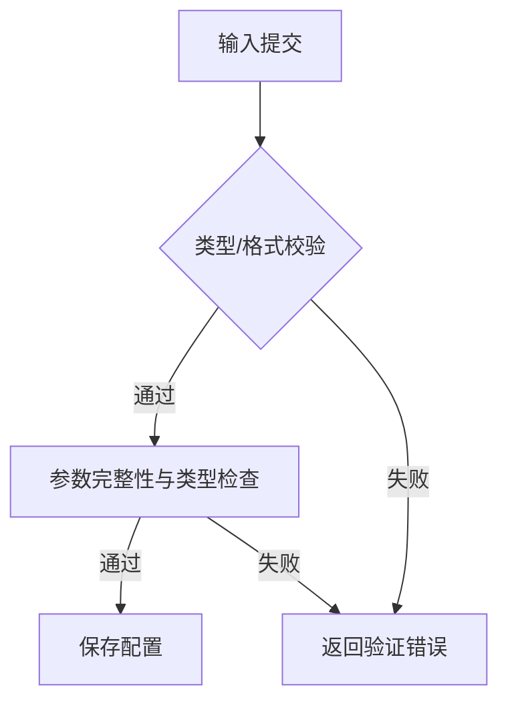
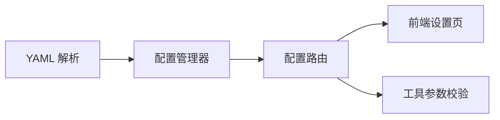

# 配置管理

## 目录
1. [简介](#简介)
2. [项目结构](#项目结构)
3. [核心组件](#核心组件)
4. [架构总览](#架构总览)
5. [详细组件分析](#详细组件分析)
6. [依赖分析](#依赖分析)
7. [性能考虑](#性能考虑)
8. [故障排查指南](#故障排查指南)
9. [结论](#结论)
10. [附录](#附录)

## 简介
本文件面向管理员与开发者，系统化阐述 ChatAI 插件的配置管理方案。内容涵盖 YAML 配置文件结构、字段释义、动态配置更新机制、配置验证规则、前端配置界面、以及迁移与版本兼容建议。目标是帮助读者快速理解并安全地维护与优化插件运行参数。

## 项目结构
- 配置文件采用 YAML 存储于 config/config.yaml，并由 config/config.js 提供读写与合并逻辑。
- 后端通过 Express 路由暴露配置读写接口；前端 Next.js 页面提供可视化配置界面。
- MCP 服务器配置在前端页面进行校验与提交，后端工具层对参数进行类型与必填项校验。

图表来源
- [index.js](file://index.js#L31-L46)
- [config.js](file://config/config.js#L18-L38)
- [configRoutes.js](file://src/services/routes/configRoutes.js#L11-L90)
- [page.tsx（系统设置）](file://frontend/app/(dashboard)/settings/system/page.tsx#L84-L138)
- [page.tsx（上下文设置）](file://frontend/app/(dashboard)/settings/context/page.tsx#L74-L106)
- [ServerConfigForm.tsx](file://frontend/components/mcp/ServerConfigForm.tsx#L34-L82)
- [helpers.js](file://src/mcp/tools/helpers.js#L707-L771)

章节来源
- [index.js](file://index.js#L31-L46)
- [config.js](file://config/config.js#L18-L38)

## 核心组件
- 配置管理器（Config 类）
  - 负责加载、合并、保存 YAML 配置；提供 get/set 方法；启动时同步数据目录下的 config.yaml。
  - 支持深度合并，确保新增字段不会破坏既有配置。
- 配置路由（configRoutes.js）
  - 提供统一的配置读取与更新接口，支持部分字段的 PATCH/PUT/POST。
  - 内存中先合并更新，最终一次性保存，减少频繁 IO。
- 前端配置界面
  - 系统设置、上下文设置、通用设置等页面，支持自动保存与手动保存。
  - MCP 服务器配置表单提供输入校验（类型、JSON 格式、URL 格式等）。
- 工具参数校验
  - 对 MCP 工具调用参数进行必填与类型校验，支持自动填充常用上下文参数。

章节来源
- [config.js](file://config/config.js#L8-L627)
- [configRoutes.js](file://src/services/routes/configRoutes.js#L11-L257)
- [page.tsx（系统设置）](file://frontend/app/(dashboard)/settings/system/page.tsx#L79-L116)
- [page.tsx（上下文设置）](file://frontend/app/(dashboard)/settings/context/page.tsx#L108-L116)
- [ServerConfigForm.tsx](file://frontend/components/mcp/ServerConfigForm.tsx#L34-L82)
- [helpers.js](file://src/mcp/tools/helpers.js#L707-L771)

## 架构总览
配置流从 YAML 文件到内存，再到 API 与前端界面，最终落盘保存。更新流程支持分步合并与一次性保存，保证一致性与性能。

图表来源
- [configRoutes.js](file://src/services/routes/configRoutes.js#L54-L90)
- [config.js](file://config/config.js#L591-L626)

## 详细组件分析

### YAML 配置文件结构与字段说明
- 基础配置（basic）
  - 命令前缀、调试开关、是否显示“思考中”提示、调试输出范围、是否引用回复、自动撤回策略等。
- 管理员配置（admin）
  - 主人QQ列表、插件作者QQ、登录通知、敏感命令权限等。
- 大模型配置（llm）
  - 默认模型、默认预设、嵌入模型与维度、模型分类（对话/工具/调度/图像/伪人/搜索）、备选模型轮询策略、兼容旧字段。
- 伪人模式（bym）
  - 开关、工具使用、触发概率、温度、最大 Token、系统提示词、继承人格、关键词映射、专属功能列表。
- 主动聊天（proactiveChat）
  - 全局开关、轮询间隔、最小消息阈值、并发触发上限、基础/最大触发概率、静默时段、时段概率乘数、星期乘数、活跃度检测、AI 参数、群组白/黑名单、防刷屏、记忆与上下文。
- 工具调用（tools）
  - 工具调用日志展示、转发消息、并行执行、中间回复、工具组模式、调度优先。
- 内置工具（builtinTools）
  - 开关、允许/禁用工具列表、危险工具清单、是否允许危险操作、启用的工具分类。
- 渠道配置（channels）
  - 多适配器渠道列表，包含 ID、名称、适配器类型、基础 URL、API Key、模型列表、优先级、启用状态、高级参数（流式、思考、LLM 超参）、策略、自定义头部、请求体模板、模型映射、图像处理、端点、鉴权、超时、重试、配额、权重、健康状态等。
- MCP 配置（mcp）
  - 开关。
- 缓存（redis）
  - 开关、主机、端口、密码、库索引。
- 图片（images）
  - 存储路径、最大大小、允许格式。
- Web（web）
  - 端口、共享端口、挂载路径、登录链接、JWT 密钥、公网地址、永久令牌、群管密钥。
- 更新（update）
  - 自动检查、启动时检查、自动更新、自动重启、通知主人。
- 代理（proxy）
  - 开关、代理档案、作用域（浏览器/API/通道）。
- 上下文（context）
  - 最大消息数、最大 Token、清理策略、自动总结（间隔、消息阈值、不活跃阈值、保留数量、模型、Token、窗口）、隔离模式（群/私聊）、自动上下文、自动结束（轮数、通知、提示）、群上下文传递、全局系统提示词与模式。
- 记忆（memory）
  - 开关、存储类型、自动提取、轮询间隔、最大记忆数、模型、群上下文采集（开关、间隔、每次最大消息、分析阈值、提取用户/话题/关系）。
- 预设（presets）
  - 默认 ID、是否允许用户切换、用户/群独立预设。
- 人格（personality）
  - 优先级、是否使用独立人格、独立上下文（开关、切换时清空）。
- 负载均衡（loadBalancing）
  - 策略。
- 思考（thinking）
  - 开关、默认深度、启用推理、显示内容、转发消息。
- 渲染（render）
  - 数学公式渲染、主题、宽度。
- 高级功能（features）
  - 群总结、个人画像、戳一戳、表情回应、撤回、入群/退群/禁言/管理员/运气王/荣誉/精华等事件响应、绘图（模型、视频模型、超时、最大图片数、API 列表、预设来源、自定义预设）、语音回复（兼容字段）。
- 语音（voice）
  - 全局开关、默认角色、最大文本长度。
- QQ 官方 Bot 代理（qqBotProxy）
  - 开关、代理地址、Bot 列表、自动重连、消息处理、IC 代发（全局/白/黑名单、回退、Markdown 模板、按钮）。
- 流式输出（streaming）
  - 开关。
- IP 探针（probe）
  - 服务地址、密钥。
- 触发（trigger）
  - 私聊/群聊开关与模式、@/前缀/关键词/随机触发、随机概率、前缀列表、关键词列表、群消息采集、黑白名单。

章节来源
- [config.yaml](file://config/config.yaml#L1-L800)
- [config.js](file://config/config.js#L62-L586)

### 动态配置更新机制
- 启动阶段
  - 插件入口在启动时创建 data 目录并调用配置管理器同步 YAML 文件，若不存在则生成默认配置并保存。
- 运行时更新
  - 前端页面通过路由提交配置更新，后端路由将更新合并到内存配置，最终一次性保存到文件，避免频繁 IO。
- 分段更新
  - 针对特定子配置（如 context、personality、proactiveChat、admin 等）提供专用路由，支持 PATCH/PUT/POST。
- 前端自动保存
  - 设置页实现防抖自动保存，提升用户体验。

图表来源
- [index.js](file://index.js#L31-L46)
- [config.js](file://config/config.js#L18-L38)
- [configRoutes.js](file://src/services/routes/configRoutes.js#L54-L90)
- [page.tsx（设置页）](file://frontend/app/(dashboard)/settings/page.tsx#L294-L330)

章节来源
- [index.js](file://index.js#L31-L46)
- [configRoutes.js](file://src/services/routes/configRoutes.js#L54-L90)
- [page.tsx（设置页）](file://frontend/app/(dashboard)/settings/page.tsx#L294-L330)

### 配置验证规则
- 前端 MCP 服务器配置表单
  - 校验类型：stdio 命令非空；npm/npx 包名格式；http/sse URL 格式；环境变量与请求头 JSON 格式。
- 工具参数校验
  - 必填参数缺失、类型不匹配（字符串/数字/布尔/数组/对象），支持从上下文自动填充 group_id/user_id。
- 路由层通用校验
  - 通过工厂函数 createConfigRoutes 提供统一的参数验证钩子，便于扩展。

图表来源
- [ServerConfigForm.tsx](file://frontend/components/mcp/ServerConfigForm.tsx#L34-L82)
- [helpers.js](file://src/mcp/tools/helpers.js#L707-L771)
- [routeFactory.js](file://src/services/middleware/routeFactory.js#L191-L215)

章节来源
- [ServerConfigForm.tsx](file://frontend/components/mcp/ServerConfigForm.tsx#L34-L82)
- [helpers.js](file://src/mcp/tools/helpers.js#L707-L771)
- [routeFactory.js](file://src/services/middleware/routeFactory.js#L191-L215)

### 环境变量支持
- 插件依赖 YAML 解析库，但当前配置文件以 YAML 为主，未直接声明环境变量注入逻辑。
- MCP 服务器配置表单支持在配置中附加 env 字段（JSON 格式），可用于向 MCP 进程传递环境变量。
- 若需环境变量注入，建议在部署层面通过进程环境或容器环境变量配合前端表单的 env 字段使用。

章节来源
- [package.json](file://package.json#L16-L45)
- [ServerConfigForm.tsx](file://frontend/components/mcp/ServerConfigForm.tsx#L335-L342)

### 配置迁移与版本兼容
- 默认配置与现有配置的合并策略
  - 启动时读取 YAML 并与默认配置进行深度合并，新增字段自动补全，避免因版本升级导致的配置丢失。
- 兼容字段
  - llm 中保留旧版 chatModel/codeModel/translationModel 字段，确保旧配置可平滑过渡。
- 版本建议
  - 升级前备份 config.yaml；升级后检查新增字段是否符合预期；利用默认配置合并机制自动补齐。

章节来源
- [config.js](file://config/config.js#L28-L57)

### 最佳实践建议
- 安全
  - 严格控制敏感字段（如 API Key、JWT 密钥、Redis 密码）的可见范围与访问权限。
  - 使用白名单与黑名单限制用户/群组的触发行为。
- 性能
  - 合理设置上下文最大消息数与 Token，避免过长上下文导致延迟与成本上升。
  - 使用工具组与调度模型减少不必要的工具调用。
  - 控制主动聊天的触发概率与时段乘数，避免打扰用户。
- 可维护性
  - 使用前端自动保存功能，减少误操作风险；必要时手动保存并核对变更。
  - 对渠道与 MCP 服务器配置进行分组管理，便于定位问题。

## 依赖分析
- 配置文件依赖
  - YAML 解析库用于读写 config.yaml。
- 后端依赖
  - Express 路由提供配置接口；工具层对参数进行二次校验。
- 前端依赖
  - Next.js 页面负责配置展示与交互；表单组件提供输入校验。

图表来源
- [package.json](file://package.json#L16-L45)
- [config.js](file://config/config.js#L1-L6)
- [configRoutes.js](file://src/services/routes/configRoutes.js#L4-L8)
- [helpers.js](file://src/mcp/tools/helpers.js#L1-L10)

章节来源
- [package.json](file://package.json#L16-L45)

## 性能考虑
- 配置更新
  - 内存合并后一次性保存，降低磁盘 IO 压力。
- 上下文与记忆
  - 合理设置 context.maxMessages/context.maxTokens 与 memory.pollInterval，避免频繁写入与计算。
- 主动聊天
  - 通过时段乘数与活跃度检测控制触发频率，减少无效对话。
- 渠道与 MCP
  - 为不同渠道设置合理的超时与重试策略，避免阻塞主流程。

## 故障排查指南
- 配置无法保存
  - 检查 data/config/config.yaml 的写权限；确认前端提交格式正确；查看后端日志中的保存调试信息。
- 参数校验失败
  - 前端表单会提示具体错误（如 URL 格式、JSON 格式、必填缺失）；工具参数校验会指出类型与缺失项。
- MCP 服务器连接异常
  - 检查表单中的类型与参数（命令/包名/URL），确认 env/headers 的 JSON 格式；查看 MCP 日志与健康状态字段。

章节来源
- [configRoutes.js](file://src/services/routes/configRoutes.js#L54-L90)
- [ServerConfigForm.tsx](file://frontend/components/mcp/ServerConfigForm.tsx#L34-L82)
- [helpers.js](file://src/mcp/tools/helpers.js#L707-L771)

## 结论
本配置管理方案以 YAML 为核心，结合内存合并与一次性保存策略，在保证易用性的同时兼顾稳定性与性能。通过前端可视化界面与严格的参数校验，管理员可以安全、高效地维护 ChatAI 插件的各项参数。建议在生产环境中遵循安全与性能最佳实践，并定期备份配置文件。

## 附录

### 配置类型与示例位置
- 基础配置（basic）：参考 [config.yaml](file://config/config.yaml#L1-L15)
- 管理员配置（admin）：参考 [config.yaml](file://config/config.yaml#L11-L15)
- 大模型配置（llm）：参考 [config.yaml](file://config/config.yaml#L16-L42)
- 伪人模式（bym）：参考 [config.yaml](file://config/config.yaml#L43-L57)
- 主动聊天（proactiveChat）：参考 [config.yaml](file://config/config.yaml#L58-L112)
- 工具调用（tools）：参考 [config.yaml](file://config/config.yaml#L113-L120)
- 内置工具（builtinTools）：参考 [config.yaml](file://config/config.yaml#L176-L199)
- 渠道配置（channels）：参考 [config.yaml](file://config/config.yaml#L201-L605)
- MCP 配置（mcp）：参考 [config.yaml](file://config/config.yaml#L678-L679)
- 缓存（redis）：参考 [config.yaml](file://config/config.yaml#L680-L685)
- 图片（images）：参考 [config.yaml](file://config/config.yaml#L686-L694)
- Web（web）：参考 [config.yaml](file://config/config.yaml#L695-L703)
- 更新（update）：参考 [config.yaml](file://config/config.yaml#L704-L709)
- 代理（proxy）：参考 [config.yaml](file://config/config.yaml#L710-L722)
- 上下文（context）：参考 [config.yaml](file://config/config.yaml#L723-L750)
- 记忆（memory）：参考 [config.yaml](file://config/config.yaml#L751-L775)
- 预设（presets）：参考 [config.yaml](file://config/config.yaml#L776-L780)
- 人格（personality）：参考 [config.yaml](file://config/config.yaml#L781-L791)
- 负载均衡（loadBalancing）：参考 [config.yaml](file://config/config.yaml#L792-L792)
- 思考（thinking）：参考 [config.yaml](file://config/config.yaml#L793-L798)
- 渲染（render）：参考 [config.yaml](file://config/config.yaml#L799-L800)
- 高级功能（features）：参考 [config.yaml](file://config/config.yaml#L400-L499)
- 语音（voice）：参考 [config.yaml](file://config/config.yaml#L500-L505)
- QQ 官方 Bot 代理（qqBotProxy）：参考 [config.yaml](file://config/config.yaml#L506-L554)
- 流式输出（streaming）：参考 [config.yaml](file://config/config.yaml#L555-L557)
- IP 探针（probe）：参考 [config.yaml](file://config/config.yaml#L558-L562)
- 触发（trigger）：参考 [config.yaml](file://config/config.yaml#L563-L584)

### 前端配置页面与交互
- 系统设置页面：提供高级配置的加载与保存，含自动保存与默认值合并。
- 上下文设置页面：聚焦上下文相关配置的加载与保存。
- 通用设置页面：监听配置变化并进行防抖自动保存。

章节来源
- [page.tsx（系统设置）](file://frontend/app/(dashboard)/settings/system/page.tsx#L84-L138)
- [page.tsx（上下文设置）](file://frontend/app/(dashboard)/settings/context/page.tsx#L74-L106)
- [page.tsx（设置页）](file://frontend/app/(dashboard)/settings/page.tsx#L294-L330)
