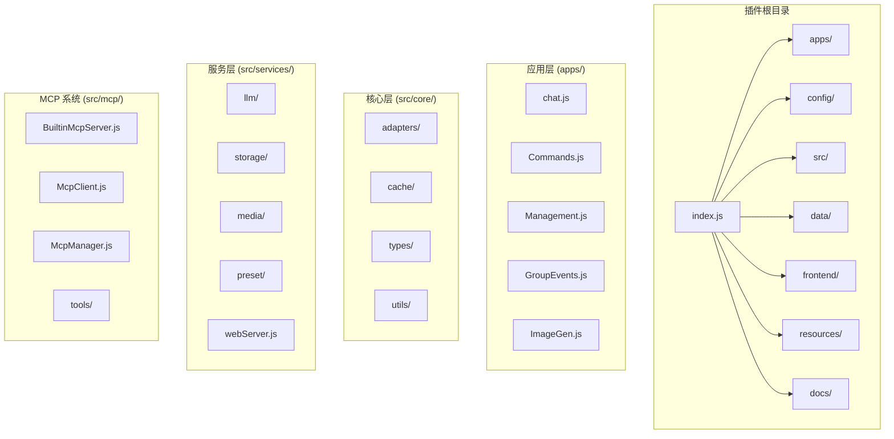
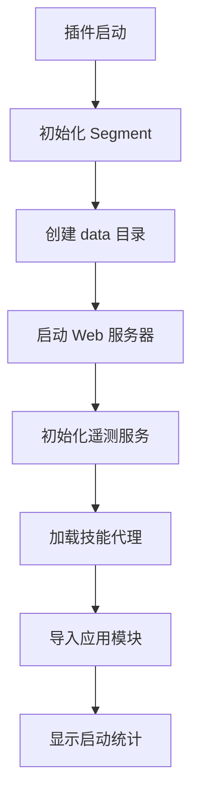
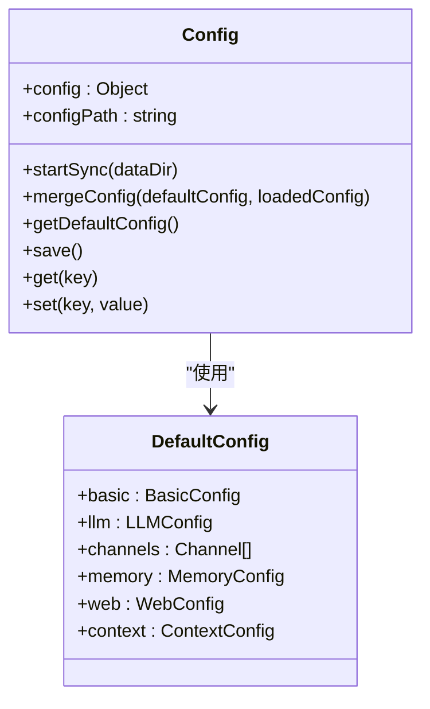
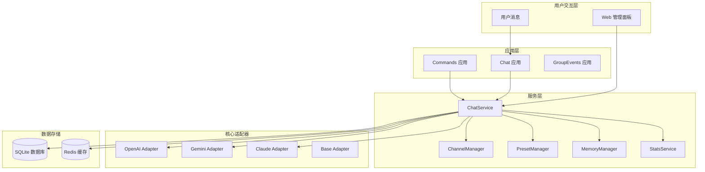
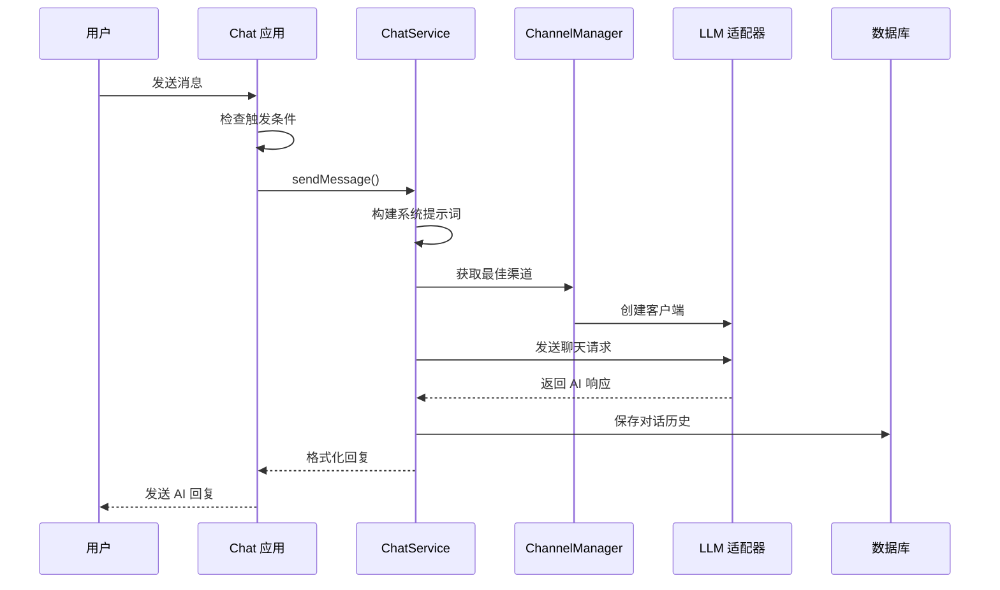
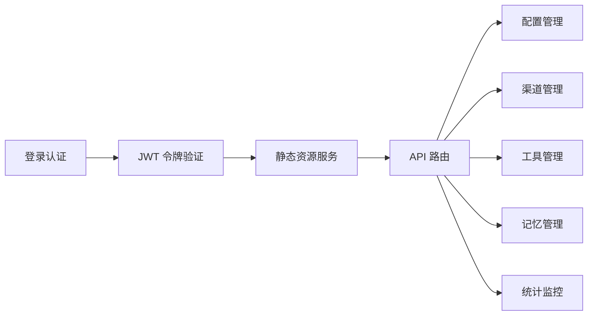
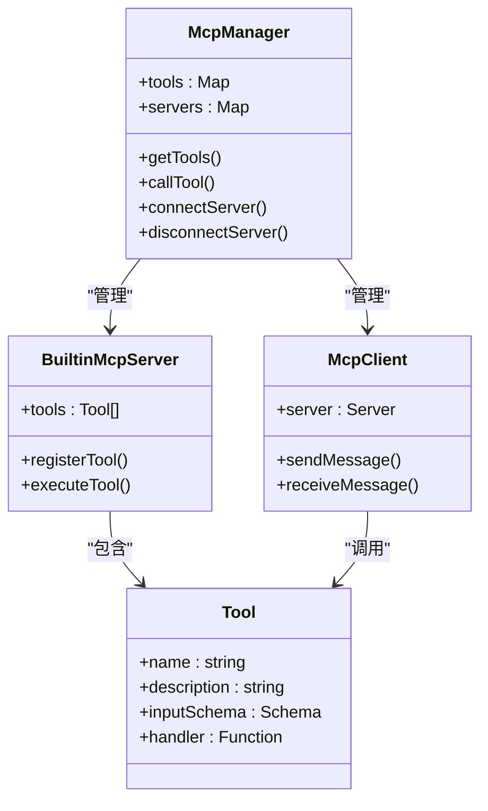
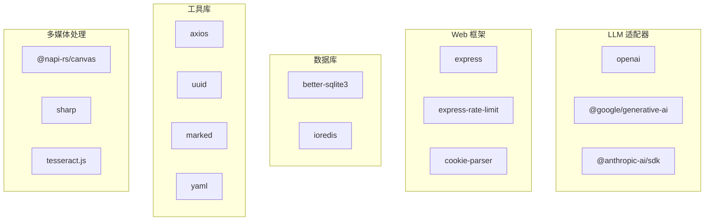

# 快速开始指南


## 目录
1. [简介](#简介)
2. [项目结构](#项目结构)
3. [核心组件](#核心组件)
4. [架构概览](#架构概览)
5. [详细组件分析](#详细组件分析)
6. [依赖分析](#依赖分析)
7. [性能考虑](#性能考虑)
8. [故障排除指南](#故障排除指南)
9. [结论](#结论)
10. [附录](#附录)

## 简介

ChatAI 插件是专为 Yunzai-Bot 设计的强大 AI 聊天插件，集成了多种 LLM 模型和丰富的工具调用能力。该插件提供了统一的聊天、预设、工具与长期/短期记忆管理系统，为 Yunzai 带来完整的"全栈 AI"体验。

### 主要功能特性

- **多模型支持**：OpenAI (GPT-4o/O1)、Google Gemini、Anthropic Claude、DeepSeek、通义千问等
- **MCP 工具调用**：内置 50+ 实用工具，支持 MCP 协议标准，可自定义扩展
- **智能对话管理**：多轮上下文记忆、用户/群组会话隔离、可配置的清理策略
- **长期记忆系统**：自动提取关键信息、向量相似度搜索、用户画像分析
- **人格预设系统**：角色预设管理、独立人格设置、动态变量替换
- **Web 管理面板**：可视化配置、实时监控、预设和渠道管理
- **AI 语音合成**：支持 GPT-SoVITS、Fish-Audio 等语音合成服务

## 项目结构



**图表来源**
- [index.js](file://index.js#L1-L258)
- [package.json](file://package.json#L1-L53)

**章节来源**
- [README.md](file://README.md#L356-L396)
- [package.json](file://package.json#L1-L53)

## 核心组件

### 插件入口点

插件的入口点位于 `index.js`，负责初始化所有核心组件和服务：



**图表来源**
- [index.js](file://index.js#L17-L174)

### 配置管理系统

配置系统采用 YAML 格式，支持运行时热更新：



**图表来源**
- [config/config.js](file://config/config.js#L8-L630)

**章节来源**
- [config/config.js](file://config/config.js#L1-L631)
- [config/config.yaml](file://config/config.yaml#L1-L800)

## 架构概览



**图表来源**
- [apps/chat.js](file://apps/chat.js#L89-L203)
- [apps/Commands.js](file://apps/Commands.js#L119-L181)
- [src/services/llm/ChatService.js](file://src/services/llm/ChatService.js#L46-L110)

## 详细组件分析

### 聊天处理组件

聊天处理是插件的核心组件，负责处理用户消息并生成 AI 回复：



**图表来源**
- [apps/chat.js](file://apps/chat.js#L464-L641)
- [src/services/llm/ChatService.js](file://src/services/llm/ChatService.js#L68-L110)

#### 触发机制分析

插件支持多种触发方式：

| 触发方式 | 描述 | 配置示例 |
|---------|------|----------|
| @机器人 | 需要 @ 机器人才能触发 | `at: true` |
| 前缀触发 | 使用 `#chat` 等前缀触发 | `prefix: true` |
| 关键词触发 | 包含特定关键词自动触发 | `keyword: true` |
| 随机触发 | 按概率随机触发 | `random: true` |

**章节来源**
- [apps/chat.js](file://apps/chat.js#L298-L381)
- [config/config.yaml](file://config/config.yaml#L564-L584)

### Web 管理面板

Web 管理面板提供了完整的可视化配置界面：



**图表来源**
- [src/services/webServer.js](file://src/services/webServer.js#L279-L537)

#### 认证机制

Web 服务器实现了多层认证机制：

1. **Token 生成**：临时 5 分钟有效或永久 Token
2. **JWT 验证**：基于 HS256 算法的令牌验证
3. **指纹绑定**：可选的客户端指纹绑定
4. **路由保护**：所有 API 路由都需要认证

**章节来源**
- [src/services/webServer.js](file://src/services/webServer.js#L313-L449)

### MCP 工具系统

MCP (Model Context Protocol) 系统提供了强大的工具扩展能力：



**图表来源**
- [src/services/webServer.js](file://src/services/webServer.js#L400-L420)

#### 内置工具分类

插件内置了 50+ 工具，按功能分类：

| 工具类别 | 工具数量 | 功能描述 |
|---------|----------|----------|
| 基础工具 | 9 | 时间获取、工具列表、环境信息等 |
| 用户信息 | 3 | 获取用户信息、好友列表、点赞等 |
| 群组信息 | 4 | 获取群信息、成员列表等 |
| 消息操作 | 7 | 发送消息、@用户、聊天记录等 |
| 群管理 | 6 | 禁言、踢人、设置群名片等 |
| 文件操作 | 5 | 群文件上传、下载、管理等 |
| 媒体处理 | 8 | 图片解析、OCR、二维码生成等 |
| 网页访问 | 2 | 访问网页、获取内容等 |
| 搜索工具 | 4 | 网页搜索、维基百科、翻译等 |
| 实用工具 | 6 | 计算、编码转换、哈希等 |
| 记忆管理 | 4 | 用户记忆的增删改查 |
| 上下文管理 | 3 | 对话上下文、群聊上下文等 |
| Bot信息 | 3 | 获取机器人自身信息、状态等 |
| 语音工具 | 3 | TTS语音合成、AI语音对话等 |

**章节来源**
- [data/tools/example_tool.js](file://data/tools/example_tool.js#L1-L43)

## 依赖分析

### 核心依赖

插件的主要依赖包括：



**图表来源**
- [package.json](file://package.json#L16-L45)

### 环境要求

| 依赖项 | 版本要求 | 用途 |
|--------|----------|------|
| Node.js | >= 18 | 运行时环境 |
| pnpm | >= 8.0 | 包管理器 |
| Yunzai-Bot | V3 | 插件框架 |
| Redis | 可选 | 缓存和会话存储 |
| 编译工具 | 可选 | 原生模块编译 |

**章节来源**
- [README.md](file://README.md#L46-L54)
- [package.json](file://package.json#L1-L53)

## 性能考虑

### 缓存策略

插件实现了多层次的缓存机制：

1. **Redis 缓存**：用于会话状态、用户配置等
2. **内存缓存**：用于频繁访问的数据
3. **数据库缓存**：SQLite 本地存储

### 性能优化建议

1. **合理配置上下文长度**：根据需求调整 `context.maxMessages` 和 `context.maxTokens`
2. **启用工具并行执行**：通过 `tools.parallelExecution` 提升工具调用效率
3. **使用流式响应**：对于支持的模型启用流式响应提升用户体验
4. **优化图片处理**：合理设置图片压缩参数和格式转换

## 故障排除指南

### 安装和构建问题

#### better-sqlite3 编译失败

**问题症状**：启动时出现 "Could not locate the bindings file" 错误

**解决方案**：
```bash
# 方法一：重新构建
cd /path/to/Yunzai
pnpm rebuild better-sqlite3

# 方法二：手动构建
cd node_modules/better-sqlite3
npm run build-release

# 方法三：使用 node-gyp
cd node_modules/better-sqlite3
npx node-gyp rebuild
```

**章节来源**
- [README.md](file://README.md#L555-L602)

### 运行时问题

#### AI 不回复消息

**排查步骤**：
1. 检查 API 配置：发送 `#ai管理面板` 进入配置
2. 测试 API 连接：在渠道管理中点击「测试连接」
3. 检查触发方式：确认 `@机器人` 或前缀触发配置
4. 查看控制台日志：观察是否有报错信息

#### Web 管理面板无法访问

**解决方案**：
1. 检查端口占用：默认端口 3000，如被占用会自动尝试 3001
2. 检查防火墙设置：确保端口已开放
3. 查看启动日志：确认实际监听的地址和端口

**章节来源**
- [README.md](file://README.md#L665-L737)

### 配置问题

#### 配置文件损坏

**恢复方法**：
```bash
# 备份当前配置
cp config/config.yaml config/config.yaml.backup

# 删除损坏的配置文件
rm config/config.yaml

# 重启插件生成新配置
# 插件会在下次启动时自动生成默认配置
```

**章节来源**
- [config/config.js](file://config/config.js#L18-L38)

## 结论

ChatAI 插件为 Yunzai-Bot 提供了完整的 AI 聊天解决方案。通过本文档的指导，用户可以顺利完成插件的安装、配置和使用。插件具有以下优势：

1. **功能完整**：涵盖聊天、记忆、工具调用、Web 管理等全方位功能
2. **易于使用**：提供直观的 Web 管理面板和丰富的配置选项
3. **扩展性强**：支持 MCP 协议和自定义工具开发
4. **性能优秀**：多层缓存和优化的响应机制

建议用户在使用过程中：
- 先进行基础配置，确保 API 渠道正常工作
- 逐步启用高级功能，如记忆系统和工具调用
- 定期备份配置和数据
- 根据实际需求调整性能参数

## 附录

### 基础使用示例

#### 与机器人对话

1. **@机器人 + 消息内容**：触发 AI 对话
2. **#chat + 消息内容**：前缀触发对话（可配置）

#### 基本命令

| 命令 | 功能 | 权限 |
|------|------|------|
| `#结束对话` | 结束当前对话，清除上下文 | 所有人 |
| `#清除记忆` | 清除个人记忆数据 | 所有人 |
| `#对话状态` | 查看当前对话详细状态 | 所有人 |
| `#我的记忆` | 查看已保存的记忆列表 | 所有人 |
| `#总结记忆` | 整理合并记忆条目 | 所有人 |
| `#chatdebug` | 切换聊天调试模式 | 所有人 |

### 最小化配置示例

为了帮助用户快速验证插件功能，这里提供一个最小化的配置示例：

```yaml
# 基础配置
basic:
  commandPrefix: "#ai"
  debug: false
  showThinkingMessage: true

# LLM 配置
llm:
  defaultModel: gemini-3-pro-preview
  defaultChatPresetId: default

# 渠道配置（示例）
channels:
  - id: demo-channel
    name: Demo 渠道
    adapterType: openai
    baseUrl: https://api.openai.com/v1
    apiKey: sk-your-api-key-here
    models:
      - gpt-4o
      - gpt-4o-mini
    priority: 1
    enabled: true

# Web 配置
web:
  port: 3000
  sharePort: false
```

### 开发者资源

- **开发者文档**：[docs/DEVELOPMENT.md](file://docs/DEVELOPMENT.md)
- **贡献指南**：[CONTRIBUTING.md](file://CONTRIBUTING.md)
- **工具开发**：[data/tools/example_tool.js](file://data/tools/example_tool.js)
