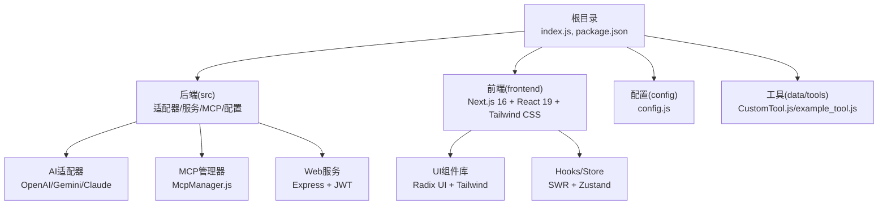
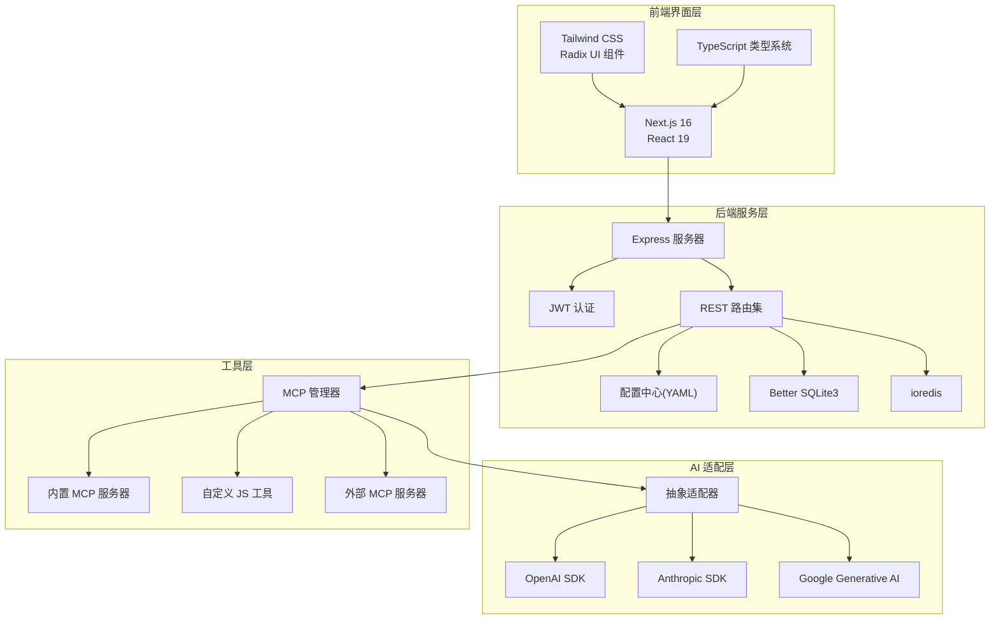
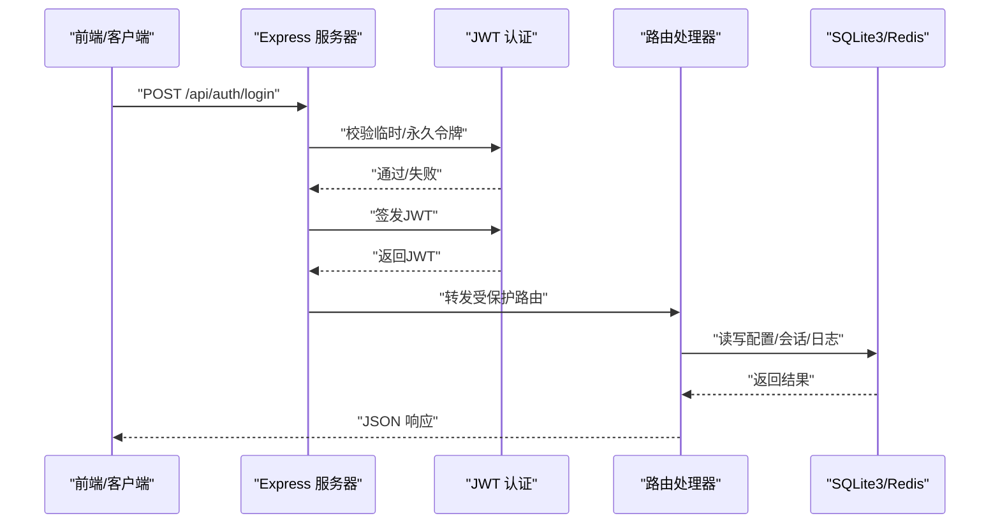
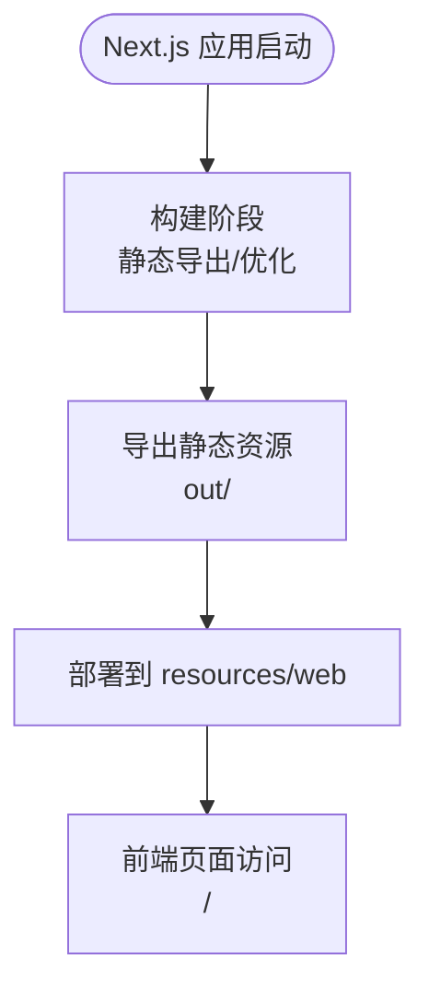
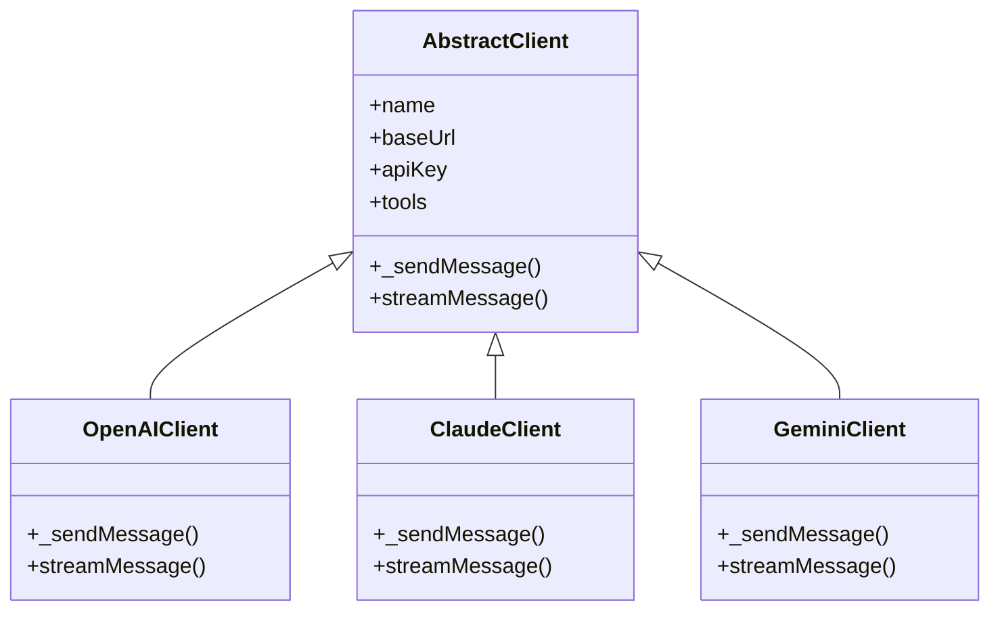
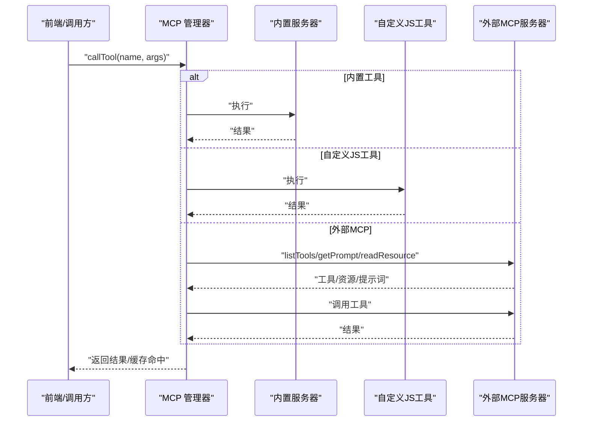
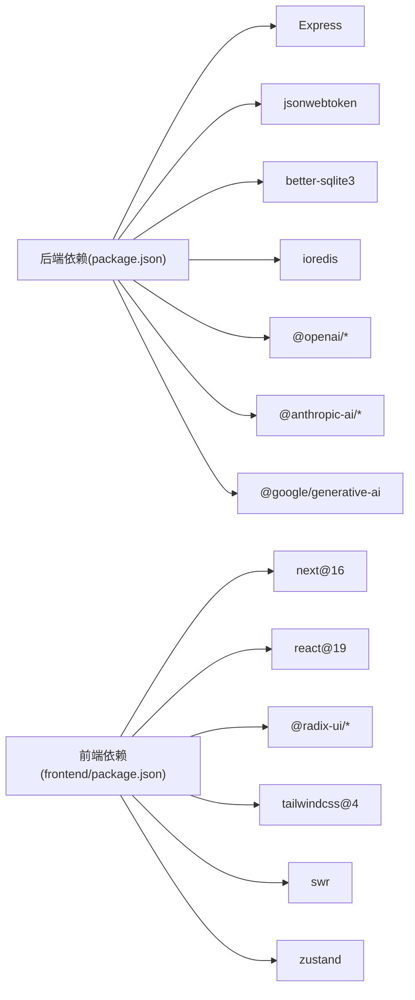

# 技术栈概览

<cite>
**本文档引用的文件**
- [package.json](file://package.json)
- [frontend/package.json](file://frontend/package.json)
- [index.js](file://index.js)
- [frontend/next.config.ts](file://frontend/next.config.ts)
- [src/utils/version.js](file://src/utils/version.js)
- [src/services/webServer.js](file://src/services/webServer.js)
- [src/core/adapters/index.js](file://src/core/adapters/index.js)
- [src/core/adapters/openai/OpenAIClient.js](file://src/core/adapters/openai/OpenAIClient.js)
- [src/core/adapters/gemini/GeminiClient.js](file://src/core/adapters/gemini/GeminiClient.js)
- [src/core/adapters/claude/ClaudeClient.js](file://src/core/adapters/claude/ClaudeClient.js)
- [src/mcp/McpManager.js](file://src/mcp/McpManager.js)
- [config/config.js](file://config/config.js)
- [frontend/lib/types.ts](file://frontend/lib/types.ts)
- [frontend/tsconfig.json](file://frontend/tsconfig.json)
</cite>

## 目录
1. [简介](#简介)
2. [项目结构](#项目结构)
3. [核心组件](#核心组件)
4. [架构总览](#架构总览)
5. [详细组件分析](#详细组件分析)
6. [依赖关系分析](#依赖关系分析)
7. [性能考量](#性能考量)
8. [故障排除指南](#故障排除指南)
9. [结论](#结论)
10. [附录](#附录)

## 简介
本技术栈概览面向 ChatAI 插件，系统梳理后端 Node.js/Express 技术栈、前端 Next.js 16/React 19/Tailwind CSS 技术栈、AI 模型集成（OpenAI SDK、Anthropic SDK、Google Generative AI）、工具系统（MCP 协议）以及开发环境与依赖管理策略。文档旨在帮助开发者快速理解整体技术布局与组件关系，并提供架构图与组件关系图辅助学习。

## 项目结构
项目采用前后端分离与模块化组织方式：
- 后端核心位于 src 目录，包含适配器层、服务层、MCP 管理、配置与工具等模块
- 前端位于 frontend 目录，基于 Next.js 16 与 React 19 构建，使用 Tailwind CSS 与 TypeScript
- 根目录包含插件入口 index.js、配置 config/config.js、工具定义 data/tools 等

图表来源
- [index.js](file://index.js#L1-L258)
- [frontend/next.config.ts](file://frontend/next.config.ts#L1-L26)
- [config/config.js](file://config/config.js#L1-L631)

章节来源
- [index.js](file://index.js#L1-L258)
- [frontend/next.config.ts](file://frontend/next.config.ts#L1-L26)
- [config/config.js](file://config/config.js#L1-L631)

## 核心组件
- 后端核心
  - Web 服务：基于 Express 的管理面板与 API 服务，支持 JWT 认证、静态资源托管、TRSS 环境共享端口
  - AI 适配器：统一抽象客户端，分别对接 OpenAI、Anthropic、Google Generative AI，支持工具调用与流式输出
  - MCP 管理：内置 MCP 服务器、自定义 JS 工具与外部 MCP 服务器连接、工具注册与缓存
  - 配置中心：YAML 驱动的配置管理，涵盖模型、工具、代理、上下文、记忆、触发器等
- 前端核心
  - Next.js 16 + React 19：SSR/CSR 混合渲染，支持静态导出
  - Tailwind CSS：原子化样式与响应式设计
  - 类型系统：TypeScript 定义群组配置、预设、通道等前端数据结构
  - 状态与 Hook：SWR 数据拉取、Zustand 状态管理

章节来源
- [src/services/webServer.js](file://src/services/webServer.js#L1-L807)
- [src/core/adapters/index.js](file://src/core/adapters/index.js#L1-L24)
- [src/mcp/McpManager.js](file://src/mcp/McpManager.js#L1-L1268)
- [config/config.js](file://config/config.js#L1-L631)
- [frontend/package.json](file://frontend/package.json#L1-L66)
- [frontend/lib/types.ts](file://frontend/lib/types.ts#L1-L275)

## 架构总览
整体架构分为三层：前端界面层、后端服务层、AI 适配层与工具层。

图表来源
- [src/services/webServer.js](file://src/services/webServer.js#L1-L807)
- [src/core/adapters/index.js](file://src/core/adapters/index.js#L1-L24)
- [src/mcp/McpManager.js](file://src/mcp/McpManager.js#L1-L1268)
- [config/config.js](file://config/config.js#L1-L631)

## 详细组件分析

### 后端技术栈（Node.js、Express、Better SQLite3、JSON Web Token）
- Node.js 与模块化
  - 插件入口以 ESM 导入方式加载配置、日志与服务，支持动态导入与并行初始化
- Express 与 Web 服务
  - 提供登录认证、健康检查、系统管理、渠道、知识库、工具、代理、MCP、内存、技能等 API 路由
  - 支持 TRSS 环境共享端口与挂载路径，自动探测本地/公网地址，支持静态资源托管
- 认证与安全
  - JWT 令牌签发与校验，支持永久令牌与一次性令牌；提供签名头校验与指纹绑定
- 存储与缓存
  - Better SQLite3 用于本地数据持久化；ioredis 用于缓存与会话
- 版本与遥测
  - 通过 Git 信息生成版本字符串，结合遥测服务上报启动信息与公告

图表来源
- [src/services/webServer.js](file://src/services/webServer.js#L340-L537)

章节来源
- [index.js](file://index.js#L1-L258)
- [src/services/webServer.js](file://src/services/webServer.js#L1-L807)
- [config/config.js](file://config/config.js#L1-L631)

### 前端技术栈（Next.js 16、React 19、Tailwind CSS）
- Next.js 16
  - 静态导出（export），生产构建优化，CSS 优化与压缩，严格模式
- React 19
  - 使用最新 React 生态组件与 Hooks
- Tailwind CSS
  - 原子化样式，支持暗色主题与响应式布局
- TypeScript
  - 定义群组配置、预设、通道等前端数据结构，提升开发体验与类型安全

图表来源
- [frontend/next.config.ts](file://frontend/next.config.ts#L1-L26)
- [frontend/tsconfig.json](file://frontend/tsconfig.json#L1-L46)

章节来源
- [frontend/package.json](file://frontend/package.json#L1-L66)
- [frontend/next.config.ts](file://frontend/next.config.ts#L1-L26)
- [frontend/lib/types.ts](file://frontend/lib/types.ts#L1-L275)
- [frontend/tsconfig.json](file://frontend/tsconfig.json#L1-L46)

### AI 模型集成（OpenAI SDK、Anthropic SDK、Google Generative AI）
- 抽象适配器
  - 统一消息格式转换、工具调用解析、流式输出与统计计费
- OpenAI
  - 支持工具调用、消息验证与清理、请求头模板与代理
- Anthropic Claude
  - 支持工具声明与文本内工具调用解析、流式输出
- Google Gemini
  - 支持系统指令、安全设置、工具声明与多模态内容转换

图表来源
- [src/core/adapters/openai/OpenAIClient.js](file://src/core/adapters/openai/OpenAIClient.js#L1-L200)
- [src/core/adapters/claude/ClaudeClient.js](file://src/core/adapters/claude/ClaudeClient.js#L1-L200)
- [src/core/adapters/gemini/GeminiClient.js](file://src/core/adapters/gemini/GeminiClient.js#L1-L200)

章节来源
- [src/core/adapters/index.js](file://src/core/adapters/index.js#L1-L24)
- [src/core/adapters/openai/OpenAIClient.js](file://src/core/adapters/openai/OpenAIClient.js#L1-L200)
- [src/core/adapters/claude/ClaudeClient.js](file://src/core/adapters/claude/ClaudeClient.js#L1-L200)
- [src/core/adapters/gemini/GeminiClient.js](file://src/core/adapters/gemini/GeminiClient.js#L1-L200)

### 工具系统（MCP 协议）
- 管理器职责
  - 管理内置工具、自定义 JS 工具、外部 MCP 服务器；提供工具注册、资源与提示词管理、缓存与日志
- 连接与配置
  - 支持内置、自定义与外部 MCP 服务器，标准化配置格式，断线重连与状态维护
- 执行与安全
  - 工具调用前进行危险工具拦截与白名单/黑名单过滤，支持缓存与 TTL

图表来源
- [src/mcp/McpManager.js](file://src/mcp/McpManager.js#L1-L1268)

章节来源
- [src/mcp/McpManager.js](file://src/mcp/McpManager.js#L1-L1268)

## 依赖关系分析
- 后端依赖
  - Express、JWT、Better SQLite3、ioredis、OpenAI SDK、Anthropic SDK、Google Generative AI、HTTP 代理、WebSocket、UUID、YAML 等
- 前端依赖
  - Next.js 16、React 19、Radix UI、Tailwind CSS、SWR、Zustand、Axios、TypeScript 等
- 版本与兼容性
  - package.json 与 frontend/package.json 明确列出各依赖版本范围
  - 前端 tsconfig 采用 ES2017 目标与 bundler 解析，保证 Next.js 16 的构建兼容性

图表来源
- [package.json](file://package.json#L16-L45)
- [frontend/package.json](file://frontend/package.json#L13-L53)

章节来源
- [package.json](file://package.json#L1-L53)
- [frontend/package.json](file://frontend/package.json#L1-L66)
- [frontend/tsconfig.json](file://frontend/tsconfig.json#L1-L46)

## 性能考量
- 前端构建优化
  - Next.js 16 启用 CSS 优化、压缩、严格模式与静态导出，适合部署到静态站点
- 后端性能
  - Express 中间件与路由分层，静态资源托管减少 IO；JWT 认证与签名头校验保障安全性
  - MCP 管理器支持工具调用缓存与 TTL，降低重复计算成本
- 数据存储
  - Better SQLite3 适合中小规模数据；ioredis 用于热点数据与会话缓存
- 流式输出
  - OpenAI、Claude、Gemini 均支持流式输出，提升用户体验

## 故障排除指南
- 认证问题
  - 检查 JWT 密钥生成与有效期；确认永久令牌配置与 Cookie 设置
- 端口占用
  - Express 在启动时尝试释放端口并自动递增端口，确保 3000 端口可用或配置 web.port
- MCP 连接失败
  - 校验外部 MCP 服务器配置与网络可达性；查看服务器状态与错误日志
- 版本与构建
  - 使用 src/utils/version.js 生成版本信息；前端通过 next.config.ts 的静态导出配置进行构建

章节来源
- [src/services/webServer.js](file://src/services/webServer.js#L582-L756)
- [src/mcp/McpManager.js](file://src/mcp/McpManager.js#L311-L405)
- [src/utils/version.js](file://src/utils/version.js#L1-L138)

## 结论
ChatAI 插件采用成熟稳定的技术栈组合：后端以 Node.js/Express 为核心，配合 Better SQLite3 与 ioredis 实现数据与缓存；前端以 Next.js 16/React 19/Tailwind CSS 构建现代化界面；AI 模型适配层统一抽象 OpenAI、Anthropic、Google Generative AI；MCP 协议工具系统提供强大的扩展能力。整体架构清晰、模块解耦、易于维护与扩展。

## 附录
- 开发环境建议
  - Node.js LTS 版本，确保 npm/yarn 可用
  - 前端开发运行 next dev，生产构建使用 next build
  - 配置文件 config.yaml 由 config/config.js 自动生成与合并
- 依赖管理策略
  - 后端依赖集中在 package.json，前端依赖在 frontend/package.json
  - 前端 tsconfig 与 ESLint 配置保证类型安全与代码风格一致性

章节来源
- [config/config.js](file://config/config.js#L18-L38)
- [frontend/next.config.ts](file://frontend/next.config.ts#L1-L26)
- [frontend/tsconfig.json](file://frontend/tsconfig.json#L1-L46)