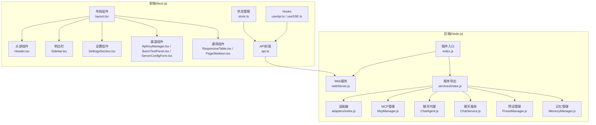
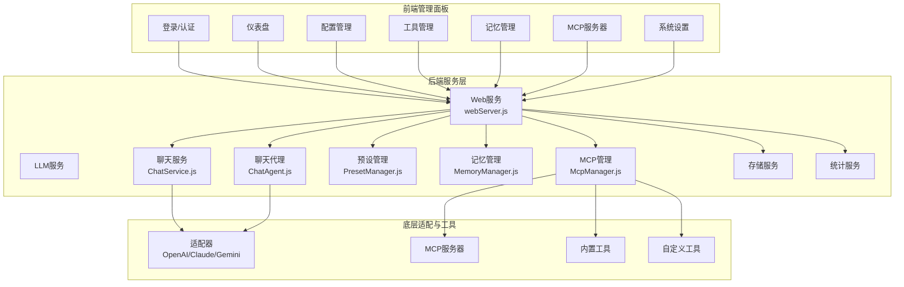
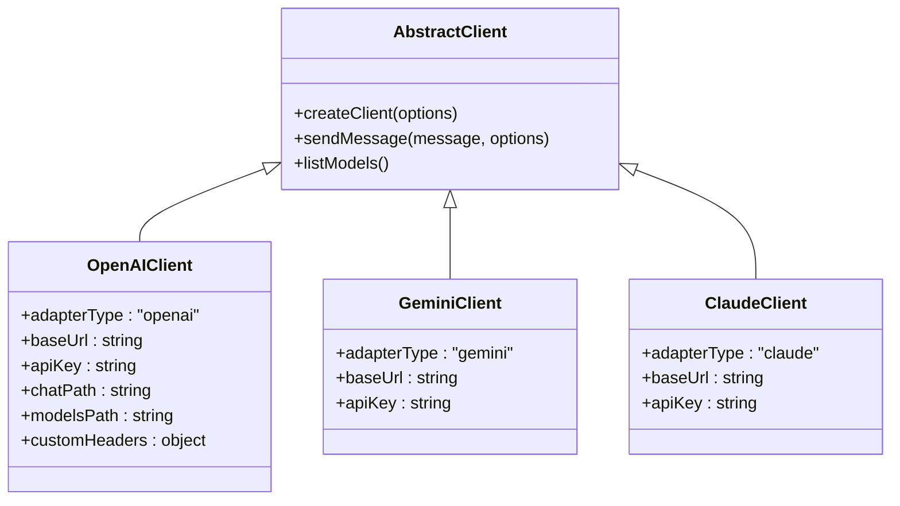
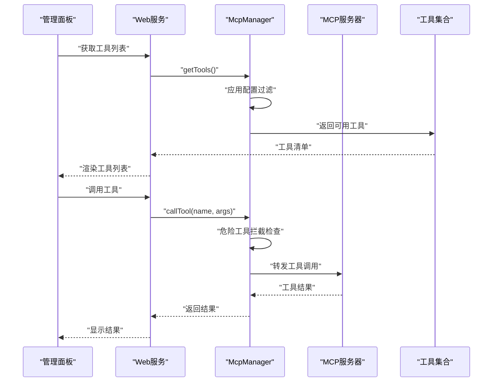
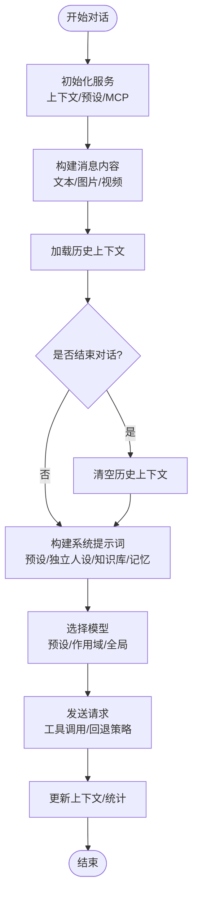
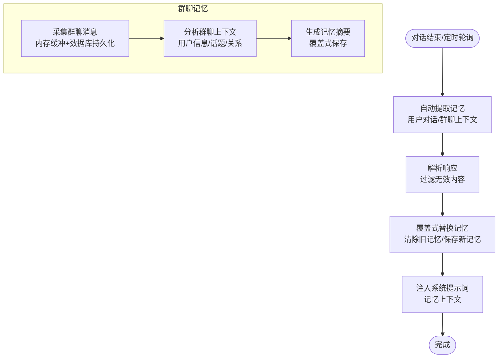
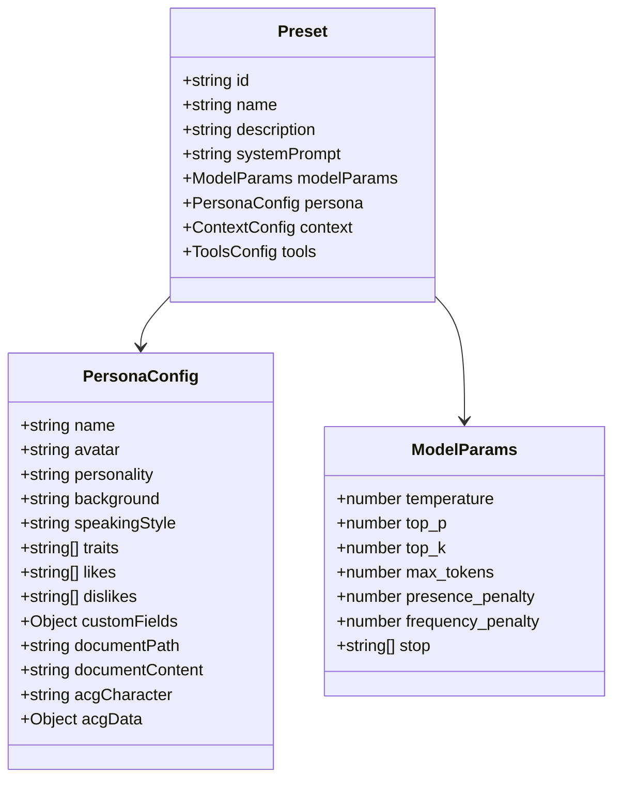
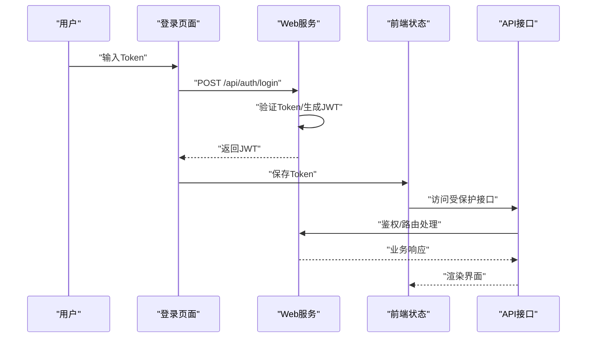
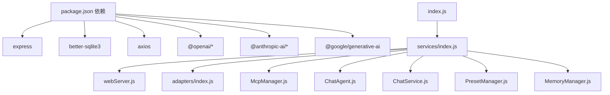

# 核心功能特性

<cite>
**本文引用的文件**
- [README.md](file://README.md)
- [index.js](file://index.js)
- [package.json](file://package.json)
- [src/core/adapters/index.js](file://src/core/adapters/index.js)
- [src/services/index.js](file://src/services/index.js)
- [src/mcp/McpManager.js](file://src/mcp/McpManager.js)
- [src/services/agent/ChatAgent.js](file://src/services/agent/ChatAgent.js)
- [src/services/storage/MemoryManager.js](file://src/services/storage/MemoryManager.js)
- [src/services/preset/PresetManager.js](file://src/services/preset/PresetManager.js)
- [src/services/llm/ChatService.js](file://src/services/llm/ChatService.js)
- [src/services/webServer.js](file://src/services/webServer.js)
- [frontend/app/layout.tsx](file://frontend/app/layout.tsx)
- [frontend/components/layout/Header.tsx](file://frontend/components/layout/Header.tsx)
- [frontend/components/layout/Sidebar.tsx](file://frontend/components/layout/Sidebar.tsx)
- [frontend/components/layout/PageHeader.tsx](file://frontend/components/layout/PageHeader.tsx)
- [frontend/components/layout/MobileNav.tsx](file://frontend/components/layout/MobileNav.tsx)
- [frontend/components/settings/SettingsSection.tsx](file://frontend/components/settings/SettingsSection.tsx)
- [frontend/components/channels/ApiKeyManager.tsx](file://frontend/components/channels/ApiKeyManager.tsx)
- [frontend/components/channels/BatchTestPanel.tsx](file://frontend/components/channels/BatchTestPanel.tsx)
- [frontend/components/channels/ServerConfigForm.tsx](file://frontend/components/channels/ServerConfigForm.tsx)
- [frontend/components/common/ResponsiveTable.tsx](file://frontend/components/common/ResponsiveTable.tsx)
- [frontend/components/common/PageSkeleton.tsx](file://frontend/components/common/PageSkeleton.tsx)
- [frontend/lib/store.ts](file://frontend/lib/store.ts)
- [frontend/lib/api.ts](file://frontend/lib/api.ts)
- [frontend/lib/hooks/useApi.ts](file://frontend/lib/hooks/useApi.ts)
- [frontend/lib/hooks/useSSE.ts](file://frontend/lib/hooks/useSSE.ts)
- [frontend/types/index.ts](file://frontend/types/index.ts)
- [frontend/types/mcp.ts](file://frontend/types/mcp.ts)
</cite>

## 目录
1. [简介](#简介)
2. [项目结构](#项目结构)
3. [核心组件](#核心组件)
4. [架构总览](#架构总览)
5. [详细组件分析](#详细组件分析)
6. [依赖分析](#依赖分析)
7. [性能考虑](#性能考虑)
8. [故障排除指南](#故障排除指南)
9. [结论](#结论)
10. [附录](#附录)

## 简介
ChatAI 插件为 Yunzai-Bot 提供了全栈 AI 能力，集成了多模型支持（OpenAI、Claude、Gemini 等）、MCP 工具调用系统、智能对话管理、长期记忆系统、人格预设系统以及 Web 管理面板。其核心目标是统一管理聊天、预设、工具与长/短期记忆，为用户提供“全栈 AI”体验。

## 项目结构
项目采用前后端分离架构，后端基于 Node.js + Express，前端基于 Next.js。核心模块包括：
- 核心适配层：支持 OpenAI、Claude、Gemini 等多家模型厂商
- MCP 管理：统一工具调用与外部 MCP 服务器接入
- 服务层：LLM 服务、聊天服务、存储服务、统计服务等
- Web 管理面板：基于 Next.js 的可视化配置与监控界面

**图表来源**
- [index.js](file://index.js#L1-L258)
- [src/services/webServer.js](file://src/services/webServer.js#L1-L807)
- [src/services/index.js](file://src/services/index.js#L1-L68)
- [src/core/adapters/index.js](file://src/core/adapters/index.js#L1-L24)
- [frontend/app/layout.tsx](file://frontend/app/layout.tsx#L1-L27)

**章节来源**
- [README.md](file://README.md#L356-L396)
- [index.js](file://index.js#L1-L258)

## 核心组件
本节概述插件的核心功能模块及其职责：
- 多模型支持：统一适配 OpenAI、Claude、Gemini 等多家厂商，支持模型映射与回退策略
- MCP 工具调用：内置 50+ 工具与外部 MCP 服务器对接，支持危险工具拦截与缓存
- 智能对话管理：多轮上下文记忆、用户/群组会话隔离、可配置的清理策略
- 长期记忆系统：自动提取关键信息、向量相似度搜索、用户画像分析
- 人格预设系统：角色预设管理、独立人格设置、动态变量替换
- Web 管理面板：可视化配置、实时监控、预设和渠道管理

**章节来源**
- [README.md](file://README.md#L30-L41)
- [src/services/index.js](file://src/services/index.js#L1-L68)

## 架构总览
整体架构分为三层：前端管理面板、后端服务层、底层适配与工具层。

**图表来源**
- [src/services/webServer.js](file://src/services/webServer.js#L1-L807)
- [src/services/llm/ChatService.js](file://src/services/llm/ChatService.js#L1-L800)
- [src/services/agent/ChatAgent.js](file://src/services/agent/ChatAgent.js#L1-L800)
- [src/services/preset/PresetManager.js](file://src/services/preset/PresetManager.js#L1-L843)
- [src/services/storage/MemoryManager.js](file://src/services/storage/MemoryManager.js#L1-L1538)
- [src/mcp/McpManager.js](file://src/mcp/McpManager.js#L1-L1268)

## 详细组件分析

### 多模型支持（OpenAI、Claude、Gemini 等）
- 适配器设计：抽象统一的客户端接口，分别实现 OpenAI、Claude、Gemini 的适配器
- 模型映射与回退：支持渠道级别的模型映射与回退策略，提升稳定性
- 配置灵活：支持自定义请求路径、请求头、模板等高级配置

**图表来源**
- [src/core/adapters/index.js](file://src/core/adapters/index.js#L1-L24)
- [src/services/llm/LlmService.js](file://src/services/llm/LlmService.js#L1-L200)

**章节来源**
- [README.md](file://README.md#L513-L551)
- [src/core/adapters/index.js](file://src/core/adapters/index.js#L1-L24)

### MCP 工具调用系统
- 管理器职责：统一管理内置工具、自定义 JS 工具与外部 MCP 服务器
- 工具过滤：支持危险工具拦截、白名单/黑名单、按配置过滤
- 缓存与日志：工具调用结果缓存与调用日志记录
- 服务器管理：支持动态连接/断开外部 MCP 服务器，支持重连与配置更新

**图表来源**
- [src/mcp/McpManager.js](file://src/mcp/McpManager.js#L555-L800)
- [src/services/webServer.js](file://src/services/webServer.js#L509-L537)

**章节来源**
- [README.md](file://README.md#L308-L354)
- [src/mcp/McpManager.js](file://src/mcp/McpManager.js#L1-L1268)

### 智能对话管理
- 会话隔离：私聊使用用户独立上下文，群聊使用共享上下文
- 上下文构建：支持历史消息过滤、标签化上下文、全局系统提示词
- 预设与人设：支持预设优先级、独立人设、前缀人格、知识库上下文
- 工具调用：根据预设与作用域配置决定是否启用工具

**图表来源**
- [src/services/llm/ChatService.js](file://src/services/llm/ChatService.js#L115-L800)
- [src/services/agent/ChatAgent.js](file://src/services/agent/ChatAgent.js#L138-L800)

**章节来源**
- [src/services/llm/ChatService.js](file://src/services/llm/ChatService.js#L1-L800)
- [src/services/agent/ChatAgent.js](file://src/services/agent/ChatAgent.js#L1-L800)

### 长期记忆系统
- 自动提取：基于对话内容自动提取用户记忆，支持覆盖式替换
- 群聊记忆：周期性轮询分析群聊上下文，提取用户信息、话题、关系
- 记忆存储：基于数据库存储，支持记忆检索与上下文注入
- 轮询策略：支持最小轮询间隔、群聊上下文采集间隔等配置

**图表来源**
- [src/services/storage/MemoryManager.js](file://src/services/storage/MemoryManager.js#L489-L800)

**章节来源**
- [src/services/storage/MemoryManager.js](file://src/services/storage/MemoryManager.js#L1-L1538)

### 人格预设系统
- 预设结构：支持系统提示词、模型参数、人设信息、上下文配置、工具配置
- 动态变量：支持 {{变量}} 与 ${表达式} 的动态替换
- 独立人设：支持群组/用户独立人设，支持空人设场景
- 知识库关联：支持将知识库内容注入到预设提示词中

**图表来源**
- [src/services/preset/PresetManager.js](file://src/services/preset/PresetManager.js#L15-L843)

**章节来源**
- [src/services/preset/PresetManager.js](file://src/services/preset/PresetManager.js#L1-L843)

### Web 管理面板
- 认证与授权：支持临时/永久 Token、JWT、指纹绑定、签名验证
- 路由与静态资源：统一路由注册、静态文件托管、SSE 广播
- 前端组件：布局、导航、设置、渠道管理、工具管理、记忆管理、MCP 管理等
- 响应式设计：支持移动端与桌面端，提供主题切换与无障碍体验

**图表来源**
- [src/services/webServer.js](file://src/services/webServer.js#L377-L537)
- [frontend/app/layout.tsx](file://frontend/app/layout.tsx#L1-L27)
- [frontend/components/layout/Header.tsx](file://frontend/components/layout/Header.tsx#L1-L131)

**章节来源**
- [src/services/webServer.js](file://src/services/webServer.js#L1-L807)
- [frontend/app/layout.tsx](file://frontend/app/layout.tsx#L1-L27)
- [frontend/components/layout/Header.tsx](file://frontend/components/layout/Header.tsx#L1-L131)

## 依赖分析
- 运行时依赖：Express、better-sqlite3、axios、@anthropic-ai/sdk、@google/generative-ai、openai 等
- 前端依赖：Next.js、UI 组件库、状态管理、API 封装、Hooks 等
- 插件入口：统一导出 apps 与 skills，支持动态加载与热更新

**图表来源**
- [package.json](file://package.json#L16-L45)
- [index.js](file://index.js#L1-L258)
- [src/services/index.js](file://src/services/index.js#L1-L68)

**章节来源**
- [package.json](file://package.json#L1-L53)
- [index.js](file://index.js#L1-L258)

## 性能考虑
- 缓存策略：MCP 工具调用结果缓存、会话上下文缓存
- 轮询优化：记忆系统轮询间隔配置、群聊上下文采集间隔
- 模型回退：多模型回退策略减少失败率
- 资源限制：请求体大小限制、速率限制中间件
- 前端优化：静态资源托管、响应式组件、懒加载

## 故障排除指南
- 数据库初始化失败：确保已执行原生模块重建，检查 data 目录写权限
- API 连接失败：检查渠道配置、API Key、网络连通性
- 工具调用失败：检查工具启用状态、危险工具权限、机器人权限
- Web 面板无法访问：检查端口占用、防火墙、TRSS 环境共享端口配置
- 内存占用过高：减少上下文长度、禁用不需要的功能、定期清理对话

**章节来源**
- [README.md](file://README.md#L651-L793)

## 结论
ChatAI 插件通过模块化设计与统一的适配器体系，实现了多模型支持、MCP 工具调用、智能对话管理、长期记忆系统与 Web 管理面板的无缝集成。其灵活的配置与强大的扩展能力，使其能够满足从个人到企业级的多样化需求，显著提升了 Yunzai 生态的智能化水平。

## 附录
- 功能演示截图与实际使用案例可参考 README 中的界面预览部分
- 开发与工具开发文档详见 docs 目录下的 ARCHITECTURE.md、DEVELOPMENT.md、TOOLS.md