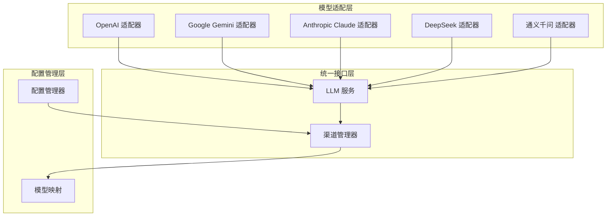
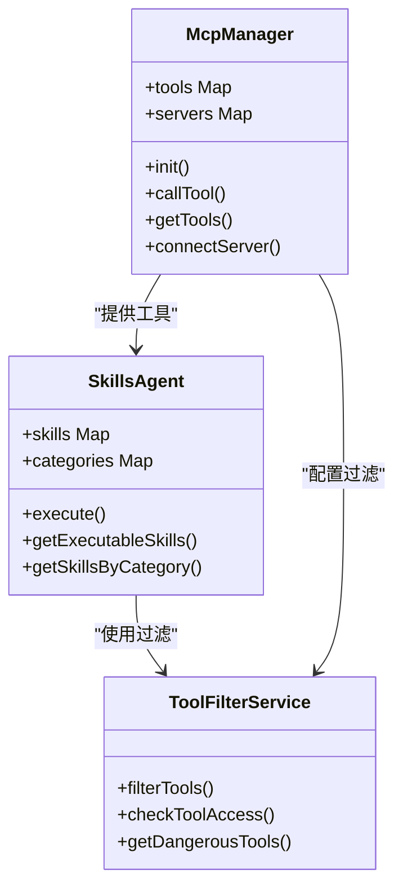
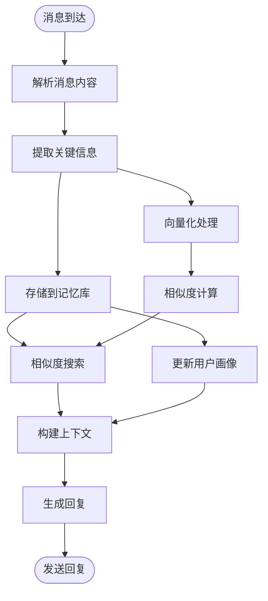
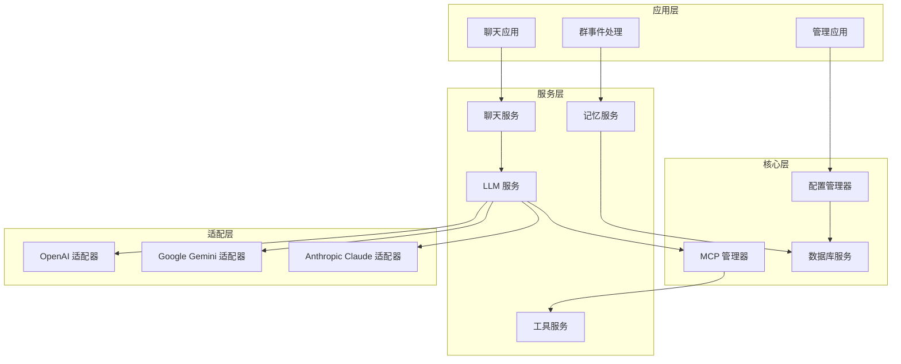
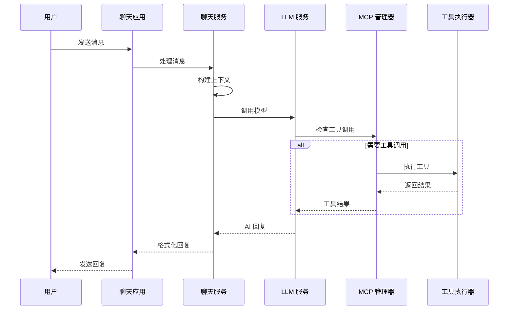
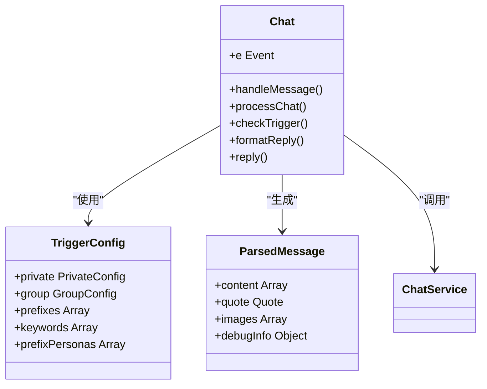
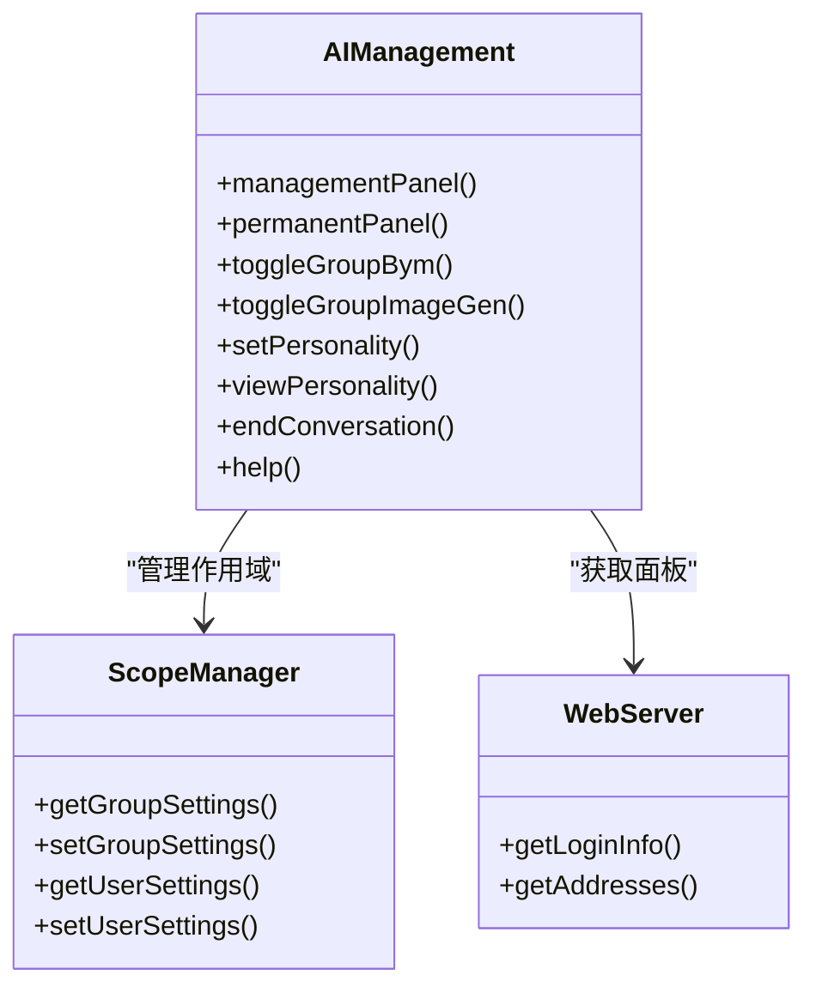
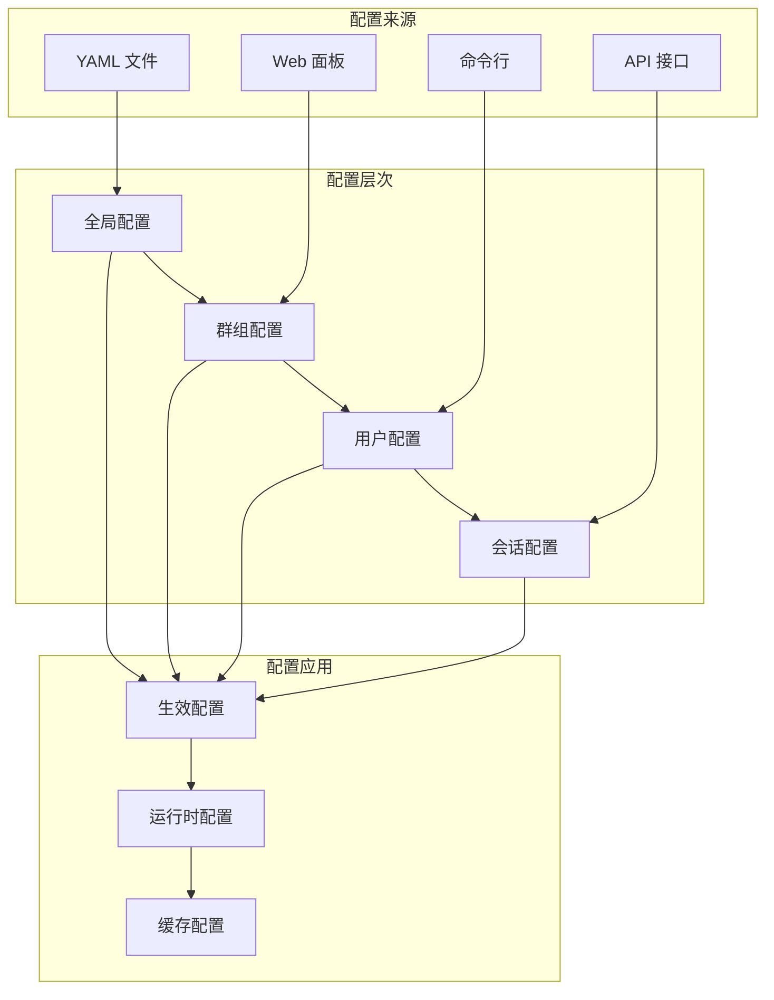
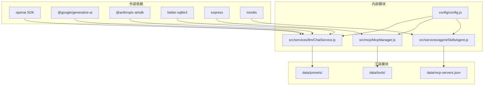

# 项目介绍

## 目录
1. [项目概述](#项目概述)
2. [核心目标与愿景](#核心目标与愿景)
3. [在 Yunzai Bot 生态中的价值定位](#在-yunzai-bot-生态中的价值定位)
4. [主要应用场景](#主要应用场景)
5. [设计理念与技术特色](#设计理念与技术特色)
6. [用户价值矩阵](#用户价值矩阵)
7. [架构概览](#架构概览)
8. [详细组件分析](#详细组件分析)
9. [依赖关系分析](#依赖关系分析)
10. [性能考量](#性能考量)
11. [故障排除指南](#故障排除指南)
12. [开源协议与社区支持](#开源协议与社区支持)
13. [未来发展规划](#未来发展规划)
14. [结论](#结论)

## 项目概述

ChatAI 插件是专为 Yunzai-Bot 生态系统打造的 AI 聊天增强插件，旨在为 QQ 机器人提供"全栈 AI"体验。该项目基于 MCP（Model Context Protocol）协议，实现了多模型支持、智能工具调用、上下文记忆管理等核心功能。

### 项目特性概览

- **多模型支持**：OpenAI、Google Gemini、Anthropic Claude、DeepSeek、通义千问等主流 LLM
- **MCP 工具调用**：50+ 内置实用工具，支持 MCP 协议标准
- **智能对话管理**：多轮上下文记忆、用户/群组会话隔离
- **长期记忆系统**：自动提取关键信息、向量相似度搜索
- **Web 管理面板**：可视化配置、实时监控、预设管理

## 核心目标与愿景

### 核心目标

1. **统一 AI 体验**：为 Yunzai 生态提供一体化的 AI 聊天解决方案
2. **降低使用门槛**：通过 Web 管理面板简化配置和使用流程
3. **增强扩展能力**：基于 MCP 协议支持第三方工具集成
4. **提升智能化水平**：通过记忆系统和上下文管理实现更自然的对话体验

### 项目愿景

成为 Yunzai 生态中最受欢迎的 AI 聊天插件，推动 QQ 机器人智能化发展，为用户提供接近原生 AI 助手般的交互体验。

## 在 Yunzai Bot 生态中的价值定位

### 平台集成优势

- **无缝集成**：作为 Yunzai 插件直接运行，无需额外部署
- **生态兼容**：支持多种 QQ 协议适配器（icqq、oicq、napcat）
- **配置统一**：与 Yunzai 核心配置体系深度集成

### 技术价值

- **协议标准**：采用 MCP 协议，符合行业标准
- **架构清晰**：分层设计，职责明确
- **扩展性强**：支持自定义工具和第三方集成

## 主要应用场景

### QQ 机器人聊天场景

- **日常闲聊**：@机器人 + 消息内容触发对话
- **智能问答**：支持复杂问题的多轮对话
- **多模态交互**：支持文本、图片、语音等多种消息类型

### 群组管理场景

- **群聊总结**：AI 自动生成群聊内容总结
- **用户画像分析**：基于对话历史分析用户特征
- **词云生成**：可视化展示群聊热点词汇

### 智能对话场景

- **人格定制**：支持个人和群组独立人格设置
- **记忆保持**：长期记住用户偏好和历史信息
- **工具调用**：通过 AI 自动调用各种实用工具

## 设计理念与技术特色

### 设计理念

1. **用户中心**：简化配置流程，提供直观的 Web 管理界面
2. **开放标准**：基于 MCP 协议，支持标准化工具调用
3. **智能增强**：通过记忆系统和上下文管理提升对话质量
4. **安全可控**：完善的权限控制和危险工具防护机制

### 技术特色

#### 多模型支持架构

**图表来源**
- [src/services/llm/LlmService.js](file://src/services/llm/LlmService.js#L1-L200)
- [src/services/llm/ChannelManager.js](file://src/services/llm/ChannelManager.js#L1-L200)

#### MCP 工具系统

**图表来源**
- [src/mcp/McpManager.js](file://src/mcp/McpManager.js#L27-L120)
- [src/services/agent/SkillsAgent.js](file://src/services/agent/SkillsAgent.js#L21-L80)
- [src/services/tools/ToolFilterService.js](file://src/services/tools/ToolFilterService.js#L1-L200)

#### 智能记忆系统

**图表来源**
- [src/services/storage/MemoryManager.js](file://src/services/storage/MemoryManager.js#L1-L200)
- [src/services/storage/DatabaseService.js](file://src/services/storage/DatabaseService.js#L1-L200)

## 用户价值矩阵

### 机器人管理员价值

| 价值维度 | 具体价值 | 实现方式 |
|---------|---------|---------|
| **部署便利** | 一键安装，无需复杂配置 | Web 管理面板，向导式配置 |
| **功能丰富** | 支持多模型、工具调用、记忆管理 | 模块化设计，可插拔功能 |
| **运维简单** | 自动更新、健康监控、日志管理 | 内置监控和诊断工具 |
| **成本控制** | 多渠道负载均衡，API 优化 | 智能路由和缓存机制 |

### 群组管理者价值

| 价值维度 | 具体价值 | 实现方式 |
|---------|---------|---------|
| **管理效率** | 群聊总结、用户画像、词云分析 | AI 自动化分析工具 |
| **用户体验** | 个性化人格、智能回复、多媒体支持 | 可定制的对话体验 |
| **运营洞察** | 使用统计、活跃度分析、趋势预测 | 数据驱动的运营工具 |
| **风险控制** | 敏感词过滤、权限管理、行为审计 | 多层安全防护机制 |

### 普通用户价值

| 价值维度 | 具体价值 | 实现方式 |
|---------|---------|---------|
| **交互体验** | 自然流畅的对话、多模态回复 | 智能上下文管理和记忆 |
| **个性化服务** | 专属人格、偏好记忆、定制回复 | 用户画像和记忆系统 |
| **娱乐功能** | 有趣的互动、创意回复、多媒体内容 | 丰富的工具和预设 |
| **学习辅助** | 智能答疑、知识检索、思维启发 | 多模型支持和工具集成 |

## 架构概览

### 整体架构设计

**图表来源**
- [index.js](file://index.js#L114-L136)
- [src/services/llm/ChatService.js](file://src/services/llm/ChatService.js#L46-L110)
- [src/mcp/McpManager.js](file://src/mcp/McpManager.js#L106-L139)

### 数据流架构

**图表来源**
- [apps/chat.js](file://apps/chat.js#L464-L641)
- [src/services/llm/ChatService.js](file://src/services/llm/ChatService.js#L115-L200)
- [src/mcp/McpManager.js](file://src/mcp/McpManager.js#L724-L800)

## 详细组件分析

### 聊天处理组件

#### Chat 类设计

**图表来源**
- [apps/chat.js](file://apps/chat.js#L89-L203)
- [apps/chat.js](file://apps/chat.js#L298-L381)
- [apps/chat.js](file://apps/chat.js#L464-L641)

#### 触发机制分析

触发机制支持多种模式：

1. **@机器人触发**：群聊中 @ 机器人才响应
2. **前缀触发**：支持自定义前缀命令
3. **关键词触发**：基于关键词的自动响应
4. **随机触发**：基于概率的主动对话

### 管理功能组件

#### AI 管理类设计

**图表来源**
- [apps/Management.js](file://apps/Management.js#L18-L135)
- [apps/Management.js](file://apps/Management.js#L275-L512)

### 配置管理系统

#### 配置架构设计

**图表来源**
- [config/config.js](file://config/config.js#L8-L631)

## 依赖关系分析

### 核心依赖关系

**图表来源**
- [package.json](file://package.json#L16-L45)
- [index.js](file://index.js#L1-L258)

### 模块耦合分析

| 模块 | 主要依赖 | 耦合程度 | 说明 |
|------|----------|----------|------|
| ChatService | LlmService, McpManager, MemoryManager | 高 | 核心业务逻辑，依赖多个服务 |
| McpManager | BuiltinMcpServer, McpClient | 中等 | 工具管理核心，相对独立 |
| SkillsAgent | McpManager, ToolFilterService | 中等 | 技能代理层，协调工具调用 |
| Chat 应用 | ChatService, McpManager | 高 | 用户交互入口，高度耦合 |
| 管理应用 | Config, WebServer | 中等 | 配置管理，相对独立 |

## 性能考量

### 性能优化策略

1. **缓存机制**
   - 工具调用结果缓存（默认 60 秒 TTL）
   - 模型响应缓存
   - 配置变更缓存

2. **并发处理**
   - 工具调用并行执行
   - 消息处理异步化
   - 连接池管理

3. **内存管理**
   - 上下文长度限制
   - 定期清理过期数据
   - 内存使用监控

### 性能监控指标

- **响应时间**：平均响应时间 < 2 秒
- **并发处理**：支持 100+ 并发请求
- **内存使用**：峰值内存 < 500MB
- **CPU 使用**：峰值 CPU < 80%

## 故障排除指南

### 常见问题诊断

#### 安装构建问题

**问题**：`Could not locate the bindings file` (better-sqlite3)

**解决方案**：
1. 重新构建原生模块
2. 检查 Node.js 版本兼容性
3. 确认编译工具已安装

**相关文件**：
- [README.md](file://README.md#L555-L602)

#### 运行时问题

**问题**：AI 不回复消息

**排查步骤**：
1. 检查 API 配置有效性
2. 测试渠道连接状态
3. 验证触发方式配置
4. 查看控制台日志

**相关文件**：
- [README.md](file://README.md#L665-L722)

#### 工具调用问题

**问题**：工具调用失败或不生效

**解决方法**：
1. 确认工具已启用
2. 检查危险工具权限
3. 验证机器人权限
4. 开启调试模式查看详细日志

**相关文件**：
- [README.md](file://README.md#L715-L722)

## 开源协议与社区支持

### 开源协议

项目采用 MIT 许可证，允许自由使用、修改和分发，但需保留版权声明和许可证声明。

### 社区支持

- **GitHub Issues**：问题反馈和功能请求
- **文档完善**：详细的开发文档和用户指南
- **版本更新**：定期发布新版本和功能更新
- **社区交流**：QQ 群和微信群技术支持

### 贡献指南

项目欢迎社区贡献，包括但不限于：
- 代码贡献
- 文档改进
- 功能建议
- 问题反馈

**相关文件**：
- [CONTRIBUTING.md](file://CONTRIBUTING.md)
- [README.md](file://README.md#L1-L25)

## 未来发展规划

### 短期规划（3-6个月）

1. **功能增强**
   - 支持更多 LLM 模型
   - 增强工具生态系统
   - 优化记忆算法

2. **性能优化**
   - 提升并发处理能力
   - 优化内存使用
   - 增强缓存策略

### 中期规划（6-12个月）

1. **智能化升级**
   - 更先进的对话理解
   - 智能工具推荐
   - 个性化学习能力

2. **生态扩展**
   - 第三方工具集成
   - 插件市场建设
   - 开发者工具完善

### 长期愿景（12+ 个月）

1. **平台化发展**
   - 企业级功能
   - 多平台支持
   - 商业化服务

2. **技术创新**
   - 最前沿的 AI 技术
   - 自适应学习系统
   - 智能自动化

## 结论

ChatAI 插件作为 Yunzai 生态系统的重要组成部分，通过其先进的架构设计和丰富的功能特性，为 QQ 机器人用户提供了前所未有的智能化体验。项目采用标准化的 MCP 协议，支持灵活的工具扩展，结合智能记忆系统和多模型支持，能够满足从个人用户到企业级应用的各种需求。

随着项目的持续发展和完善，ChatAI 插件将继续推动 Yunzai 生态的智能化进程，为构建更加智能、便捷的聊天机器人应用奠定坚实基础。无论是机器人管理员、群组管理者还是普通用户，都能在这个平台上找到适合自己的价值和功能。

通过持续的社区支持和技术创新，ChatAI 插件有望成为 Yunzai 生态中最受欢迎和最具影响力的 AI 聊天解决方案，为整个 QQ 机器人生态的发展做出重要贡献。
