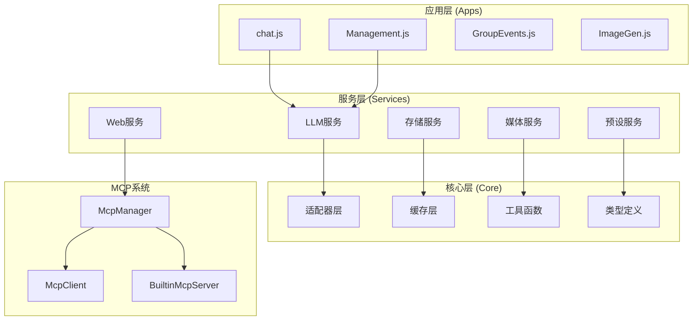
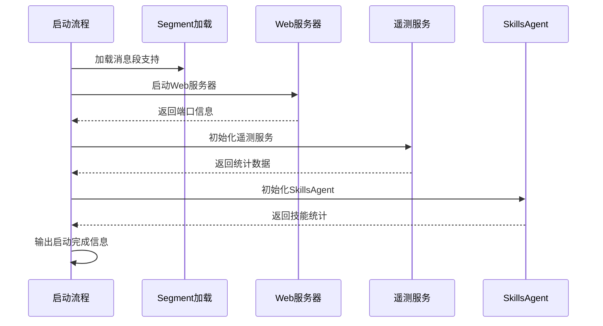
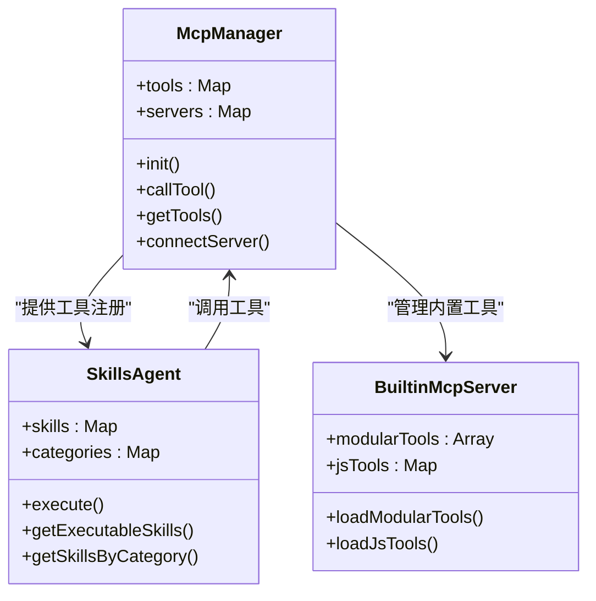
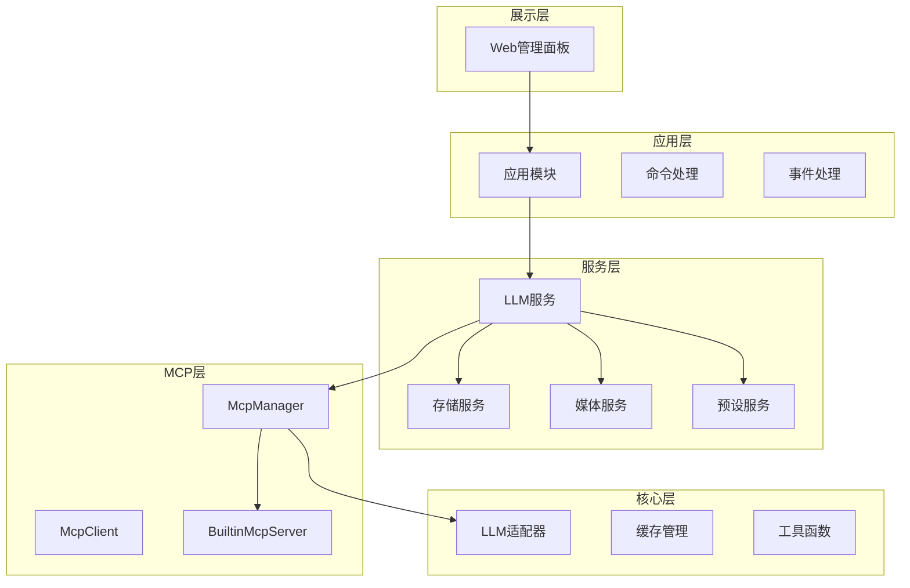
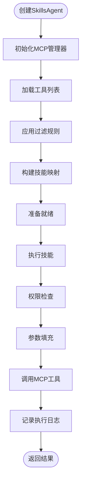
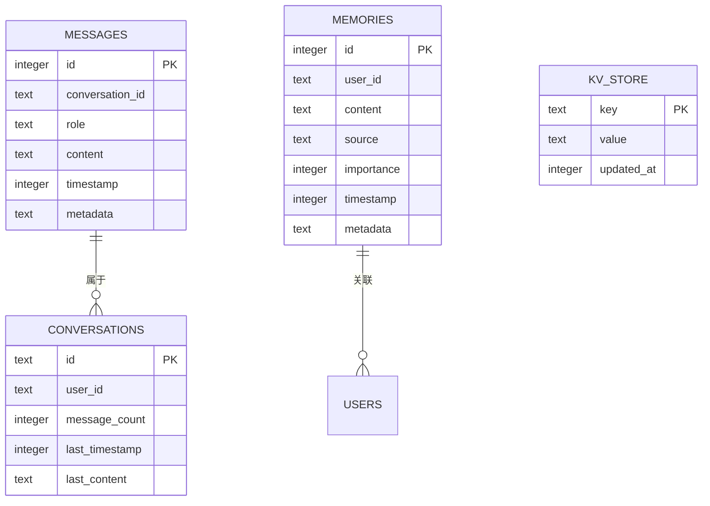
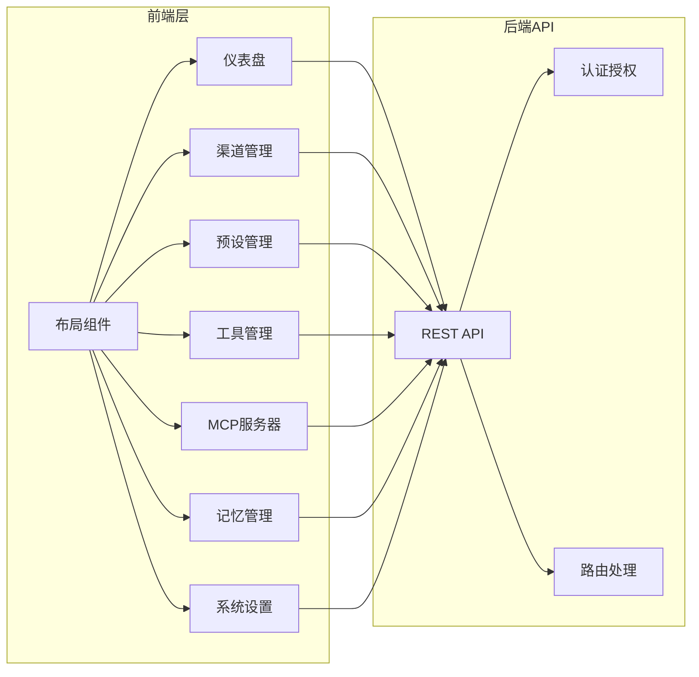
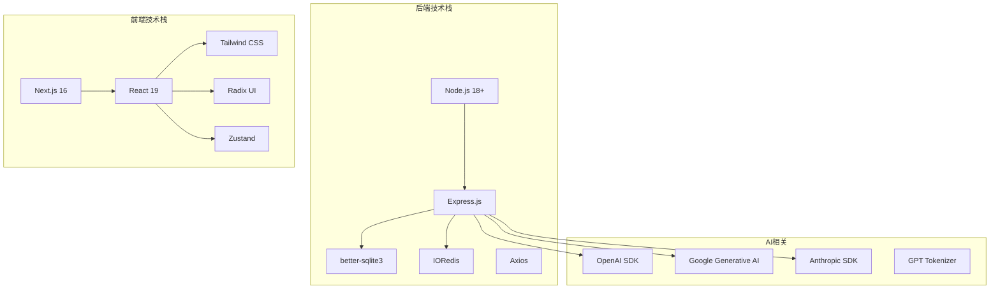

# 项目概述

ChatAI 插件是专为 Yunzai-Bot 生态系统打造的全栈 AI 聊天插件，为 QQ 机器人提供强大而灵活的智能对话能力。

## 目录
1. [项目简介](#项目简介)
2. [项目结构](#项目结构)
3. [核心组件](#核心组件)
4. [架构总览](#架构总览)
5. [详细组件分析](#详细组件分析)
6. [依赖关系分析](#依赖关系分析)
7. [性能考量](#性能考量)
8. [故障排除指南](#故障排除指南)
9. [结论](#结论)
10. [附录](#附录)

## 项目简介

ChatAI 插件是专为 Yunzai-Bot 生态系统打造的全栈 AI 聊天插件，旨在为 QQ 机器人提供强大而灵活的智能对话能力。该项目的核心目标是在 Yunzai 平台上实现统一的聊天管理、预设配置、工具调用与长/短期记忆系统，为用户提供接近"全栈 AI"的综合体验。

### 主要特性

- **多模型支持**：支持 OpenAI (GPT-4o/O1)、Google Gemini、Anthropic Claude、DeepSeek、通义千问等多种主流 LLM 模型
- **MCP 工具调用**：内置 50+ 实用工具，支持 MCP 协议标准，可自定义扩展
- **智能对话管理**：多轮上下文记忆、用户/群组会话隔离、可配置的清理策略
- **长期记忆系统**：自动提取关键信息、向量相似度搜索、用户画像分析
- **人格预设系统**：角色预设管理、独立人格设置、动态变量替换
- **Web 管理面板**：可视化配置、实时监控、预设和渠道管理
- **AI 语音合成**：支持 GPT-SoVITS、Fish-Audio 等语音合成服务

### 技术定位与价值

在 Yunzai 生态系统中，ChatAI 插件扮演着"智能中枢"的角色，通过以下方式创造价值：

1. **统一入口**：为 Yunzai 提供统一的 AI 对话管理界面
2. **能力扩展**：通过 MCP 协议将各种外部工具和服务整合到 AI 对话中
3. **智能增强**：结合上下文记忆和长期记忆，提供更智能的对话体验
4. **生态集成**：与 Yunzai 的消息系统、权限管理、群组管理等核心功能深度集成

## 项目结构

项目采用模块化架构设计，主要分为以下几个层次：

**图表来源**
- [index.js](file://index.js#L114-L136)
- [ARCHITECTURE.md](file://docs/ARCHITECTURE.md#L19-L87)

### 目录结构概览

项目采用清晰的分层架构：

- **apps/**：应用模块，处理具体业务功能
- **src/**：源代码，包含核心业务逻辑
- **config/**：配置管理
- **data/**：运行时数据，包括数据库文件和工具配置
- **docs/**：项目文档
- **frontend/**：Next.js 前端源码
- **resources/web/**：前端构建产物

**章节来源**
- [README.md](file://README.md#L356-L396)

## 核心组件

### 插件入口与初始化

插件入口文件负责整体初始化流程，包括 Segment 加载、Web 服务器启动、遥测服务初始化等关键步骤。

**图表来源**
- [index.js](file://index.js#L17-L174)

### 配置管理系统

配置系统采用 YAML 格式，支持基础配置、渠道配置、上下文配置、记忆配置等多个维度：

- **基础配置**：命令前缀、触发模式、调试设置等
- **渠道配置**：多 API 渠道管理，支持负载均衡和故障转移
- **上下文配置**：历史消息管理、清理策略、隔离模式
- **记忆配置**：长期记忆存储、自动提取、最大记忆数
- **MCP 配置**：MCP 服务器连接管理
- **内置工具配置**：工具启用/禁用、危险工具管理

**章节来源**
- [config.js](file://config/config.js#L62-L586)

### MCP 管理系统

MCP (Model Context Protocol) 系统是项目的核心创新，实现了统一的工具调用接口：

**图表来源**
- [McpManager.js](file://src/mcp/McpManager.js#L27-L49)
- [SkillsAgent.js](file://src/services/agent/SkillsAgent.js#L21-L42)

**章节来源**
- [ARCHITECTURE.md](file://docs/ARCHITECTURE.md#L173-L456)

## 架构总览

项目采用分层架构设计，从底层到上层依次为：

1. **核心层**：LLM 适配器、缓存管理、工具函数
2. **MCP 层**：工具注册、发现、调用
3. **服务层**：LLM 服务、存储服务、媒体服务、预设服务
4. **应用层**：聊天处理、命令管理、群事件处理
5. **展示层**：Web 管理面板

**图表来源**
- [ARCHITECTURE.md](file://docs/ARCHITECTURE.md#L19-L87)

## 详细组件分析

### SkillsAgent 组件

SkillsAgent 是项目的核心抽象层，为业务层提供统一的技能管理接口：

**图表来源**
- [SkillsAgent.js](file://src/services/agent/SkillsAgent.js#L44-L58)
- [SkillsAgent.js](file://src/services/agent/SkillsAgent.js#L326-L379)

#### 技能过滤机制

SkillsAgent 实现了多层次的技能过滤：

1. **配置过滤**：基于配置文件的启用/禁用规则
2. **预设过滤**：基于用户预设的工具访问控制
3. **权限过滤**：基于用户权限和危险工具检查

**章节来源**
- [SkillsAgent.js](file://src/services/agent/SkillsAgent.js#L326-L379)

### 内置工具系统

项目内置了丰富的工具类别，按功能组织：

| 工具类别 | 工具数量 | 功能描述 |
|---------|---------|----------|
| 基础工具 | 9 | 时间获取、工具列表、环境信息等 |
| 用户信息 | 3 | 获取用户信息、好友列表、点赞等 |
| 群组信息 | 4 | 获取群信息、成员列表等 |
| 消息操作 | 7 | 发送消息、@用户、聊天记录等 |
| 群管理 | 6 | 禁言、踢人、设置群名片等 |
| 文件操作 | 5 | 群文件上传、下载、管理等 |
| 媒体处理 | 8 | 图片解析、OCR、二维码生成等 |
| 网页访问 | 2 | 访问网页、获取内容等 |
| 搜索工具 | 4 | 网页搜索、维基百科、翻译等 |
| 实用工具 | 6 | 计算、编码转换、哈希等 |
| 记忆管理 | 4 | 用户记忆的增删改查 |
| 上下文管理 | 3 | 对话上下文、群聊上下文等 |
| Bot信息 | 3 | 获取机器人自身信息、状态等 |
| 语音工具 | 3 | TTS语音合成、AI语音对话等 |

**章节来源**
- [tools/index.js](file://src/mcp/tools/index.js#L30-L58)

### 数据存储架构

项目采用 SQLite 作为主要数据存储，支持对话历史、用户记忆、配置管理等功能：

**图表来源**
- [DatabaseService.js](file://src/services/storage/DatabaseService.js#L47-L78)

**章节来源**
- [DatabaseService.js](file://src/services/storage/DatabaseService.js#L26-L78)

### Web 管理面板

项目提供完整的 Web 管理面板，基于 Next.js 构建：

**图表来源**
- [frontend/app/layout.tsx](file://frontend/app/layout.tsx#L11-L26)

**章节来源**
- [frontend/package.json](file://frontend/package.json#L1-L66)

## 依赖关系分析

### 技术栈概览

项目采用现代化的技术栈组合：

**图表来源**
- [package.json](file://package.json#L16-L45)
- [frontend/package.json](file://frontend/package.json#L13-L52)

### 关键依赖分析

| 依赖类别 | 核心依赖 | 用途 | 版本要求 |
|---------|---------|------|----------|
| 核心运行时 | Node.js | 服务器运行时 | >= 18 |
| Web框架 | Express | HTTP服务 | ^4.21.2 |
| 数据库 | better-sqlite3 | 本地数据存储 | 12.4.1 |
| 缓存 | ioredis | Redis缓存 | ^5.8.2 |
| AI SDK | openai, @google/generative-ai, @anthropic-ai/sdk | LLM集成 | latest |
| 前端框架 | next, react, tailwindcss | 管理面板 | latest |
| 工具库 | axios, uuid, yaml | 通用工具 | latest |

**章节来源**
- [package.json](file://package.json#L1-L53)

## 性能考量

### 缓存策略

项目实现了多层次的缓存机制：

1. **工具结果缓存**：MCP 工具调用结果缓存，支持 TTL 控制
2. **内存缓存**：配置信息、工具定义等热点数据缓存
3. **Redis 缓存**：会话状态、用户权限等分布式缓存

### 性能优化建议

1. **合理配置缓存 TTL**：根据工具调用频率设置合适的缓存时间
2. **批量工具调用**：利用并行执行减少等待时间
3. **数据库索引优化**：确保常用查询字段建立适当索引
4. **内存管理**：定期清理过期缓存和日志数据

## 故障排除指南

### 常见问题诊断

#### 数据库初始化失败

**症状**：启动时报数据库初始化错误

**解决方案**：
1. 确保已执行 `pnpm rebuild better-sqlite3`
2. 检查 `data/` 目录写入权限
3. 删除损坏的数据库文件后重启

#### API 连接问题

**症状**：AI 不回复消息或 API 错误

**排查步骤**：
1. 检查渠道配置是否正确
2. 测试 API 连接状态
3. 验证触发方式配置
4. 查看控制台日志

#### 工具调用失败

**症状**：工具执行失败或无响应

**解决方案**：
1. 检查工具启用状态
2. 验证危险工具权限设置
3. 确认机器人管理权限
4. 开启调试模式查看详细日志

**章节来源**
- [README.md](file://README.md#L553-L793)

## 结论

ChatAI 插件项目展现了现代 AI 聊天插件的完整架构设计，通过 MCP 协议实现了工具调用的标准化，通过 SkillsAgent 抽象层提供了统一的技能管理接口，通过多层缓存和优化确保了良好的性能表现。

### 项目优势

1. **架构先进**：采用分层架构和协议标准化设计
2. **扩展性强**：支持自定义工具和第三方 MCP 服务器
3. **性能优秀**：多级缓存和优化策略
4. **易于使用**：提供完整的 Web 管理面板
5. **生态友好**：深度集成 Yunzai 生态系统

### 技术特色

1. **MCP 协议支持**：标准化的工具调用接口
2. **多模型兼容**：统一的 LLM 适配器设计
3. **智能记忆系统**：长期记忆和上下文管理
4. **可视化管理**：直观的 Web 管理界面
5. **安全可靠**：权限控制和错误处理机制

## 附录

### 快速开始

1. **环境要求**：Node.js >= 18, pnpm >= 8.0
2. **安装步骤**：克隆插件到 Yunzai/plugins 目录
3. **依赖安装**：执行 `pnpm install` 和 `pnpm approve-builds`
4. **启动服务**：在 Yunzai 根目录执行 `pnpm start`
5. **访问面板**：发送 `#ai管理面板` 获取登录链接

### 开发指南

项目提供完整的开发文档，包括架构说明、代码规范、测试指南和发布流程，便于开发者参与项目贡献。